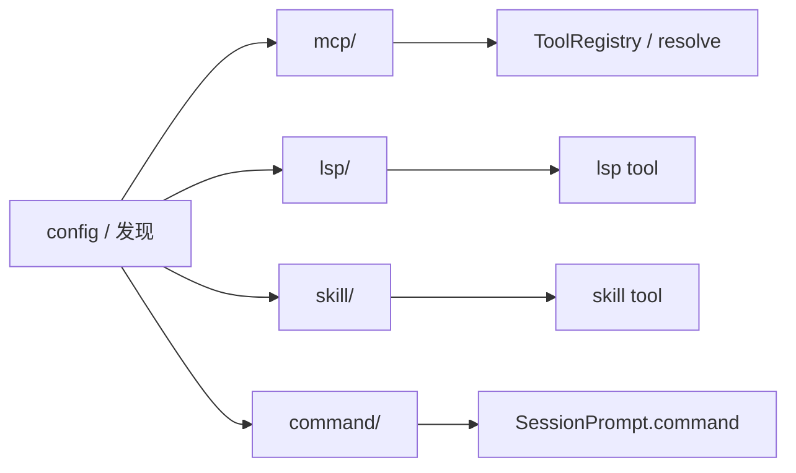

# 14 · MCP、LSP、Skill 与 Command

> **核心问题：** 除 Plugin 外，OpenCode 还有哪些「扩展线」？各自如何进入 Session？

---

## 1. 四条线总览

---

## 2. MCP

目录：[`mcp/`](https://github.com/anomalyco/opencode/tree/7fe7b9f258e36ad9f9acded20c5a9df201da19d5/packages/opencode/src/mcp)

| 组件 | 用途 |
|------|------|
| [`index.ts`](https://github.com/anomalyco/opencode/blob/7fe7b9f258e36ad9f9acded20c5a9df201da19d5/packages/opencode/src/mcp/index.ts) | stdio / HTTP / SSE 客户端 |
| [`auth.ts`](https://github.com/anomalyco/opencode/blob/7fe7b9f258e36ad9f9acded20c5a9df201da19d5/packages/opencode/src/mcp/auth.ts) | 连接状态 |
| oauth-* | OAuth 2.0 流程 |
| Config | [`config/mcp.ts`](https://github.com/anomalyco/opencode/blob/7fe7b9f258e36ad9f9acded20c5a9df201da19d5/packages/opencode/src/config/mcp.ts) |
| CLI | [`cli/cmd/mcp.ts`](https://github.com/anomalyco/opencode/blob/7fe7b9f258e36ad9f9acded20c5a9df201da19d5/packages/opencode/src/cli/cmd/mcp.ts) |

**进入 Session：** MCP 工具在 `SessionTools.resolve` 与内置工具 **并列** 注册给 LLM。插件也可在 `hook.config` 里追加 MCP 声明。

---

## 3. LSP

目录：[`lsp/`](https://github.com/anomalyco/opencode/tree/7fe7b9f258e36ad9f9acded20c5a9df201da19d5/packages/opencode/src/lsp)

| 组件 | 用途 |
|------|------|
| [`lsp.ts`](https://github.com/anomalyco/opencode/blob/7fe7b9f258e36ad9f9acded20c5a9df201da19d5/packages/opencode/src/lsp/lsp.ts) | 按 config 启动 language server |
| `client.ts` / `server.ts` | LSP 协议 |
| Config | [`config/lsp.ts`](https://github.com/anomalyco/opencode/blob/7fe7b9f258e36ad9f9acded20c5a9df201da19d5/packages/opencode/src/config/lsp.ts) |
| Tool | [`tool/lsp.ts`](https://github.com/anomalyco/opencode/blob/7fe7b9f258e36ad9f9acded20c5a9df201da19d5/packages/opencode/src/tool/lsp.ts) |

**bootstrap：** `lsp.init()` 在 plugin 之后并行启动。插件可注册额外 LSP 相关 tool，依赖内核已启动的 language server 进程。

---

## 4. Skill

目录：[`skill/`](https://github.com/anomalyco/opencode/tree/7fe7b9f258e36ad9f9acded20c5a9df201da19d5/packages/opencode/src/skill)

| 组件 | 用途 |
|------|------|
| [`discovery.ts`](https://github.com/anomalyco/opencode/blob/7fe7b9f258e36ad9f9acded20c5a9df201da19d5/packages/opencode/src/skill/discovery.ts) | 扫描 SKILL.md |
| 搜索路径 | `.opencode/`、`.agents/`、`.claude/` 等 |
| Tool | [`tool/skill.ts`](https://github.com/anomalyco/opencode/blob/7fe7b9f258e36ad9f9acded20c5a9df201da19d5/packages/opencode/src/tool/skill.ts) 按需加载正文 |
| Config | [`config/skills.ts`](https://github.com/anomalyco/opencode/blob/7fe7b9f258e36ad9f9acded20c5a9df201da19d5/packages/opencode/src/config/skills.ts) |

Skill **不** 自动全量进 context；agent 通过 **skill tool** 拉取，节省 token。插件可在 `hook.config` 注册更多 skill 路径或定义。

---

## 5. Command（Slash）

目录：[`command/`](https://github.com/anomalyco/opencode/tree/7fe7b9f258e36ad9f9acded20c5a9df201da19d5/packages/opencode/src/command)

| 来源 | 说明 |
|------|------|
| config `command` | 用户自定义模板 |
| MCP prompts | 暴露为 command |
| skill 派生 | 部分 skill 生成 command |
| 内置 | initialize、review 等 template |

执行链：[`SessionPrompt.command`](https://github.com/anomalyco/opencode/blob/7fe7b9f258e36ad9f9acded20c5a9df201da19d5/packages/opencode/src/session/prompt.ts) → **`command.execute.before`** → 展开模板 → **`prompt()`**

---

## 6. 选型：何时用哪条线

| 需求 | 推荐 |
|------|------|
| 远程 API / 数据库 | MCP |
| IDE 级符号/诊断 | LSP + lsp tool |
| 可复用知识包 | Skill |
| 用户一键工作流 | Command |
| 深度改 runtime | Plugin hook |

---

## 读完后应能回答

- [ ] MCP 工具如何进 LLM？
- [ ] Skill 与 Instruction 区别？
- [ ] slash command 与普通 prompt 入口关系？

→ **下一篇：** [15 · 后台、PTY、快照与 Worktree](./15-background-pty-and-worktree.md)
