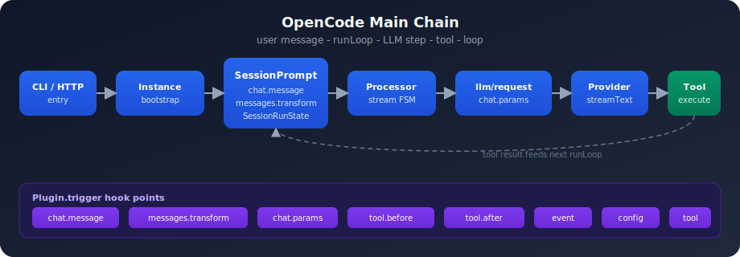
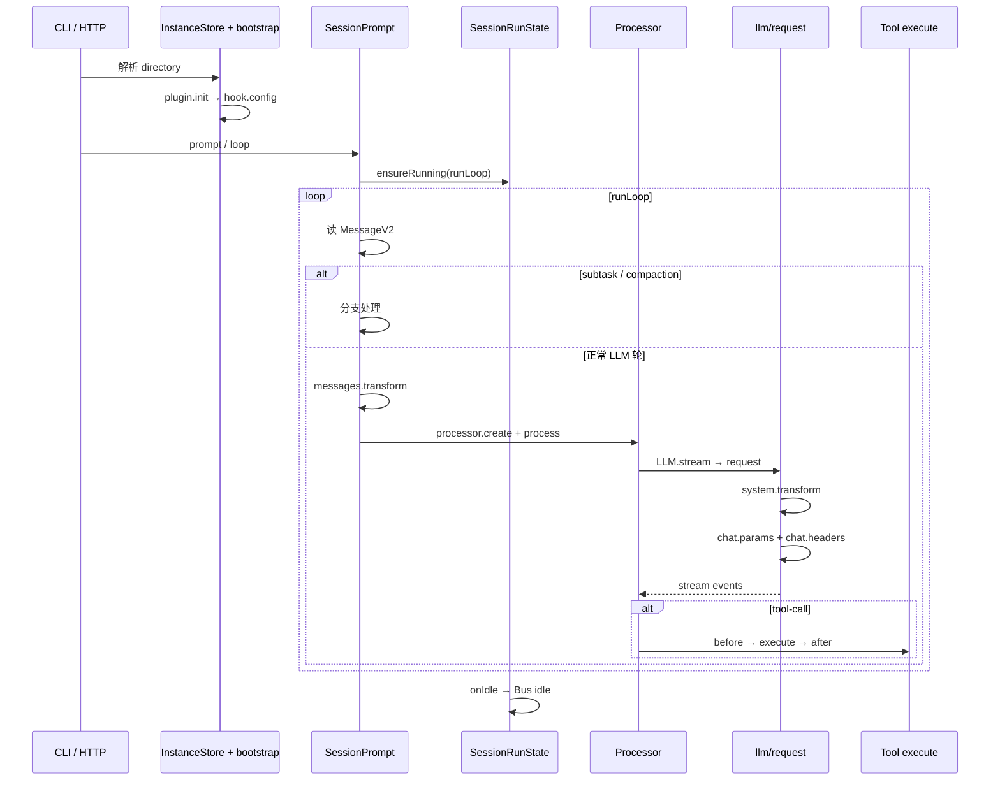

# 18 · 主链路总图（Atlas）

> **用途：** 一张图串起 00–17 所有关键文件与 hook 点；读源码时的导航锚点。



<p align="center"><sub>图内英文标签 · 详见 <a href="./18-main-chain-atlas.md">18 总图</a> 与 <a href="./appendix/A1-full-trace-narrative.md">A1 叙事</a></sub></p>

---

## 1. 端到端时序



---

## 2. 文件锚点表

| 阶段 | 文件 | 文档 |
|------|------|------|
| 启动 | [`project/bootstrap.ts`](https://github.com/anomalyco/opencode/blob/7fe7b9f258e36ad9f9acded20c5a9df201da19d5/packages/opencode/src/project/bootstrap.ts) | [02](./02-effect-instance-and-bootstrap.md) |
| 配置 | [`config/config.ts`](https://github.com/anomalyco/opencode/blob/7fe7b9f258e36ad9f9acded20c5a9df201da19d5/packages/opencode/src/config/config.ts) | [04](./04-config-system.md) |
| HTTP | [`handlers/session.ts`](https://github.com/anomalyco/opencode/blob/7fe7b9f258e36ad9f9acded20c5a9df201da19d5/packages/opencode/src/server/routes/instance/httpapi/handlers/session.ts) | [03](./03-cli-server-and-entry.md) |
| 并发 | [`session/run-state.ts`](https://github.com/anomalyco/opencode/blob/7fe7b9f258e36ad9f9acded20c5a9df201da19d5/packages/opencode/src/session/run-state.ts) | [09](./09-session-prompt-runloop.md) |
| 主循环 | [`session/prompt.ts`](https://github.com/anomalyco/opencode/blob/7fe7b9f258e36ad9f9acded20c5a9df201da19d5/packages/opencode/src/session/prompt.ts) | [09](./09-session-prompt-runloop.md) |
| 流解析 | [`session/processor.ts`](https://github.com/anomalyco/opencode/blob/7fe7b9f258e36ad9f9acded20c5a9df201da19d5/packages/opencode/src/session/processor.ts) | [09](./09-session-prompt-runloop.md) |
| LLM | [`session/llm/request.ts`](https://github.com/anomalyco/opencode/blob/7fe7b9f258e36ad9f9acded20c5a9df201da19d5/packages/opencode/src/session/llm/request.ts) | [10](./10-llm-stream-and-provider.md) |
| 工具 | [`tool/registry.ts`](https://github.com/anomalyco/opencode/blob/7fe7b9f258e36ad9f9acded20c5a9df201da19d5/packages/opencode/src/tool/registry.ts) | [11](./11-tool-registry-and-execution.md) |
| 存储 | [`session/session.sql.ts`](https://github.com/anomalyco/opencode/blob/7fe7b9f258e36ad9f9acded20c5a9df201da19d5/packages/opencode/src/session/session.sql.ts) | [08](./08-session-message-and-storage.md) |
| 事件 | [`bus/index.ts`](https://github.com/anomalyco/opencode/blob/7fe7b9f258e36ad9f9acded20c5a9df201da19d5/packages/opencode/src/bus/index.ts) | [13](./13-bus-and-session-events.md) |
| 插件 | [`plugin/index.ts`](https://github.com/anomalyco/opencode/blob/7fe7b9f258e36ad9f9acded20c5a9df201da19d5/packages/opencode/src/plugin/index.ts) | [05](./05-plugin-protocol-and-loader.md) |

---

## 3. Hook 注入点（单轮 LLM）

| 顺序 | Hook | 位置 |
|------|------|------|
| 1 | `chat.message` | prompt（user 入库前） |
| 2 | `experimental.chat.messages.transform` | prompt runLoop |
| 3 | `experimental.chat.system.transform` | llm/request |
| 4 | **`chat.params`** | llm/request |
| 5 | **`chat.headers`** | llm/request |
| 6 | `experimental.text.complete` | processor |
| 7 | `tool.execute.before` | tools / prompt |
| 8 | `tool.execute.after` | tools / prompt |
| 9 | `shell.env` | shell / pty |

注册型：`config`（bootstrap）、`tool`（registry）、`event`（Bus 全量）。完整表：[06](./06-hook-system-reference.md)。

---

## 4. 单轮数据流（ASCII）

```
User parts (DB)
    → filterCompactedEffect
    → messages.transform (hook)
    → toModelMessagesEffect
    → + system / skills / instructions
    → chat.params / headers (hook)
    → Provider API
    → stream → Processor → Part (DB)
    → [tool?] → execute hooks → Part (DB) → runLoop 下一轮
```

---

## 5. 与插件的关系

- 内核拥有：**runLoop 控制流**、Session DB、Permission 求值、stream 协议
- 插件通过 **Hook 改 input/output**，通过 **`config` / `tool` 注册** 扩展能力
- 跨项目边界（若同时用增强插件）：见 [OpenCode ↔ 增强插件边界](../../comparisons/opencode-vs-omo-boundary.md)

---

## 读完后应能回答

- [ ] 从 HTTP 到 chat.params 经过哪些文件？
- [ ] 哪几个 hook 在同一次 LLM 轮次里必定触发？
- [ ] idle 事件在链路哪一环发布？

→ **验收：** [17 · 架构评价与掌握验收](./17-architecture-review-and-mastery.md)

**配套阅读：**

- [附录 A1 · 完整叙事 Trace](./appendix/A1-full-trace-narrative.md) — 用故事串起本图
- [19 · 多模型与 Provider](./19-multi-model-and-provider-system.md) — 标题/small/variant/subagent
- [learning-paths · 选路径与 Checklist](./learning-paths.md) — 读完本图后下一步
- [flow/ · 流程专题索引](./flow/README.md) — 权限、插件加载、工具执行等
- [external-resources · 社区资料对照](./external-resources.md) — ZeroZ / qqzhangyanhua 互补阅读
