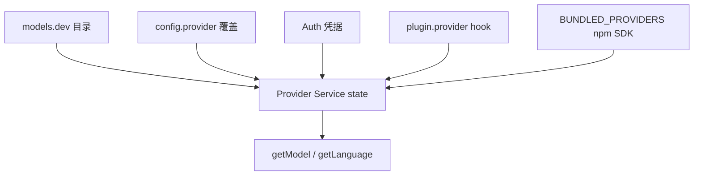

# 19 · 多模型与 Provider 体系

> **核心问题：** OpenCode 如何同时支持 Anthropic / OpenAI / DeepSeek / 网关 / 自托管？**一次 session 里谁决定用哪个 model？** 主模型、小模型、variant、subagent 各是什么？

这是 **篇幅最长** 的内核专题：多 Provider 是 OpenCode 与单一厂商 agent 的最大架构差异之一。

**主文件：** [`provider/provider.ts`](https://github.com/anomalyco/opencode/blob/7fe7b9f258e36ad9f9acded20c5a9df201da19d5/packages/opencode/src/provider/provider.ts)  
**厂商适配：** [`provider/transform.ts`](https://github.com/anomalyco/opencode/blob/7fe7b9f258e36ad9f9acded20c5a9df201da19d5/packages/opencode/src/provider/transform.ts)  
**请求组装：** [`session/llm/request.ts`](https://github.com/anomalyco/opencode/blob/7fe7b9f258e36ad9f9acded20c5a9df201da19d5/packages/opencode/src/session/llm/request.ts)

---

## 1. 三层概念（先建立词汇）

| 概念 | 含义 | 例子 |
|------|------|------|
| **Provider** | 厂商或网关 **连接** | `anthropic`、`openai`、`openrouter`、`github-copilot` |
| **Model** | 该 Provider 下的 **具体模型 id** | `claude-sonnet-4-20250514`、`gpt-4o` |
| **Variant** | 同一 model 的 **推理档位 / 扩展选项** | `low` / `high` effort、thinking budget |

配置与代码里常见字符串格式：

```text
provider/model-id     →  anthropic/claude-sonnet-4-20250514
```

解析：[`Provider.parseModel`](https://github.com/anomalyco/opencode/blob/7fe7b9f258e36ad9f9acded20c5a9df201da19d5/packages/opencode/src/provider/provider.ts#L1830-L1836)（第一个 `/` 前为 providerID，其余为 modelID）。

---

## 2. Provider 从哪来（注册表）



### 2.1 内置 SDK 映射（节选）

[`BUNDLED_PROVIDERS`](https://github.com/anomalyco/opencode/blob/7fe7b9f258e36ad9f9acded20c5a9df201da19d5/packages/opencode/src/provider/provider.ts#L91-L117) 把 provider id 接到 Vercel AI SDK 包：

| npm 包 | 典型 Provider |
|--------|----------------|
| `@ai-sdk/anthropic` | Anthropic |
| `@ai-sdk/openai` | OpenAI |
| `@ai-sdk/google` | Gemini |
| `@ai-sdk/openai-compatible` | 自托管 OpenAI 兼容 |
| `@openrouter/ai-sdk-provider` | OpenRouter |
| `@ai-sdk/github-copilot` | Copilot |
| `@ai-sdk/amazon-bedrock` | Bedrock |
| `gitlab-ai-provider` | GitLab Workflow |
| … | Groq、Mistral、xAI 等 |

**含义：** 多模型不是「一个 LLM 类写 if/else」，而是 **Provider 插件化 + 统一 streamText 路径**。

### 2.2 Config 门控

[`config/config.ts`](https://github.com/anomalyco/opencode/blob/7fe7b9f258e36ad9f9acded20c5a9df201da19d5/packages/opencode/src/config/config.ts)：

| 键 | 作用 |
|----|------|
| `model` | 全局默认 `provider/model` |
| `small_model` | 轻量任务专用（标题等） |
| `provider.<id>` | 单 Provider 的 options、models 覆盖、variant 禁用 |
| `enabled_providers` | **白名单**：仅这些 Provider 可用 |
| `disabled_providers` | 黑名单 |

### 2.3 插件扩展

- **`plugin.provider` hook** — 动态注册 Provider / Model 列表。
- **`plugin.auth` hook** — 登录流（Codex、Copilot 等内置 auth 插件）。

---

## 3. 一次对话「用哪个 model」—— 决策树

**主 runLoop 内** 跟的是 **`lastUser.model`**（从后往前找最后一条 user 消息）。

### 3.1 创建 user 消息时（`createUserMessage`）

baseline [`prompt.ts` 搜 `createUserMessage`](https://github.com/anomalyco/opencode/blob/7fe7b9f258e36ad9f9acded20c5a9df201da19d5/packages/opencode/src/session/prompt.ts)：

```
model =
  input.model                    // API/CLI 显式指定
  ?? ag.model                    // 当前 agent 绑定
  ?? currentModel(sessionID)     // session 表 或 上一条 user 或 defaultModel

variant =
  input.variant
  ?? (agent.variant 且 agent.model 与 model 一致)
```

**持久化：** user 消息 + session 表的 `model` JSON；切换时发 **ModelSwitched** 事件。

### 3.2 默认 model（`Provider.defaultModel`）

[`#L1771–1802`](https://github.com/anomalyco/opencode/blob/7fe7b9f258e36ad9f9acded20c5a9df201da19d5/packages/opencode/src/provider/provider.ts#L1771-L1802) 顺序：

1. config **`model`**
2. 状态文件 **`model.json` recent 列表**（用户最近用过的）
3. 第一个可用 Provider 里 **sort 优先级** 最高的 model（`gpt-5`、`claude-sonnet-4`…）

### 3.3 runLoop 每 step 的 model

```typescript
const model = yield* getModel(lastUser.model.providerID, lastUser.model.modelID, sessionID)
```

**同一 user turn 的多轮 tool loop 不换 model**，除非：

- 新 user 消息带了新 model；
- subtask 指定了 `task.model`（见 §6）；
- compaction 子流程可能用 agent 的 model 配置。

### 3.4 Agent 级绑定

[`agent/agent.ts`](https://github.com/anomalyco/opencode/blob/7fe7b9f258e36ad9f9acded20c5a9df201da19d5/packages/opencode/src/agent/agent.ts) `Info.model` + `Info.variant`：

| Agent | 典型 model 策略 |
|-------|-----------------|
| build | 用户默认 / 强模型 |
| plan | 常绑只读 + 可绑便宜 model |
| general / explore | subagent，可绑 **不同** model |
| title | 可选绑 small；否则走 getSmallModel |

config + `hook.config` 可给每个 agent 指定 **`provider/model`**。

---

## 4. Variant：同 model 多档位（reasoning / thinking）

### 4.1 什么是 variant

User 消息上：`model.variant`（如 `high`）。  
在 LLM 请求前 merge 进 options：

[`llm/request.ts` / `llm.ts` 路径](https://github.com/anomalyco/opencode/blob/7fe7b9f258e36ad9f9acded20c5a9df201da19d5/packages/opencode/src/session/llm/request.ts)：

```typescript
const variant = user.model.variant ? model.variants[user.model.variant] : {}
options = merge(options, agent.options, variant)
```

### 4.2 variants 谁生成

[`ProviderTransform.variants(model)`](https://github.com/anomalyco/opencode/blob/7fe7b9f258e36ad9f9acded20c5a9df201da19d5/packages/opencode/src/provider/transform.ts#L620) — **按 model id + api.npm 分支**，例如：

| 模型族 | variant 键 → options 形状 |
|--------|---------------------------|
| OpenAI reasoning (o-series) | `low/medium/high` → `reasoningEffort` |
| Anthropic adaptive | effort 档位 → thinking budget |
| Gemini 3 | `minimal/low/medium/high` → thinkingLevel |
| Grok-3-mini | `low/high` |
| OpenRouter 上的 GPT/Gemini/Claude | 统一 `reasoning.effort` 包装 |

**DeepSeek / Kimi / GLM 等** 常返回 `{}` —— 思考开关更多靠 **`chat.params` 插件** 写 `options`，而非 UI variant。

### 4.3 UI / TUI 与 variant

TUI 选「扩展思考」→ 写入 user message 的 **variant** 字段 → 自动 merge 对应 options。  
插件读 **`input.message`（UserMessage）** 里的 variant 做额外逻辑（与 OmO think-mode 同类，但 OpenCode 内核已有一层 variant merge）。

---

## 5. 小模型（small_model）—— 第二条 LLM 管线

并非所有 LLM 调用都用主 model。

### 5.1 config `small_model`

[`getSmallModel`](https://github.com/anomalyco/opencode/blob/7fe7b9f258e36ad9f9acded20c5a9df201da19d5/packages/opencode/src/provider/provider.ts#L1713-L1768)：

1. 若 config 有 **`small_model`** → 解析并 getModel；
2. 否则在当前 provider 的 models 里按 **优先级列表** 找（haiku、flash、nano…）；
3. Bedrock 还有 **region/global 前缀** 特殊逻辑。

### 5.2 谁传 `small: true`

| 调用方 | 用途 |
|--------|------|
| **`ensureTitle`** | 首条 user 后生成 session 标题 |
| 其它 `llm.stream({ small: true })` | 摘要、轻量分类等 |

[`ensureTitle`](https://github.com/anomalyco/opencode/blob/7fe7b9f258e36ad9f9acded20c5a9df201da19d5/packages/opencode/src/session/prompt.ts) 逻辑：

- agent **`title`** 的 model，或 **getSmallModel(当前 provider)**，或 **fallback 主 model**；
- **`small: true`** → request 里走 `ProviderTransform.smallOptions`（更省 token 的参数）。

**叙事：** [A1 第三幕](./appendix/A1-full-trace-narrative.md) 标题生成与主对话 **并行**。

### 5.3 Compaction

[`compaction.ts`](https://github.com/anomalyco/opencode/blob/7fe7b9f258e36ad9f9acded20c5a9df201da19d5/packages/opencode/src/session/compaction.ts) 压缩摘要 LLM 使用 **overflow 时 session/agent 关联的 model**（可 config 指定 compaction 用哪个 model —— 见 config schema）。

---

## 6. Subagent / Task 的独立 model

[`handleSubtask`](https://github.com/anomalyco/opencode/blob/7fe7b9f258e36ad9f9acded20c5a9df201da19d5/packages/opencode/src/session/prompt.ts#L298)：

```typescript
const taskModel = task.model
  ? yield* getModel(task.model.providerID, task.model.modelID, sessionID)
  : model   // 主 loop 当前 model
```

- **subtask part** 可带 **独立 provider/model**；
- Task tool 的 `subagent_type` 指向 **另一 agent**（其自身也可绑 model）；
- 实现 **「主编排用 Sonnet、探索用 Haiku」** 而不改主 user 消息。

详见 [11 §4](../11-tool-registry-and-execution.md)。

---

## 7. ProviderTransform：厂商差异集中处理

[`transform.ts`](https://github.com/anomalyco/opencode/blob/7fe7b9f258e36ad9f9acded20c5a9df201da19d5/packages/opencode/src/provider/transform.ts) 负责 **OpenCode 统一语义 → 各 SDK options**：

| 能力 | 说明 |
|------|------|
| `temperature` / `topP` / `maxOutputTokens` | 按 model.capabilities 裁剪 |
| `options()` | provider 级默认 + model.options |
| `variants()` | §4 |
| message 转换 | reasoning block、tool schema、多模态、cache key |
| 特殊分支 | Copilot Responses API、LiteLLM stub tool、Venice、Bedrock 等 |

**插件一般不改 transform**；改 **`chat.params` 的 output.options** 即可叠加厂商字段。

---

## 8. 请求链上的 model 相关 hook

顺序（[`request.ts`](https://github.com/anomalyco/opencode/blob/7fe7b9f258e36ad9f9acded20c5a9df201da19d5/packages/opencode/src/session/llm/request.ts)）：

1. merge agent.prompt + system + instructions  
2. **`experimental.chat.system.transform`**  
3. merge **base options**（ProviderTransform + agent.options + **variant**）  
4. **`chat.params`** ← 插件改 temperature / **options**（thinking、effort…）  
5. **`chat.headers`** ← Copilot 等  
6. `streamText` / native LLM 路由  

**每 step 调用 LLM 都会走一遍** —— 见 [10](../10-llm-stream-and-provider.md)、[A1](./appendix/A1-full-trace-narrative.md)。

---

## 9. 多 Provider 并行存在时的行为

| 问题 | 行为 |
|------|------|
| 能否同 session 混用 Anthropic + OpenAI？ | **可以**，靠 **每条 user 消息的 model 字段**；history 转 ModelMessage 时按 **当前调用 model** 做 transform |
| Provider 凭据 | [`auth/`](https://github.com/anomalyco/opencode/tree/7fe7b9f258e36ad9f9acded20c5a9df201da19d5/packages/opencode/src/auth) 分 provider 存 |
| Model 不存在 | `ModelNotFoundError` + suggestions；Bus `session.error` |
| 模糊查找 | `Provider.closest()` fuzzysort |

---

## 10. 写插件 / 配 config 的实操指南

### 10.1 只服务 DeepSeek thinking

```typescript
"chat.params": async (input, output) => {
  if (input.model.providerID !== "deepseek") return
  output.options = { ...output.options, enable_thinking: true }
}
```

### 10.2 按 agent 分 model

在 **`opencode.jsonc`**：

```jsonc
{
  "agent": {
    "build": { "model": "anthropic/claude-sonnet-4-20250514" },
    "explore": { "model": "anthropic/claude-haiku-4-5", "mode": "subagent" }
  }
}
```

或在 **`hook.config`** 里注入（大型插件常用）。

### 10.3 默认 + 轻量标题

```jsonc
{
  "model": "anthropic/claude-sonnet-4-20250514",
  "small_model": "anthropic/claude-haiku-4-5"
}
```

### 10.4 禁用某 Provider

```jsonc
{ "disabled_providers": ["opencode"] }
```

或 **`enabled_providers`** 白名单。

---

## 11. 与 packages/llm 的关系

[`packages/llm/`](https://github.com/anomalyco/opencode/tree/7fe7b9f258e36ad9f9acded20c5a9df201da19d5/packages/llm) 提供更 schema-first 的路由层；`session/llm.ts` 在 stream 路径上 **Effect Stream 包装** AI SDK。深读 Provider 时：

- **模型列表 / capabilities** → `packages/core` + models.dev  
- **单次请求参数** → `provider/transform.ts` + `llm/request.ts`  
- **流事件** → [A2 processor](./appendix/A2-processor-deep-dive.md)

---

## 12. 常见误区

| 误区 | 事实 |
|------|------|
| 「换模型要改 runLoop」 | 只需 **新 user 消息** 或 agent/config 绑定 |
| 「chat.params 只调一次」 | **每个 LLM step 都调** |
| 「variant 等于 model」 | variant 是 **同一 model 的 options 档位** |
| 「subagent 必用主 model」 | subtask / agent 可指定 **独立 model** |
| 「改 transform.ts 才能加 thinking」 | 优先 **`chat.params` → output.options** |

---

## 读完后应能回答

- [ ] 画出 model 选择的优先级（至少 4 层）？
- [ ] `small_model` 与主 `model` 各用在什么调用？
- [ ] variant 与 chat.params 的分工？
- [ ] Task 子 agent 如何换 model？
- [ ] 为何 OpenCode 能接 OpenRouter + 直连 Anthropic 并存？

→ **叙事：** [A1 Trace](./appendix/A1-full-trace-narrative.md)  
→ **chat.params 字段：** [10](../10-llm-stream-and-provider.md)  
→ **验收：** [17 §4 简答](../17-architecture-review-and-mastery.md)
