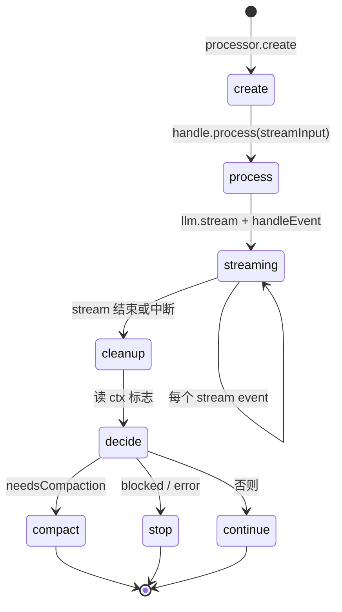

# 附录 A2 · SessionProcessor 深读（LLM 流状态机）

> **文件：** [`session/processor.ts`](https://github.com/anomalyco/opencode/blob/7fe7b9f258e36ad9f9acded20c5a9df201da19d5/packages/opencode/src/session/processor.ts)  
> **职责：** 消费 **一轮** `LLM.stream` 的事件，增量写 DB，调度 tool，决定返回 **`compact` | `stop` | `continue`**。

与 [09 runLoop](../09-session-prompt-runloop.md) 的分工：**runLoop 管 while；processor 管单次 stream。**

---

## 1. 生命周期



入口：baseline [`SessionProcessor.process` #L780](https://github.com/anomalyco/opencode/blob/7fe7b9f258e36ad9f9acded20c5a9df201da19d5/packages/opencode/src/session/processor.ts#L780)  
返回：[`#L845–847`](https://github.com/anomalyco/opencode/blob/7fe7b9f258e36ad9f9acded20c5a9df201da19d5/packages/opencode/src/session/processor.ts#L845-L847)

```typescript
if (ctx.needsCompaction) return "compact"
if (ctx.blocked || ctx.assistantMessage.error) return "stop"
return "continue"
```

runLoop 收到 `"continue"` 会 **再转一圈**；`"compact"` 触发 compaction 分支；`"stop"` 往往 break。

---

## 2. ProcessorContext（内存状态）

| 字段 | 作用 |
|------|------|
| `assistantMessage` | 本轮 assistant 行 |
| `model` | 本轮 LLM 用的 Provider.Model |
| `toolcalls` | 进行中的 tool call → Deferred 等待完成 |
| `currentText` | 当前 text part 缓冲 |
| `reasoningMap` | 按 id 缓冲 reasoning part |
| `snapshot` | 文件快照 id（step 前后 diff patch） |
| `needsCompaction` | finish-step 检测 overflow 或 ContextOverflowError |
| `blocked` | permission deny 等 |
| `shouldBreak` | config `continue_loop_on_deny` |

---

## 3. Stream 事件 → 动作（完整表）

| 事件 | DB / 副作用 | 备注 |
|------|-------------|------|
| `start-step` | step-start part + snapshot | 记录 agent/model/variant（v2 事件） |
| `finish-step` | step-finish part；更新 assistant.finish、tokens、cost | 可能设 `needsCompaction` |
| `reasoning-start/delta/end` | reasoning part 增量 | thinking 模型 |
| `text-start/delta/end` | text part 增量 | end 时 **experimental.text.complete** |
| `tool-input-start` | tool part **pending** | 可标 `providerExecuted` |
| `tool-call` | tool part **running** | doom_loop 检测 → permission.ask |
| `tool-result` | **completeToolCall** → completed | provider 内执行的工具 |
| `tool-error` | failToolCall | |
| `error` | throw → retry / halt | |
| `finish` | 无（stream 结束） | |

**providerExecuted：** 工具在 Provider 侧已执行完，OpenCode **不再**本地 execute，但仍有 part 记录；runLoop 的 `hasToolCalls` 会排除这类 part（见 [09 §4](../09-session-prompt-runloop.md)）。

---

## 4. tool-call 与 runLoop 的衔接

1. Processor 收到 `tool-call` → part 状态 running。
2. Stream 结束后 `process()` 通常返回 **`continue`**（除非 error/compact）。
3. runLoop 顶部看到 **未完成 tool** 或 finish=tool-calls → **不 exit**。
4. **[`session/tools.ts`](https://github.com/anomalyco/opencode/blob/7fe7b9f258e36ad9f9acded20c5a9df201da19d5/packages/opencode/src/session/tools.ts)** 执行工具 → 更新 part → **await tool Deferred**。
5. 下一圈 runLoop → **新 assistant message** → 再次 `process()` → LLM 看到 tool result。

**叙事版：** [A1 第五、六幕](./A1-full-trace-narrative.md)

---

## 5. 错误与重试

[`SessionRetry.policy`](https://github.com/anomalyco/opencode/blob/7fe7b9f258e36ad9f9acded20c5a9df201da19d5/packages/opencode/src/session/retry.ts) 包在 stream 外：

- 可重试错误 → status `retry`，再调 LLM（**同一 model**，除非插件在 event 里换 model）。
- **ContextOverflowError** → `needsCompaction = true`，Bus `session.error`，返回 compact 路径。
- 其它致命错误 → `assistantMessage.error`，`process()` → **`stop`**。

插件 **runtime 换 model** 不在 processor 内；需 `event` hook 监听 error 后用户/agent 再发消息。

---

## 6. cleanup（Ensuring）

无论成功失败，`cleanup()` 会：

-  flush 未结束的 text/reasoning part；
- 将仍 running 的 tool 标 **aborted**；
- 写 `assistantMessage.time.completed`。

避免 DB 里留半条 assistant。

---

## 7. 与 hook 的交点

| Hook | 在 processor 内 |
|------|-----------------|
| `experimental.text.complete` | text-end |
| `tool.execute.*` | 不在 processor 内；在 tools 执行路径 |
| `chat.params` | 不在 processor 内；在 **llm/request** 每次 stream 前 |

---

## 8. 调试清单

| 现象 | 查 |
|------|-----|
| tool 一直 pending | toolcalls Deferred 是否 settle；tools.ts 是否 execute |
| 有 tool 但 loop 退出 | runLoop exit 条件 vs hasToolCalls / providerExecuted |
| 突然 compact | finish-step overflow 或 ContextOverflowError |
| 同 tool 重复 3 次 | doom_loop permission |

---

## 读完后应能回答

- [ ] `process()` 三种返回值各导致 runLoop 什么行为？
- [ ] tool-call 与 tool-result 事件区别？
- [ ] chat.params 在 processor 的哪一环？（答：不在 processor）

→ **叙事：** [A1](./A1-full-trace-narrative.md)  
→ **多模型：** [19](../19-multi-model-and-provider-system.md)
