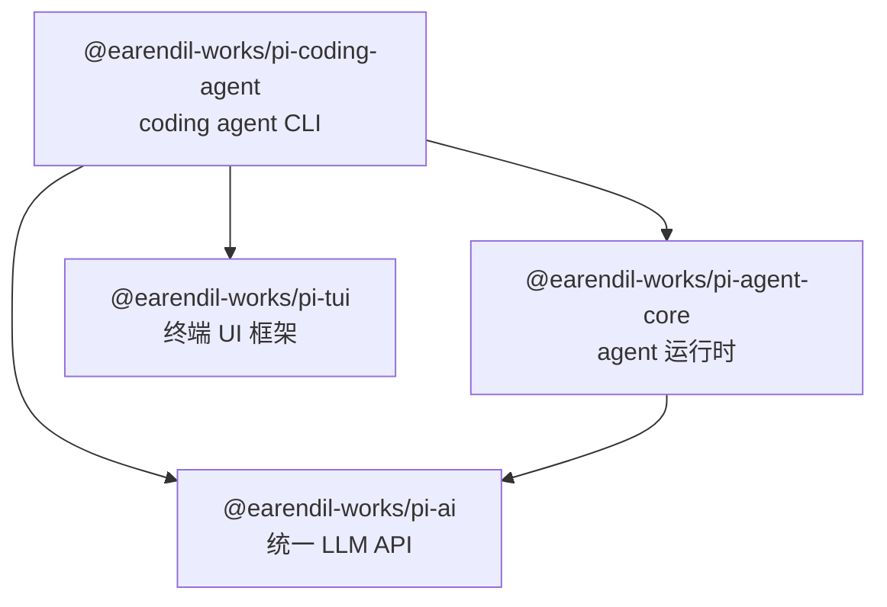

# 01 · 分包架构与依赖图

Pi 是一个 npm monorepo，包含 4 个工作区包。严格的分层依赖图和 lockstep 版本策略是其架构核心。

## 四个包概览

| 目录 | npm 名 | 职责 | 内部依赖 |
|------|--------|------|----------|
| `packages/ai` | `@earendil-works/pi-ai` | 统一多供应商 LLM API：模型发现、供应商配置、token/cost 追踪、context 序列化与跨供应商迁移 | 无 |
| `packages/tui` | `@earendil-works/pi-tui` | 终端 UI 框架：差分渲染、同步输出（CSI 2026）、组件系统、自动补全 | 无 |
| `packages/agent` | `@earendil-works/pi-agent-core` | Agent 运行时：状态管理、工具调用、事件流、消息转向（steering/follow-up）、并发工具执行 | `pi-ai` |
| `packages/coding-agent` | `@earendil-works/pi-coding-agent` | 交互式 coding agent CLI：四种运行模式（交互/print/JSON/RPC）、SDK 嵌入、扩展系统、会话管理 | `pi-ai`, `pi-agent-core`, `pi-tui` |

## 依赖图（Mermaid）



依赖关系是单向的、无环的：

- **`coding-agent`** 依赖全部三个内层包（`agent`, `ai`, `tui`）
- **`agent`** 仅依赖 `ai`
- **`ai`** 和 **`tui`** 互相独立，各自零内部依赖

## 依赖方向与构建顺序

根 `package.json` 的 `build` 脚本显示构建必须自底向上：

```json
"build": "cd packages/tui && npm run build && cd ../ai && npm run build && cd ../agent && npm run build && cd ../coding-agent && npm run build"
```

构建顺序：**tui → ai → agent → coding-agent**。其中 `tui` 和 `ai` 没有先后依赖可以互换位置，但脚本选择了固定的顺序。参考：[package.json 的 build 脚本](https://github.com/earendil-works/pi/blob/fc8a1559017f1e581cfa971aa3cef11a507a4975/package.json#L14)

每个内部包的依赖以 **caret range** 声明，确保 lockstep 版本下的兼容性（见下文）。外部依赖则全部精确 pin 死版本号。

## 关键架构约束：`tui` 零依赖 `ai`

`@earendil-works/pi-tui` 的 `dependencies` 中只有两个外部包——`get-east-asian-width` 和 `marked`——没有任何对 `pi-ai` 的引用。

```json
// packages/tui/package.json
"dependencies": {
    "get-east-asian-width": "1.6.0",
    "marked": "15.0.12"
}
```

这并非偶然，而是**刻意的架构约束**：TUI 框架是纯渲染层，不耦合 LLM 调用、流事件或 provider 逻辑。`coding-agent` 虽然同时依赖 `tui` 和 `ai`，但它在应用层做胶水代码。对照 [tui 的 package.json](https://github.com/earendil-works/pi/blob/fc8a1559017f1e581cfa971aa3cef11a507a4975/packages/tui/package.json)，`pi-tui` 的依赖图上确实没有任何 `pi-ai` 相关条目。

类似地，`ai` 也是零内部依赖的叶节点——它是一个纯 LLM 抽象库，不依赖 agent 逻辑或 UI。

## lockstep 版本策略

所有四个包的版本号完全相同，当前为 **`0.75.5`**。

版本升级通过根 package.json 的脚本执行：

```json
"version:patch": "npm version patch -ws --no-git-tag-version && node scripts/sync-versions.js && npm install --package-lock-only"
"version:minor": "npm version minor -ws --no-git-tag-version && node scripts/sync-versions.js && npm install --package-lock-only"
"version:major": "npm version major -ws --no-git-tag-version && node scripts/sync-versions.js && npm install --package-lock-only"
```

流程：`npm version` 统一 bump 所有工作区 → `sync-versions.js` 检查一致性并更新内部依赖的 caret range → `npm install --package-lock-only` 重新计算 lockfile。

`snyc-versions.js` 的核心逻辑：

1. 读取所有 workspace `package.json`，提取 `versionMap`
2. 断言所有版本相同——任何不一致都会报错退出
3. 遍历每个包，将所有对 `@earendil-works/pi-*` 的依赖更新为 `^<当前版本>`

参考：[sync-versions.js](https://github.com/earendil-works/pi/blob/fc8a1559017f1e581cfa971aa3cef11a507a4975/scripts/sync-versions.js)

**为什么用 caret range 而非 exact？** 因为 lockstep 保证了四个包永远同版本发布，caret range（如 `^0.75.5`）匹配 `>=0.75.5 <0.76.0`，恰好覆盖同一次发布的所有包。同时对外部消费者来说，caret range 允许他们在同一 minor 范围内灵活解析，而不强制 pin 死。

## npm 依赖安全：多层防线

Pi 对 npm 依赖采用层次化安全策略，在依赖引入的每个阶段都有 check。

### 第一层：精确版本 + 包年龄约束

`.npmrc` 配置了两条关键规则：

```
save-exact=true
min-release-age=2
```

- **`save-exact=true`**：所有 `npm install <pkg>` 自动写入精确版本（如 `"openai": "6.26.0"`），不含 `^` 或 `~`
- **`min-release-age=2`**：npm 在解析依赖时，跳过发布不到 2 天的版本，防止 supply-chain 攻击在同一天通过新版本注入恶意代码

参考：[.npmrc](https://github.com/earendil-works/pi/blob/fc8a1559017f1e581cfa971aa3cef11a507a4975/.npmrc)

### 第二层：`check:pinned-deps` 脚本

`scripts/check-pinned-deps.mjs` 遍历全仓库所有 `package.json`，检查规则：

- 内部 workspace 依赖（`@earendil-works/pi-*`）允许自由版本
- 非 registry specifier（`workspace:`, `file:`, `git:`, `github:`, `https:` 等）跳过
- 其余**所有外部依赖必须是精确版本**（semver exact pattern），否则报错

这个脚本被 `npm run check` 调用，而 `check` 又在 pre-commit 和 CI 中运行，确保没有人意外引入浮动版本。

参考：[check-pinned-deps.mjs](https://github.com/earendil-works/pi/blob/fc8a1559017f1e581cfa971aa3cef11a507a4975/scripts/check-pinned-deps.mjs)

### 第三层：`--ignore-scripts` 安装

文档示例和 CI 都使用 `--ignore-scripts`：

```bash
npm install --ignore-scripts  # 安装时不执行生命周期脚本
npm ci --ignore-scripts       # CI 同样
```

`npm install -g --ignore-scripts @earendil-works/pi-coding-agent` 是官方安装命令。这意味着依赖的 `preinstall` / `postinstall` 等生命周期脚本不会执行，防止恶意脚本在安装阶段运行。

### 第四层：`npm-shrinkwrap.json` 发布

`packages/coding-agent/npm-shrinkwrap.json` 是发布 CLI 包的关键文件。它由 `scripts/generate-coding-agent-shrinkwrap.mjs` 从根 `package-lock.json` **生成**（而非直接使用 npm 原生 shrinkwrap）：

- 从 coding-agent 的依赖树出发，BFS 遍历所有依赖
- 内部 workspace 包被转换为 registry tarball 引用的**外部包**（`resolved` 指向 npm registry URL）
- 所有 `link` 条目被移除（不允许本地链接漏到已发布包）
- **install-script allowlist 检查**：只有预先审核批准的包才允许 `hasInstallScript: true`
  - 当前 allowlist 只有两个：`@google/genai`（preinstall 是 no-op）和 `protobufjs`（postinstall 只是警告）
  - 新增任何带生命周期脚本的依赖都会在生成时失败

在 `--check` 模式下，会比较当前文件与生成结果是否一致，不一致就报错——确保 shrinkwrap 不会被遗忘更新。

参考：[generate-coding-agent-shrinkwrap.mjs](https://github.com/earendil-works/pi/blob/fc8a1559017f1e581cfa971aa3cef11a507a4975/scripts/generate-coding-agent-shrinkwrap.mjs)

### 第五层：pre-commit lockfile 保护

`.husky/pre-commit` 在执行 `npm run check` 之前先跑 `check-lockfile-commit.mjs`：

- 如果 `package-lock.json` 不在 staged files 中 → 直接放行
- 如果设置了 `PI_ALLOW_LOCKFILE_CHANGE=1` → 放行（明确意图）
- 如果变更只涉及 workspace package metadata（`packages/` 下的路径）→ 放行（版本同步的正常产物）
- 否则 → **阻止提交**，输出变更摘要并提示人工审查

这确保对 lockfile 的修改永远不会被意外提交。每个依赖变更都需要有人明确审核过了才能进入代码库。

参考：[check-lockfile-commit.mjs](https://github.com/earendil-works/pi/blob/fc8a1559017f1e581cfa971aa3cef11a507a4975/scripts/check-lockfile-commit.mjs)

### 第六层：Scheduled CI audit

根 `README.md` 描述：CI 中有计划任务运行 `npm audit --omit=dev` 和 `npm audit signatures --omit=dev`，对已知漏洞和包签名进行周期性检查。

## 安全防线总览

```
install 阶段          提交阶段          发布阶段          CI 持续
────────────         ─────────         ────────         ────────
save-exact=true      lockfile 保护     shrinkwrap 生成   npm audit
min-release-age=2    pinned-deps 检查   install-script    (定时)
--ignore-scripts     check 全流程       allowlist
```

## 关键结论

1. **四包三层**：`ai` 和 `tui` 是独立叶节点；`agent` 是中间层（依赖 `ai`）；`coding-agent` 是顶层（依赖全部三个）。依赖图严格无环，方向自底向上。

2. **lockstep 版本**：四个包始终保持相同版本号。版本 bump 通过 `npm version -ws` 统一执行，`sync-versions.js` 同步更新内部依赖的 caret range。消费者通过 caret range 获得灵活性，而 monorepo 内部保证同版本一致性。

3. **`tui` 零依赖 `ai` 是刻意的架构约束**：TUI 框架是纯渲染层，不耦合 LLM 逻辑。这是分层设计而非工程遗漏。

4. **依赖安全是防御深度**：精确版本 + 2 天年龄门禁 + 锁定版本自动检查 + `--ignore-scripts` + shrinkwrap 生成 + lockfile 提交保护 + CI 定期审计，七层防线覆盖安装、提交、发布、持续运行四个阶段。每一层独立失效不致命，但多层叠加大幅降低供应链攻击面。

5. **shrinkwrap 是发布的关键产物**：它不是 npm 原生生成，而是从根 lockfile 的依赖树精炼出来的——移除内部链接、转换为 registry 引用、审核生命周期脚本。这使 CLI 的 npm 用户也能获得精确的传递依赖锁定。
