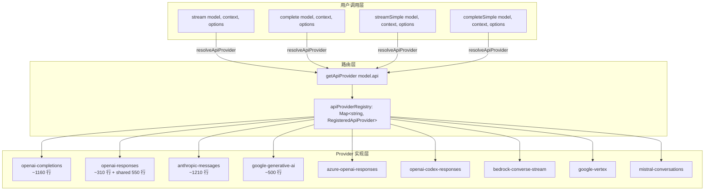
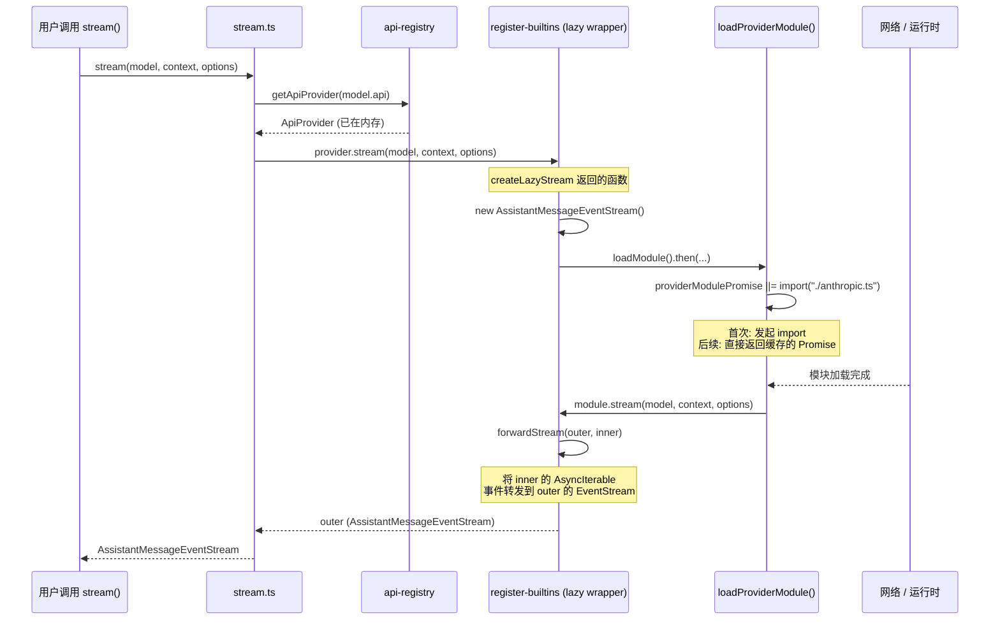

# 02 · LLM 抽象层（pi-ai）

Pi 的 `packages/ai`（`pi-ai`）是一个约 37K 行的多 provider 统一 LLM 抽象层。它提供 `stream()` / `complete()` / `streamSimple()` 三个 API 入口，通过 `api-registry` 路由到 9 种底层 wire protocol 实现，背后支持 30+ 个 provider。

**证据基准版本**：[fc8a1559017f1e581cfa971aa3cef11a507a4975](https://github.com/earendil-works/pi/blob/fc8a1559017f1e581cfa971aa3cef11a507a4975/packages/ai/)

---

## 1. 整体架构

用户调用 `stream()` / `complete()` / `streamSimple()` → 根据 `model.api` 查 `api-registry` → 找到对应 `ApiProvider` → 调用其 `stream()` / `streamSimple()` 实现。每个 `ApiProvider` 内部通过懒加载机制按需引入 provider 文件。



**证据**：

- `stream()` / `complete()` / `streamSimple()` 定义：[stream.ts L25-L59](https://github.com/earendil-works/pi/blob/fc8a1559017f1e581cfa971aa3cef11a507a4975/packages/ai/src/stream.ts#L25-L59)
- `complete()` 是 `stream().result()` 的语法糖，收集整个事件流后 resolve 最终 `AssistantMessage`
- `api-registry` 基于 `Map<string, RegisteredApiProvider>` 实现路由：[api-registry.ts L40-L81](https://github.com/earendil-works/pi/blob/fc8a1559017f1e581cfa971aa3cef11a507a4975/packages/ai/src/api-registry.ts#L40-L81)
- 9 个内置 provider 注册：[register-builtins.ts L345-L406](https://github.com/earendil-works/pi/blob/fc8a1559017f1e581cfa971aa3cef11a507a4975/packages/ai/src/providers/register-builtins.ts#L345-L406)

---

## 2. 四种 Wire Protocol（及扩展）

pi-ai 支持 9 种 API wire protocol，核心是 4 种——各自对应一个主流 LLM 厂商的原始 API 格式。其余 5 种是变体或兼容层：

| Wire Protocol | 对应厂商 | provider 示例 | 特点 |
|---|---|---|---|
| `openai-completions` | OpenAI Chat Completions | openai, deepseek, groq, openrouter, 20+ | 最广泛的兼容层，通过 `compat` 字段适配差异 |
| `openai-responses` | OpenAI Responses API | openai, azure-openai-responses | 新一代 API，原生 reasoning、prompt caching |
| `anthropic-messages` | Anthropic Messages | anthropic, fireworks | Claude Code stealth mode、extended thinking |
| `google-generative-ai` | Google Gemini | google | Gemini 3 的 thought signatures、function calling |
| `openai-codex-responses` | OpenAI Codex CLI | openai-codex | Codex CLI 兼容，WebSocket transport |
| `azure-openai-responses` | Azure OpenAI | azure-openai-responses | Azure 平台兼容 |
| `bedrock-converse-stream` | AWS Bedrock | amazon-bedrock | AWS SDK 鉴权，Node-only（不能浏览器） |
| `google-vertex` | Google Vertex AI | google-vertex | GCP 鉴权，ADC 凭据 |
| `mistral-conversations` | Mistral | mistral | Mistral 原生 API |

**API 类型定义**：[types.ts L6-L17](https://github.com/earendil-works/pi/blob/fc8a1559017f1e581cfa971aa3cef11a507a4975/packages/ai/src/types.ts#L6-L17)

```typescript
export type KnownApi =
  | "openai-completions"
  | "mistral-conversations"
  | "openai-responses"
  | "azure-openai-responses"
  | "openai-codex-responses"
  | "anthropic-messages"
  | "bedrock-converse-stream"
  | "google-generative-ai"
  | "google-vertex";

export type Api = KnownApi | (string & {});  // 支持自定义扩展
```

### 2.1 `openai-completions` —— 最广泛的兼容层

这是最复杂的 provider 实现（~1160 行），因为它不只是实现 OpenAI 原生 API，更是一个**多 provider 兼容适配器**。

兼容性通过 `OpenAICompletionsCompat` 接口控制，包含 20+ 个开关：[types.ts L365-L400](https://github.com/earendil-works/pi/blob/fc8a1559017f1e581cfa971aa3cef11a507a4975/packages/ai/src/types.ts#L365-L400)

关键差异化处理：

- **thinkingFormat**：6 种格式（openai、deepseek、openrouter、together、zai、qwen）映射不同 provider 的 reasoning 参数。例如 DeepSeek 用 `thinking: { type: "enabled" }`，Together 用 `reasoning: { enabled: true }`，z.ai 用顶层 `enable_thinking: boolean`
- **maxTokens 字段名**：大多数 provider 用 `max_completion_tokens`，但 chutes.ai、Moonshot、Cloudflare AI Gateway 等要用 `max_tokens`
- **tool result 格式**：部分 provider 要求 tool result 带 `name` 字段；部分要求 tool result 后必须插入 assistant 消息
- **严格模式**：`strict: false`，大部分 provider 接受，但 Moonshot / Together / Cloudflare AI Gateway 会拒绝，因此 `supportsStrictMode: false`
- **OpenRouter routing**：通过 `provider` 字段传递路由偏好
- **Vercel AI Gateway routing**：通过 `providerOptions.gateway` 字段传递路由偏好

**证据**：参数构建 [openai-completions.ts L503-L624](https://github.com/earendil-works/pi/blob/fc8a1559017f1e581cfa971aa3cef11a507a4975/packages/ai/src/providers/openai-completions.ts#L503-L624)，兼容性检测 [openai-completions.ts L1065-L1129](https://github.com/earendil-works/pi/blob/fc8a1559017f1e581cfa971aa3cef11a507a4975/packages/ai/src/providers/openai-completions.ts#L1065-L1129)

### 2.2 `openai-responses` —— 新一代 API

OpenAI Responses API 相比 Chat Completions 的差异：

- 原生的 `reasoning` 类型（reasoning content 和 text content 分离）
- `prompt_cache_key` + `prompt_cache_retention` 内置支持
- `service_tier` 支持（flex vs default pricing）
- 更复杂的消息格式转换（`convertResponsesMessages` → Shared Module `openai-responses-shared.ts`，~550 行）

**证据**：[openai-responses.ts L81-L157](https://github.com/earendil-works/pi/blob/fc8a1559017f1e581cfa971aa3cef11a507a4975/packages/ai/src/providers/openai-responses.ts#L81-L157)

### 2.3 `anthropic-messages` —— Claude Code Stealth Mode

Anthropic provider 的特色：

- **Claude Code stealth mode**：当检测到工具名为 Claude Code 标准工具（Read、Write、Edit、Bash、Grep 等 21 个），自动转换名称到 Claude Code 官方大小写；返回时反向映射恢复用户定义的工具名
- **自定义 SSE 解析器**：绕过 `@anthropic-ai/sdk` 的事件解析，直接实现 SSE stream 解析以获取更细粒度的事件控制（`message_start`、`content_block_start` 等 7 种事件类型）
- **Extended Thinking**：支持 adaptive thinking（effort 模式）和 budget-based thinking（token 预算模式）
- **Cache Control**：Anthropic 原生 `cache_control: { type: "ephemeral" }` 标记到 system prompt、最后一个 tool 定义、最后一对 user/assistant 消息

**证据**：Claude Code 工具映射 [anthropic.ts L70-L106](https://github.com/earendil-works/pi/blob/fc8a1559017f1e581cfa971aa3cef11a507a4975/packages/ai/src/providers/anthropic.ts#L70-L106)，SSE 解析器 [anthropic.ts L255-L280](https://github.com/earendil-works/pi/blob/fc8a1559017f1e581cfa971aa3cef11a507a4975/packages/ai/src/providers/anthropic.ts#L255-L280)

### 2.4 `google-generative-ai` —— Thought Signatures

Google provider 使用 `@google/genai` SDK，其独特概念：

- **Thought Signatures**：加密的推理上下文，可在多轮对话中回传以保持推理连续性。签名可以出现在任何 part 类型上（text、functionCall 等），`thought: true` 是判断 thinking content 的标记
- **Google Thinking Level**：Gemini 3 模型专用的枚举 `THINKING_LEVEL_UNSPECIFIED / MINIMAL / LOW / MEDIUM / HIGH`

**证据**：[google-shared.ts L12-L35](https://github.com/earendil-works/pi/blob/fc8a1559017f1e581cfa971aa3cef11a507a4975/packages/ai/src/providers/google-shared.ts#L12-L35)

---

## 3. API 表面：stream / complete / streamSimple

pi-ai 对外暴露两条调用路径：

| API | 输入 | 输出 | 用途 |
|---|---|---|---|
| `stream()` | `Model<TApi>`, `Context`, `StreamOptions` | `AssistantMessageEventStream` | 底层控制，直接传 provider 原生参数 |
| `complete()` | 同上 | `Promise<AssistantMessage>` | `stream().result()` 的语法糖 |
| `streamSimple()` | `Model<TApi>`, `Context`, `SimpleStreamOptions` | `AssistantMessageEventStream` | 高层抽象，自动处理 reasoning level、token 预算 |
| `completeSimple()` | 同上 | `Promise<AssistantMessage>` | `streamSimple().result()` 的语法糖 |

`SimpleStreamOptions` 在 `StreamOptions` 基础上增加 `reasoning?: ThinkingLevel` 和 `thinkingBudgets?: ThinkingBudgets`，使调用方只需关心 "想多深"（`minimal / low / medium / high / xhigh`），provider 内部自动映射到对应 API 参数。

**证据**：[stream.ts L25-L59](https://github.com/earendil-works/pi/blob/fc8a1559017f1e581cfa971aa3cef11a507a4975/packages/ai/src/stream.ts#L25-L59)，[simple-options.ts](https://github.com/earendil-works/pi/blob/fc8a1559017f1e581cfa971aa3cef11a507a4975/packages/ai/src/providers/simple-options.ts)

### 事件流协议

所有 `stream()` 返回的 `AssistantMessageEventStream` 遵循统一事件协议 [types.ts L347-L359](https://github.com/earendil-works/pi/blob/fc8a1559017f1e581cfa971aa3cef11a507a4975/packages/ai/src/types.ts#L347-L359)：

```typescript
export type AssistantMessageEvent =
  | { type: "start"; partial: AssistantMessage }
  | { type: "text_start"; contentIndex: number; partial: AssistantMessage }
  | { type: "text_delta"; contentIndex: number; delta: string; partial: AssistantMessage }
  | { type: "text_end"; contentIndex: number; content: string; partial: AssistantMessage }
  | { type: "thinking_start"; contentIndex: number; partial: AssistantMessage }
  | { type: "thinking_delta"; contentIndex: number; delta: string; partial: AssistantMessage }
  | { type: "thinking_end"; contentIndex: number; content: string; partial: AssistantMessage }
  | { type: "toolcall_start"; contentIndex: number; partial: AssistantMessage }
  | { type: "toolcall_delta"; contentIndex: number; delta: string; partial: AssistantMessage }
  | { type: "toolcall_end"; contentIndex: number; toolCall: ToolCall; partial: AssistantMessage }
  | { type: "done"; reason: StopReason; message: AssistantMessage }
  | { type: "error"; reason: "aborted" | "error"; error: AssistantMessage };
```

关键设计：
- `start` 在流开始时发送，携带初始的 `AssistantMessage`
- `text/text_delta` / `thinking_delta` / `toolcall_delta` 在生成过程中增量推送
- `done` 携带最终成功的完整消息
- `error` 携带 `stopReason: "error" | "aborted"` 的完整消息（**合同条款**：错误编码到流中，不抛异常）

### EventStream 实现

`EventStream<T, R>` 是一个通用事件总线：[event-stream.ts L1-L67](https://github.com/earendil-works/pi/blob/fc8a1559017f1e581cfa971aa3cef11a507a4975/packages/ai/src/utils/event-stream.ts#L1-L67)

- 内部队列 + consumer 等待链，当无 consumer 时事件入队，有 consumer 时直接分发
- `push()` 检测完成事件时自动 resolve `finalResultPromise`
- `end()` 通知所有等待 consumer 流结束
- `result()` 返回 `Promise<R>`，等待流终止

---

## 4. 懒加载 Provider（动态 import + Promise 缓存）

pi-ai 的重要设计：provider 模块在**首次使用**时才通过动态 `import()` 加载，避免启动时加载所有 provider 的 SDK 依赖。



**三个关键设计决策**：

1. **Promise 缓存** (`||=`)：每个 provider 只有一个 `Promise` 实例，确保并发调用只触发一次 import。例如 [register-builtins.ts L209](https://github.com/earendil-works/pi/blob/fc8a1559017f1e581cfa971aa3cef11a507a4975/packages/ai/src/providers/register-builtins.ts#L209)：
   ```typescript
   anthropicProviderModulePromise ||= import("./anthropic.ts").then((module) => { ... });
   ```

2. **双层 Stream 架构**：`createLazyStream()` 立即返回一个 `outer` stream，在 `loadModule()` 完成后将 `inner` stream 的事件通过 `forwardStream()` 转发过去。这样即使 import 尚未完成，调用方也能订阅事件。

3. **错误容错**：懒加载失败时不会崩溃，而是 emit `error` 事件到 stream，携带 `createLazyLoadErrorMessage()` 构建的错误消息 [register-builtins.ts L141-L160](https://github.com/earendil-works/pi/blob/fc8a1559017f1e581cfa971aa3cef11a507a4975/packages/ai/src/providers/register-builtins.ts#L141-L160)

**特殊处理**：Bedrock provider 依赖 AWS SDK（Node-only），使用 `importNodeOnlyProvider()` 来处理 `.ts` → `.js` 路径转换，并支持通过 `setBedrockProviderModule()` 注入外部实现 [register-builtins.ts L89-L92](https://github.com/earendil-works/pi/blob/fc8a1559017f1e581cfa971aa3cef11a507a4975/packages/ai/src/providers/register-builtins.ts#L89-L92)

**注册流程**：
- `stream.ts` 开头 `import "./providers/register-builtins.ts"` 触发模块加载
- `register-builtins.ts` 末尾调用 `registerBuiltInApiProviders()` 将 9 个 lazy wrapper 注册到 `api-registry` [register-builtins.ts L406](https://github.com/earendil-works/pi/blob/fc8a1559017f1e581cfa971aa3cef11a507a4975/packages/ai/src/providers/register-builtins.ts#L406)

---

## 5. 模型注册表（Model Registry）

`models.generated.ts` 是一个**自动生成**的文件（~16K 行），包含 30+ provider、数百个模型的完整元数据。

**证据**：
- 自动生成脚本：[scripts/generate-models.ts](https://github.com/earendil-works/pi/blob/fc8a1559017f1e581cfa971aa3cef11a507a4975/packages/ai/scripts/generate-models.ts)（~1947 行）
- 生成文件：[models.generated.ts](https://github.com/earendil-works/pi/blob/fc8a1559017f1e581cfa971aa3cef11a507a4975/packages/ai/src/models.generated.ts)（~16K 行）

### 数据来源

- **OpenRouter API**：通过 OpenRouter 的 models 接口获取大量第三方模型的价格、context window、reasoning 支持等信息
- **models.dev API**：获取模型能力和限制信息
- **Cloudflare AI Gateway**：获取 Cloudflare 托管的模型列表
- **手动维护**：特殊 provider（如 GitHub Copilot、Kimi）的 headers 和 compat 配置在脚本中硬编码

### 模型数据结构

```typescript
export const MODELS = {
  "amazon-bedrock": {
    "amazon.nova-2-lite-v1:0": {
      id: "amazon.nova-2-lite-v1:0",
      name: "Nova 2 Lite",
      api: "bedrock-converse-stream",
      provider: "amazon-bedrock",
      baseUrl: "https://bedrock-runtime.us-east-1.amazonaws.com",
      reasoning: false,
      input: ["text", "image"],
      cost: { input: 0.33, output: 2.75, cacheRead: 0, cacheWrite: 0 },
      contextWindow: 128000,
      maxTokens: 4096,
    } satisfies Model<"bedrock-converse-stream">,
    // ... 更多模型
  },
  // ... 更多 provider
};
```

### 模型查询 API

[models.ts L20-L37](https://github.com/earendil-works/pi/blob/fc8a1559017f1e581cfa971aa3cef11a507a4975/packages/ai/src/models.ts#L20-L37)

```typescript
// 按 provider + modelId 精确查找，类型安全
getModel("openai", "gpt-5.1")

// 获取某个 provider 的所有模型
getModels("openai")

// 获取所有 provider 列表
getProviders()
```

### Thinking Level 映射

每个模型有 `thinkingLevelMap` 字段，将 pi 的抽象 thinking level 映射到 provider 特定值。

[models.ts L50-L58](https://github.com/earendil-works/pi/blob/fc8a1559017f1e581cfa971aa3cef11a507a4975/packages/ai/src/models.ts#L50-L58)：

```typescript
export function getSupportedThinkingLevels(model: Model): ModelThinkingLevel[] {
  if (!model.reasoning) return ["off"];
  return ["off", "minimal", "low", "medium", "high", "xhigh"].filter((level) => {
    const mapped = model.thinkingLevelMap?.[level];
    if (mapped === null) return false;   // null = 不支持
    if (level === "xhigh") return mapped !== undefined;
    return true;
  });
}
```

`clampThinkingLevel()` 函数 ：当请求的 level 不支持时，向上或向下查找最近可用级别。

### 成本计算

[models.ts L39-L46](https://github.com/earendil-works/pi/blob/fc8a1559017f1e581cfa971aa3cef11a507a4975/packages/ai/src/models.ts#L39-L46)：基于模型定价（$/M tokens）和实际 token 用量计算，区分 input、output、cacheRead、cacheWrite 四项。

### API Key 获取

[env-api-keys.ts](https://github.com/earendil-works/pi/blob/fc8a1559017f1e581cfa971aa3cef11a507a4975/packages/ai/src/env-api-keys.ts) 提供 `getEnvApiKey(provider)` → 自动查找对应环境变量：

| Provider | 环境变量 |
|---|---|
| openai | `OPENAI_API_KEY` |
| anthropic | `ANTHROPIC_OAUTH_TOKEN` / `ANTHROPIC_API_KEY` |
| google | `GEMINI_API_KEY` |
| deepseek | `DEEPSEEK_API_KEY` |
| groq | `GROQ_API_KEY` |
| openrouter | `OPENROUTER_API_KEY` |
| ... 28+ provider | 各自的环境变量 |

特殊处理：
- **Google Vertex**：优先 `GOOGLE_CLOUD_API_KEY`，其次检查 ADC（Application Default Credentials）
- **AWS Bedrock**：支持 6 种凭据来源（`AWS_PROFILE`、`AWS_ACCESS_KEY_ID`+`AWS_SECRET_ACCESS_KEY`、`AWS_BEARER_TOKEN_BEDROCK`、ECS Task Role、IRSA）
- **Bun bug 绕过**：Bun 编译的二进制在 sandbox 中 `process.env` 为空，通过读取 `/proc/self/environ` 恢复环境变量

---

## 6. Provider 对比

| Provider | API Wire Protocol | 模块大小 | 特色能力 | 瓶颈 |
|---|---|---|---|---|
| openai-completions | openai-completions | ~1160 行 | 6 种 thinking format、OpenRouter routing、Vercel Gateway routing、20+ compat 开关 | 兼容性迷宫 |
| openai-responses | openai-responses | ~310 + 550 行 | prompt caching 原生、reasoning summary、service_tier | 新 API，provider 少 |
| anthropic-messages | anthropic-messages | ~1210 行 | Claude Code stealth mode、自定义 SSE 解析、adaptive thinking、cache control | 仅 Claude 系列模型 |
| google-generative-ai | google-generative-ai | ~500 行 | thought signatures、Gemini 3 thinking levels、functionCall 原生 | Gemini 特有协议 |
| google-vertex | google-vertex | ~700 行 | GCP ADC 鉴权、与 google-generative-ai 共享消息转换逻辑 | GCP 绑定 |
| openai-codex-responses | openai-codex-responses | ~310 + 共享 | WebSocket transport、Codex CLI 兼容 | Codex 专用 |
| azure-openai-responses | azure-openai-responses | ~300 行 | Azure 鉴权、与 openai-responses 共享核心逻辑 | Azure 绑定 |
| bedrock-converse-stream | bedrock-converse-stream | ~600 行 | AWS SDK 鉴权、Node-only | 不能浏览器 |
| mistral-conversations | mistral-conversations | ~350 行 | Mistral 原生 API | 仅 Mistral 模型 |

---

## 7. 上下文传递（Context Handoff）

当对话在不同 provider/模型之间切换时（例如先用 DeepSeek 推理、再用 GPT-5 总结），需要处理消息格式的差异。这个责任落在 `transformMessages()` 函数。

**证据**：[transform-messages.ts L59-L219](https://github.com/earendil-works/pi/blob/fc8a1559017f1e581cfa971aa3cef11a507a4975/packages/ai/src/providers/transform-messages.ts#L59-L219)

### 处理策略

| 转换场景 | 策略 | 证据 |
|---|---|---|
| 非 vision 模型遇到图片 | 替换为占位文本 `(image omitted: model does not support images)` | [L15-L33](https://github.com/earendil-works/pi/blob/fc8a1559017f1e581cfa971aa3cef11a507a4975/packages/ai/src/providers/transform-messages.ts#L15-L33) |
| thinking → text | 跨模型时 thinking blocks 转为纯文本 | [L109-L113](https://github.com/earendil-works/pi/blob/fc8a1559017f1e581cfa971aa3cef11a507a4975/packages/ai/src/providers/transform-messages.ts#L109-L113) |
| redacted thinking | 加密的 thinking 只在同模型间保留，跨模型丢弃 | [L100-L103](https://github.com/earendil-works/pi/blob/fc8a1559017f1e581cfa971aa3cef11a507a4975/packages/ai/src/providers/transform-messages.ts#L100-L103) |
| toolCall ID 规范化 | OpenAI Responses API 的 ID 450+ 字符含特殊符号 → 截断+净化到 40 字符 `[a-zA-Z0-9_-]` | [L748-L761](https://github.com/earendil-works/pi/blob/fc8a1559017f1e581cfa971aa3cef11a507a4975/packages/ai/src/providers/openai-completions.ts#L748-L761) |
| orphaned tool calls | 没有 toolResult 的 tool call → 插入 synthetic error result | [L157-L177](https://github.com/earendil-works/pi/blob/fc8a1559017f1e581cfa971aa3cef11a507a4975/packages/ai/src/providers/transform-messages.ts#L157-L177) |
| error/aborted 消息 | 不完整轮次（stopReason "error"/"aborted"）直接丢弃 | [L191-L194](https://github.com/earendil-works/pi/blob/fc8a1559017f1e581cfa971aa3cef11a507a4975/packages/ai/src/providers/transform-messages.ts#L191-L194) |
| user after toolResult | 部分 provider 要求在 tool 消息和 user 消息之间插入 synthetic assistant | [L777-L781](https://github.com/earendil-works/pi/blob/fc8a1559017f1e581cfa971aa3cef11a507a4975/packages/ai/src/providers/openai-completions.ts#L777-L781) |
| 空 assistant 消息 | 无 content 且无 tool_calls 的消息跳过 | [L904-L911](https://github.com/earendil-works/pi/blob/fc8a1559017f1e581cfa971aa3cef11a507a4975/packages/ai/src/providers/openai-completions.ts#L904-L911) |

### 双 Pass 架构

`transformMessages()` 使用两阶段处理：
1. **Pass 1**：逐消息转换（图片降级、thinking → text、ID 规范化）
2. **Pass 2**：扫描并修复 tool call/tool result 配对，插入 synthetic tool results 确保会话完整性

---

## 8. 结构化 Tool Result（LLM 专用 vs UI 详情）

`ToolResultMessage` 类型设计为两部分内容：

```typescript
export interface ToolResultMessage<TDetails = any> {
  role: "toolResult";
  toolCallId: string;
  toolName: string;
  content: (TextContent | ImageContent)[];  // 发送给 LLM 的文本
  details?: TDetails;                        // UI 展示的结构化数据
  isError: boolean;
  timestamp: number;
}
```

**证据**：[types.ts L292-L300](https://github.com/earendil-works/pi/blob/fc8a1559017f1e581cfa971aa3cef11a507a4975/packages/ai/src/types.ts#L292-L300)

这个设计的意图：
- `content` 是序列化为文本的内容，会被发送到 LLM（如 "文件读取成功，共 300 行"）
- `details` 是给 UI 的结构化数据（如完整的文件内容、语法高亮信息），不发送给 LLM

在 `convertMessages()` 中（[openai-completions.ts L913-L978](https://github.com/earendil-works/pi/blob/fc8a1559017f1e581cfa971aa3cef11a507a4975/packages/ai/src/providers/openai-completions.ts#L913-L978)），tool result 被转换为 OpenAI 的 tool message 格式时：
- 只提取 `content` 中的 text blocks → 构建 `role: "tool"` 消息的 `content` 字段
- 图片 block 被分离出来，作为独立的 user 消息附加到 tool result 之后
- `details` 字段完全不被触及

---

## 9. AbortSignal 全链路支持

pi-ai 在所有 provider 中实现了完整的 AbortSignal 管道：

### 传递路径

```
StreamOptions.signal
  → OpenAI SDK { signal: options.signal }
  → Anthropic SDK { signal: options.signal }
  → Google SDK (AbortSignal)
  → 自定义 SSE 解析器
```

**证据**：

- OpenAI Completions：[openai-completions.ts L150](https://github.com/earendil-works/pi/blob/fc8a1559017f1e581cfa971aa3cef11a507a4975/packages/ai/src/providers/openai-completions.ts#L150) — `{ signal: options.signal }`
- OpenAI Responses：[openai-responses.ts L120](https://github.com/earendil-works/pi/blob/fc8a1559017f1e581cfa971aa3cef11a507a4975/packages/ai/src/providers/openai-responses.ts#L120) — 同样格式
- Anthropic：[anthropic.ts L513](https://github.com/earendil-works/pi/blob/fc8a1559017f1e581cfa971aa3cef11a507a4975/packages/ai/src/providers/anthropic.ts#L513) — `{ signal: options.signal }`
- Anthropic SSE 解析器：[anthropic.ts L349](https://github.com/earendil-works/pi/blob/fc8a1559017f1e581cfa971aa3cef11a507a4975/packages/ai/src/providers/anthropic.ts#L349) — 自定义 `iterateSseMessages()` 接受 `signal`，在每次迭代检查 `signal?.aborted`

### 终止后处理

所有 provider 在流处理完成后执行两次检查：

1. **SDK 层**：`signal.aborted` 检查，若在流解析期间被取消则抛出 "Request was aborted"
2. **流层**：如果输出消息的 `stopReason === "aborted"`，也抛异常

**证据**：[openai-completions.ts L390-L402](https://github.com/earendil-works/pi/blob/fc8a1559017f1e581cfa971aa3cef11a507a4975/packages/ai/src/providers/openai-completions.ts#L390-L402)

**异常捕获**：所有 provider 在 catch 块中区分 abort 和 error：
```typescript
output.stopReason = options?.signal?.aborted ? "aborted" : "error";
output.errorMessage = error instanceof Error ? error.message : JSON.stringify(error);
stream.push({ type: "error", reason: output.stopReason, error: output });
stream.end();
```

---

## 10. TypeBox + AJV 工具参数验证

pi-ai 使用 TypeBox 定义工具参数 schema，运行时通过 AJV（via `typebox/compile`）验证 LLM 返回的 tool call arguments。

**证据**：[validation.ts](https://github.com/earendil-works/pi/blob/fc8a1559017f1e581cfa971aa3cef11a507a4975/packages/ai/src/utils/validation.ts)

### 验证流程

```
Tool.parameters (TypeBox schema)
  → Value.Convert(schema, args)      // TypeBox 内置转换
  → Compile(schema)                   // 编译为 AJV validator
  → validator.Check(args)             // 快速检查
  → validator.Errors(args)            // 失败时生成详细错误
  → 格式化错误消息抛给 LLM
```

### 智能类型强制转换

`validation.ts` 实现了一个完整的 JSON Schema 类型强制转换器（`coerceWithJsonSchema()`），在验证失败前尝试修复 LLM 输出中的类型不匹配：

| 目标类型 | 强制转换规则 |
|---|---|
| `number` | `null` → 0；字符串 `"123"` → 123；`boolean` → 1/0 |
| `integer` | 同上，额外要求整数 |
| `boolean` | `null` → false；字符串 `"true"/"false"` 转换；数字 1/0 转换 |
| `string` | `null` → ""；number/boolean → String() |
| `null` | `""`, `0`, `false` → null |
| `object` | 递归应用 property 强制转换 |
| `array` | 逐元素应用 items schema 强制转换 |
| `union` (anyOf/oneOf) | 对每个 member 尝试转换+验证，取第一个匹配的 |

**证据**：[validation.ts L77-L149](https://github.com/earendil-works/pi/blob/fc8a1559017f1e581cfa971aa3cef11a507a4975/packages/ai/src/utils/validation.ts#L77-L149)

### 验证器缓存

AJV validator 编译开销大，因此使用 `WeakMap` 缓存：[validation.ts L6](https://github.com/earendil-works/pi/blob/fc8a1559017f1e581cfa971aa3cef11a507a4975/packages/ai/src/utils/validation.ts#L6)

```typescript
const validatorCache = new WeakMap<object, ReturnType<typeof Compile>>();
```

### 兼容性设计

- **TypeBox metadata 检测**：通过 `Symbol.for("TypeBox.Kind")` 判断是否为 TypeBox schema [validation.ts L27-L29](https://github.com/earendil-works/pi/blob/fc8a1559017f1e581cfa971aa3cef11a507a4975/packages/ai/src/utils/validation.ts#L27-L29)
- **纯 JSON Schema 降级路径**：如果不是 TypeBox schema（比如用户用纯 JSON Schema 定义），使用自定义的 JSON Schema 强制转换逻辑
- **Google 兼容枚举**：`StringEnum()` helper 生成 `{ type: "string", enum: [...] }` 格式，兼容 Google API 不支持 `anyOf/const` 的问题

**证据**：[typebox-helpers.ts L1-L24](https://github.com/earendil-works/pi/blob/fc8a1559017f1e581cfa971aa3cef11a507a4975/packages/ai/src/utils/typebox-helpers.ts#L1-L24)

---

## 11. 其他关键细节

### Session 资源管理

[session-resources.ts](https://github.com/earendil-works/pi/blob/fc8a1559017f1e581cfa971aa3cef11a507a4975/packages/ai/src/session-resources.ts) 提供全局 session 资源清理机制：
- `registerSessionResourceCleanup()` 注册清理函数
- `cleanupSessionResources(sessionId?)` 按需触发清理
- 适用于 WebSocket 连接、缓存条目等需要手动释放的资源

### Context Overflow 检测

[overflow.ts](https://github.com/earendil-works/pi/blob/fc8a1559017f1e581cfa971aa3cef11a507a4975/packages/ai/src/utils/overflow.ts) 提供统一的 context 溢出检测：

- **模式 1（显式错误）**：20 个正则匹配 15+ provider 的溢出错误消息
- **模式 2（静默溢出）**：z.ai 成功返回但 `usage.input > contextWindow` → 判定溢出
- **模式 3（截断溢出）**：Xiaomi MiMo 截断超大输入后返回 `stopReason: "length"` + `output: 0` → 判定溢出
- 排除规则：`NON_OVERFLOW_PATTERNS` 过滤掉 throttling / rate limit 等非溢出错误

### JSON 修复与流式解析

[json-parse.ts](https://github.com/earendil-works/pi/blob/fc8a1559017f1e581cfa971aa3cef11a507a4975/packages/ai/src/utils/json-parse.ts)：
- `repairJson()` — 修复 LLM 生成的畸形 JSON（未转义的控制字符、无效转义序列）
- `parseStreamingJson()` — 流式解析不完整 JSON，回退链：`JSON.parse` → `repairJson + JSON.parse` → `partial-json` → `repairJson + partial-json` → `{}`

### Image 子系统

image 生成（`generateImages()`）与 LLM 调用平行但独立：
- 独立的 registry：`images-api-registry.ts` 和 `image-models.ts`
- 独立的类型：`ImagesModel`、`ImagesContext`、`AssistantImages`
- 目前仅支持 `openrouter-images` API

---

## 关键结论

1. **统一抽象，分化实现**：`stream()` / `complete()` 提供统一入口，`api-registry` 根据 `model.api` 路由到对应 wire protocol 实现。这种设计使调用方感知不到 provider 差异。

2. **懒加载是性能关键**：真正的 provider 模块通过动态 `import()` + Promise 缓存实现按需加载，避免 ~37K 行代码全量加载。双层 Stream（outer + inner）确保 import 期间调用方不阻塞。

3. **`openai-completions` 是兼容层枢纽**：它不只是 OpenAI API，更是 20+ provider 的统一适配器。`compat` 对象通过 20+ 个开关处理字段名差异、参数格式差异、behavior 差异。Thinking format 的 6 种变体是这个设计的缩影。

4. **上下文传递是跨 provider 的关键挑战**：`transformMessages()` 的双 pass 结构处理了 ID 规范化、图片降级、thinking → text 转换、orphaned tool call 修复、error 消息丢弃等 7+ 种场景。

5. **错误不抛异常**：provider 的 `StreamFunction` 合同规定：所有错误编码到 event stream 中（`error` 事件），不 throw。这使得上层可以统一处理错误，不受 provider 实现差异影响。

6. **TypeBox + 强制转换提供 LLM 输出的容错性**：LLM 经常返回类型不匹配的参数（如字符串 `"10"` 而非数字 `10`）。TypeBox 的 `Value.Convert` + 自定义 JSON Schema 强制转换器在 AJV 验证前尝试修复，大幅降低验证失败率。

7. **AbortSignal 是基础设施而非可选项**：所有 9 个 provider 实现都贯穿 AbortSignal，从 SDK 层到自定义 SSE 解析器层，确保取消操作即时生效且资源正确释放。

8. **模型数据由脚本生成，非手动维护**：`models.generated.ts`（16K 行）由 `scripts/generate-models.ts`（~1947 行）从 OpenRouter API + models.dev + Cloudflare AI Gateway 聚合生成，确保模型列表、价格、能力信息始终最新。
