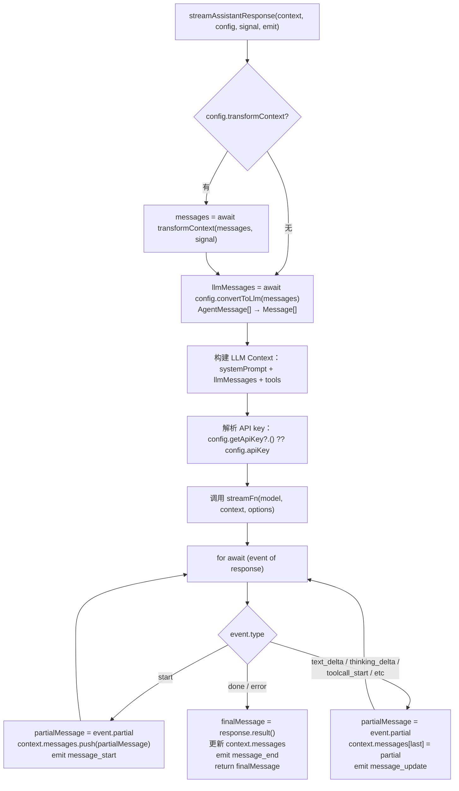
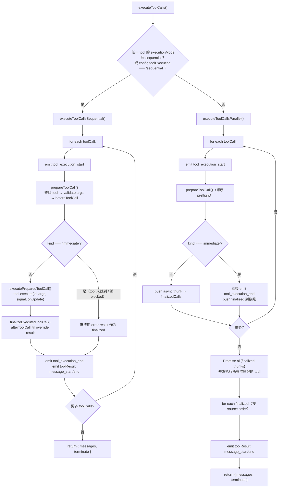
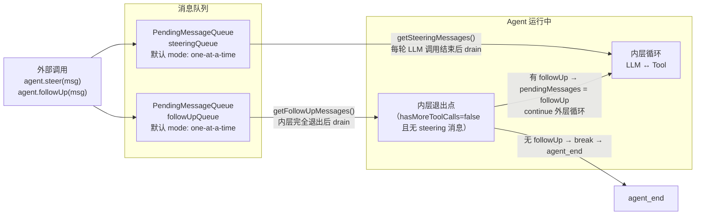

# 03 · Agent 循环（pi-agent-core）

> **源码：** [earendil-works/pi](https://github.com/earendil-works/pi)
> **基准版本：** [`fc8a1559`](https://github.com/earendil-works/pi/commit/fc8a1559017f1e581cfa971aa3cef11a507a4975)
> **核心文件：** `packages/agent/src/agent-loop.ts`（742 行）、`packages/agent/src/agent.ts`（557 行）、`packages/agent/src/types.ts`（418 行）
> **npm 包：** `@mariozechner/pi-agent-core`

---

## 概述

pi-agent-core 是 Pi 的 agent 循环引擎，实现了经典的 **LLM → tool calls → tool results → LLM** 循环。它提供了两层 API：

| API 层级 | 入口 | 职责 |
|----------|------|------|
| 低层 API | `agentLoop()` / `agentLoopContinue()` | 纯函数，返回 `EventStream`，无状态管理 |
| 高层 API | `Agent` 类 | 有状态封装，事件订阅、双队列、屏障语义 |

低层 API 是无状态的函数式接口——它不持有任何内部状态，只负责驱动「LLM 调用 → 工具执行 → 下一轮」这个循环。高层 `Agent` 类在此基础上添加了消息队列、状态管理、事件屏障等机制。

两者的核心逻辑最终都汇聚到同一个函数：`runLoop()`。

---

## 1. 三个入口的差异

### agentLoop()

```typescript
// agent-loop.ts:31-54
export function agentLoop(
  prompts: AgentMessage[],
  context: AgentContext,
  config: AgentLoopConfig,
  signal?: AbortSignal,
  streamFn?: StreamFn,
): EventStream<AgentEvent, AgentMessage[]>
```

**用途：** 启动一次新的 agent 执行。把传入的 `prompts` 追加到 `context.messages` 末尾，然后进入循环。

**核心流程：** 创建 `EventStream` → 调用 `runAgentLoop()`（fire-and-forget） → 返回 stream。

`runAgentLoop()` 做的事很简单：

```typescript
// agent-loop.ts:95-118
export async function runAgentLoop(...) {
  const newMessages: AgentMessage[] = [...prompts];
  const currentContext: AgentContext = {
    ...context,
    messages: [...context.messages, ...prompts],  // 把 prompts 追加到 context
  };
  await emit({ type: "agent_start" });
  await emit({ type: "turn_start" });
  for (const prompt of prompts) {
    await emit({ type: "message_start", message: prompt });
    await emit({ type: "message_end", message: prompt });
  }
  await runLoop(currentContext, newMessages, config, signal, emit, streamFn);
}
```

关键在于：prompts 被同时记入 `currentContext.messages`（供 LLM 请求使用）和 `newMessages`（最终返回值），然后进入 `runLoop()`。

### agentLoopContinue()

```typescript
// agent-loop.ts:64-93
export function agentLoopContinue(
  context: AgentContext,
  config: AgentLoopConfig,
  signal?: AbortSignal,
  streamFn?: StreamFn,
): EventStream<AgentEvent, AgentMessage[]>
```

**用途：** 从当前 context 继续执行，**不添加新消息**。典型场景是出错后重试——context 已经包含了 user message 或 tool result，不需要再插入新消息。

**关键约束（agent-loop.ts:70-77）：**

- `context.messages` 不能为空
- 最后一条消息的 `role` 不能是 `"assistant"`（LLM 要求 user/toolResult 作为输入）

`runAgentLoopContinue()` 与 `runAgentLoop()` 的结构基本一致，但它不追加 prompts，`newMessages` 初始为空数组。

### Agent 类

```typescript
// agent.ts:166
export class Agent
```

`Agent` 是有状态的高层封装，它：

1. **持有内部状态**（`_state: MutableAgentState`）：messages、tools、model、thinkingLevel 等
2. **管理双队列**：`steeringQueue`、`followUpQueue`（通过 `PendingMessageQueue` 类）
3. **提供事件订阅**：`subscribe()` → `listeners: Set<(event, signal) => void>`
4. **实现屏障语义**：`processEvents()` 先更新内部 state，再 await 所有 listener

`Agent.prompt()` 和 `Agent.continue()` 内部最终调用 `runAgentLoop()` / `runAgentLoopContinue()`（agent.ts:386-411），但在此之前做了关键的事：

```typescript
// agent.ts:422-448
private createLoopConfig(options = {}): AgentLoopConfig {
  return {
    model: this._state.model,
    reasoning: ...,
    convertToLlm: this.convertToLlm,
    transformContext: this.transformContext,
    // 把 PendingMessageQueue.drain() 绑定为 getSteeringMessages / getFollowUpMessages
    getSteeringMessages: async () => this.steeringQueue.drain(),
    getFollowUpMessages: async () => this.followUpQueue.drain(),
    ...
  };
}
```

这意味着低层 `runLoop()` 在每轮循环中通过回调来消费 Agent 层的队列，而 Agent 层完全不知道循环的内部细节。

---

## 2. runLoop()：双层循环结构

```mermaid
flowchart TD
    START["入口：runLoop()"] --> CHECK_FIRST{firstTurn?}
    CHECK_FIRST -->|是| FIRST["poll steering 队列（初始）"]
    CHECK_FIRST -->|否| TURN_START["emit turn_start"]

    FIRST --> OUTER_START["外层 while(true) 开始"]
    OUTER_START --> RESET["reset hasMoreToolCalls = true"]

    RESET --> INNER{"内层 while 条件<br/>hasMoreToolCalls<br/>或 pendingMessages > 0"}
    INNER -->|否| FOLLOWUP["外层检查 followUp 队列"]
    FOLLOWUP -->|有消息| SET_PENDING["pendingMessages = followUpMessages<br/>continue 外层"]
    FOLLOWUP -->|无消息| BREAK["break 外层循环 → agent_end"]

    INNER -->|是| TURN_START_EVENT["emit turn_start（非首轮）"]
    TURN_START_EVENT --> INJECT["注入 pendingMessages<br/>到 context.messages + newMessages"]
    INJECT --> STREAM["streamAssistantResponse()<br/>LLM 调用 + 事件流"]
    STREAM --> CHECK_ERR{stopReason<br/>是 error 或 aborted?}
    CHECK_ERR -->|是| END_ERR["emit turn_end + agent_end → 返回"]
    CHECK_ERR -->|否| TOOL_CALLS["提取 assistantMessage 中的 toolCall blocks"]
    TOOL_CALLS --> HAS_TOOLS{有 toolCalls?}
    HAS_TOOLS -->|否| TURN_END
    HAS_TOOLS -->|是| EXEC["executeToolCalls()"]
    EXEC --> TERMINATE{terminate?}
    TERMINATE -->|true| F_TOOL["hasMoreToolCalls = false"]
    TERMINATE -->|false| T_TOOL["hasMoreToolCalls = true"]
    F_TOOL --> TURN_END["emit turn_end"]
    T_TOOL --> TURN_END

    TURN_END --> PREPARE["config.prepareNextTurn?()<br/>可选替换下一轮的 model/thinkingLevel"]
    PREPARE --> SHOULD_STOP{config.shouldStopAfterTurn?()}
    SHOULD_STOP -->|true| AGENT_END["emit agent_end → 返回"]
    SHOULD_STOP -->|false| STEER_POLL["poll steering 队列"]
    STEER_POLL --> INNER
```

这是 `runLoop()`（agent-loop.ts:155-269）的完整流程，核心设计是一个**双层循环**：

### 外层循环：处理 followUp

```typescript
while (true) {                          // 外层
  let hasMoreToolCalls = true;

  while (hasMoreToolCalls || pendingMessages.length > 0) {  // 内层
    // ...
  }

  // 内层退出 = agent 没有更多 tool calls，也没有 steering 消息
  // 此时检查 followUp 队列
  const followUpMessages = (await config.getFollowUpMessages?.()) || [];
  if (followUpMessages.length > 0) {
    pendingMessages = followUpMessages;  // 注入内层循环
    continue;                            // 外层继续
  }
  break;  // 真正结束
}
```

### 内层循环：处理 steering + tool calls

内层循环在两种条件下继续：
1. `hasMoreToolCalls === true`：上一轮 LLM 返回了 tool calls，且不是全部 terminate
2. `pendingMessages.length > 0`：有 steering 或 followUp 消息等待注入

每轮内层的核心步骤：

1. **注入 pendingMessages**（agent-loop.ts:183-189）：将这些消息 emit 为 `message_start` / `message_end` 事件，并追加到 context 和 newMessages
2. **调 LLM**（agent-loop.ts:192-193）：`streamAssistantResponse()` 
3. **执行工具**（agent-loop.ts:203-216）：`executeToolCalls()`
4. **emit turn_end**（agent-loop.ts:218）
5. **prepareNextTurn**（agent-loop.ts:220-238）：可选替换下一轮的 model / thinkingLevel
6. **shouldStopAfterTurn**（agent-loop.ts:241-251）：提前终止检查
7. **poll steering**（agent-loop.ts:253）

### 设计类比：游戏引擎输入缓冲

这个双层循环可以类比游戏引擎的架构：

| 游戏引擎概念 | Pi Agent 对应 |
|-------------|--------------|
| **帧循环（frame update）** | 内层循环：LLM 调用 + 工具执行 |
| **输入缓冲（input buffer）** | steering 队列：用户在一帧内按下的多个按键 |
| **关卡切换（level transition）** | followUp 队列：关卡结束后的下一关卡触发 |
| **游戏循环（game loop）** | 外层循环：决定是否进入下一关卡 |

这正是 Mario Zechner（libGDX 创始人）游戏引擎背景的体现——他把 agent 交互建模成了一个实时系统的输入处理问题。

---

## 3. streamAssistantResponse()：LLM 调用与事件流



这是 `streamAssistantResponse()`（agent-loop.ts:275-368）的完整流程。它是 `AgentMessage[]` 转换为 LLM 可理解的 `Message[]` 的唯一位置。

### 消息转换管道

```
AgentMessage[]  ──[transformContext?]──→  AgentMessage[]  ──[convertToLlm]──→  Message[]  ──→  LLM
  (含自定义类型)      (可选: 裁剪/注入)       (必需: 过滤+转换)        (纯 LLM 消息)
```

**transformContext**（agent-loop.ts:284-286）：
- 在 `convertToLlm` 之前执行
- 操作的是 `AgentMessage[]`（可能包含自定义消息类型）
- 典型用途：上下文窗口管理（裁剪旧消息）、注入外部上下文

**convertToLlm**（agent-loop.ts:289）：
- 将 `AgentMessage[]` 转换为 LLM 兼容的 `Message[]`
- 默认实现（agent.ts:31-35）：只保留 `role === "user" | "assistant" | "toolResult"` 的消息
- 应用可以通过自定义实现过滤 UI 通知、转换自定义消息类型

### 流式事件处理

`streamFunction`（默认为 `streamSimple`，由 `@earendil-works/pi-ai` 提供）返回一个异步迭代器。对于每个 delta event，`streamAssistantResponse` 做的事：

1. **partial 更新**（agent-loop.ts:332-338）：`partialMessage = event.partial`，然后用 partial 更新 `context.messages[last]`
2. **emit message_update**：携带 `assistantMessageEvent`（包含具体的 delta 类型和内容）
3. **done/error 时**（agent-loop.ts:342-356）：调用 `response.result()` 获取最终消息，emit `message_end`

### API key 动态解析

```typescript
// agent-loop.ts:299-302
const resolvedApiKey =
  (config.getApiKey ? await config.getApiKey(config.model.provider) : undefined) || config.apiKey;
```

这个设计解决了短时效 token（如 GitHub Copilot 的 OAuth token）的问题——每次 LLM 调用前都重新解析 API key，避免 token 过期导致工具执行阶段过长后 LLM 调用失败。

**证据：** [`fc8a1559` / packages/agent/src/types.ts#L189-L196](https://github.com/earendil-works/pi/blob/fc8a1559017f1e581cfa971aa3cef11a507a4975/packages/agent/src/types.ts#L189-L196)

---

## 4. executeToolCalls()：并行与顺序执行



### 执行模式决策

```typescript
// agent-loop.ts:381-383
const hasSequentialToolCall = toolCalls.some(
  (tc) => currentContext.tools?.find((t) => t.name === tc.name)?.executionMode === "sequential",
);
if (config.toolExecution === "sequential" || hasSequentialToolCall) {
  return executeToolCallsSequential(...);
}
return executeToolCallsParallel(...);
```

决定执行模式的两个条件（agent-loop.ts:380-387）：
1. **全局配置**：`config.toolExecution === "sequential"`
2. **工具级覆盖**：任一 tool call 对应的 tool 定义了 `executionMode: "sequential"`

只要满足其一，整个批次顺序执行。

### 并行模式的精髓：preflight 顺序、执行并发

并行执行不是简单的 `Promise.all` 所有工具调用，而是**两阶段**（agent-loop.ts:451-516）：

**阶段 1 — preflight（顺序）：**
- 遍历每个 toolCall
- 调用 `prepareToolCall()`：查找 tool → `prepareArguments()` 兼容处理 → `validateToolArguments()` → `beforeToolCall()` 钩子
- 如果 `beforeToolCall` 返回 `{ block: true }`，立即产生 error result（`kind === "immediate"`）
- 如果所有检查通过，返回 `kind === "prepared"`，push 一个 async thunk 到 `finalizedCalls` 数组

**阶段 2 — 执行（并发）：**
```typescript
// agent-loop.ts:502-503
const orderedFinalizedCalls = await Promise.all(
  finalizedCalls.map((entry) => typeof entry === "function" ? entry() : Promise.resolve(entry)),
);
```

- 所有准备好的 tool 并发执行（`Promise.all`）
- `tool_execution_end` 事件在**工具完成顺序**发出（每个 thunk 内部 emit）
- 最终 `toolResult` message 事件在 **assistant source order** 发出（agent-loop.ts:505-510）

这种设计保证了：`beforeToolCall` 能看到前面工具的执行结果（因为是顺序 preflight），而执行可以是并发的。

### beforeToolCall / afterToolCall 钩子

```typescript
// agent-loop.ts:581-605 (prepareToolCall 中的 beforeToolCall)
if (config.beforeToolCall) {
  const beforeResult = await config.beforeToolCall({
    assistantMessage, toolCall, args: validatedArgs, context: currentContext
  }, signal);
  if (beforeResult?.block) {
    return {
      kind: "immediate",
      result: createErrorToolResult(beforeResult.reason || "Tool execution was blocked"),
      isError: true,
    };
  }
}
```

```typescript
// agent-loop.ts:665-708 (finalizeExecutedToolCall 中的 afterToolCall)
if (config.afterToolCall) {
  const afterResult = await config.afterToolCall({
    assistantMessage, toolCall, args, result, isError, context: currentContext
  }, signal);
  if (afterResult) {
    result = {
      content: afterResult.content ?? result.content,
      details: afterResult.details ?? result.details,
      terminate: afterResult.terminate ?? result.terminate,
    };
    isError = afterResult.isError ?? isError;
  }
}
```

**边界条件（agent-loop.ts:72-80）：**
- `beforeToolCall` 如果抛出异常，会被 `prepareToolCall` 的 `try/catch` 捕获，返回 `kind: "immediate"` 的 error result
- `afterToolCall` 如果抛出异常，也会被 catch，替换为 error result
- 两个钩子都接收 `signal` 参数，应该自行检查并响应 abort

**证据：** [`fc8a1559` / packages/agent/src/types.ts#L52-L81](https://github.com/earendil-works/pi/blob/fc8a1559017f1e581cfa971aa3cef11a507a4975/packages/agent/src/types.ts#L52-L81)

---

## 5. 终止协议（Terminate Protocol）

Pi 的工具执行不依赖于 "stop tool" 或特殊消息类型来结束循环。它使用了一个更优雅的机制：

### terminate 标志

```typescript
// agent-loop.ts:544-546
function shouldTerminateToolBatch(finalizedCalls: FinalizedToolCallOutcome[]): boolean {
  return finalizedCalls.length > 0 && finalizedCalls.every(
    (finalized) => finalized.result.terminate === true
  );
}
```

**规则：** 一个 tool batch **全部** tool call 的结果都设置了 `terminate: true` 时，才视为终止。

### 终止后的行为

```typescript
// agent-loop.ts:208-211
const executedToolBatch = await executeToolCalls(...);
toolResults.push(...executedToolBatch.messages);
hasMoreToolCalls = !executedToolBatch.terminate;
```

当 `hasMoreToolCalls` 为 `false`，内层循环退出（除非还有 pendingMessages）。这跳过了后续的 LLM 调用——即工具执行完毕后，不会再把 tool results 送回 LLM 获取新的响应。

### 两种终止路径

| 路径 | 触发条件 | 行为 |
|------|----------|------|
| **terminate 协议** | 所有 tool results 都有 `terminate: true` | 跳过 LLM 调用，内层循环退出 → 外层检查 followUp |
| **shouldStopAfterTurn** | 回调返回 `true` | 内层循环直接退出 → emit `agent_end`，不检查 followUp |

`shouldStopAfterTurn` 更"绝对"——它跳过 followUp 检查，直接结束整个 agent run。适用于上下文即将溢出等场景。

### terminate 的来源

1. **工具返回值**（types.ts:350-354）：`AgentToolResult<T>.terminate?: boolean`
2. **afterToolCall 钩子**（agent-loop.ts:690）：可 override `terminate` 值
3. **工具执行异常不会设置 terminate**（agent-loop.ts:658-661）：只有正常 return 才可能带 `terminate: true`

**证据：** [`fc8a1559` / packages/agent/src/agent-loop.ts#L544-L546](https://github.com/earendil-works/pi/blob/fc8a1559017f1e581cfa971aa3cef11a507a4975/packages/agent/src/agent-loop.ts#L544-L546)

---

## 6. Steering vs FollowUp 双队列系统



### 语义差异

| 维度 | Steering | FollowUp |
|------|----------|----------|
| **注入时机** | 每轮 LLM 调用 + 工具执行完成后（内层循环） | Agent 完成所有工作、内层循环退出后（内层/外层边界） |
| **语义** | "正在工作时打断/修正方向" | "完成后再做这件事" |
| **消费模式** | 内层循环的 `while` 条件包含 `pendingMessages.length > 0` | 外层循环的 `while(true)` 处理 |
| **Agent 方法** | `agent.steer(message)` | `agent.followUp(message)` |

### QueueMode: all vs one-at-a-time

```typescript
// agent.ts:118-152
class PendingMessageQueue {
  public mode: QueueMode;

  drain(): AgentMessage[] {
    if (this.mode === "all") {
      const drained = this.messages.slice();
      this.messages = [];
      return drained;       // 一次性清空全部
    }
    // "one-at-a-time": 每次只取一条
    const first = this.messages[0];
    if (!first) return [];
    this.messages = this.messages.slice(1);
    return [first];
  }
}
```

| mode | 行为 | 适用场景 |
|------|------|----------|
| `"one-at-a-time"`（默认） | 每次 drain 只取最旧的一条消息，剩余下轮再取 | 用户逐条输入，每条都需要 LLM 响应后再处理下一条 |
| `"all"` | 一次性取全部，全部注入到同一轮 | 批量注入多条指令，一次性处理 |

默认 `one-at-a-time` 模拟了聊天式的交互——用户发一条消息，等 agent 响应完，再发下一条。如果用户快速连发多条消息，它们不会一次性全部注入，而是一条一条排队处理。

**证据：** [`fc8a1559` / packages/agent/src/types.ts#L38-L44](https://github.com/earendil-works/pi/blob/fc8a1559017f1e581cfa971aa3cef11a507a4975/packages/agent/src/types.ts#L38-L44)

---

## 7. 事件系统：Push + Async-Iterable 混合

Pi 的事件系统采用了独特的**混合模式**：

### 低层：push 模式（emit callback）

```typescript
// agent-loop.ts:25
export type AgentEventSink = (event: AgentEvent) => Promise<void> | void;
```

`runLoop()` 和 `streamAssistantResponse()` 通过 `emit(event)` 回调同步推送事件。所有事件按产生顺序依次 await emit 完成。

### 低层 API：async iterable 包装

```typescript
// agent-loop.ts:145-150
function createAgentStream(): EventStream<AgentEvent, AgentMessage[]> {
  return new EventStream<AgentEvent, AgentMessage[]>(
    (event: AgentEvent) => event.type === "agent_end",  // 终结信号
    (event: AgentEvent) => (event.type === "agent_end" ? event.messages : []),  // 返回值提取
  );
}
```

`agentLoop()` / `agentLoopContinue()` 返回的 `EventStream` 是一个 async iterable：

```typescript
for await (const event of agentLoop([msg], context, config)) {
  // 消费事件
}
```

### 高层 API：Agent 屏障语义

`Agent` 类的 `processEvents()` 在分发事件给 listener 之前先更新内部 state：

```typescript
// agent.ts:509-556
private async processEvents(event: AgentEvent): Promise<void> {
  // 1. 先更新内部状态
  switch (event.type) {
    case "message_start":
      this._state.streamingMessage = event.message;
      break;
    case "message_update":
      this._state.streamingMessage = event.message;
      break;
    case "message_end":
      this._state.streamingMessage = undefined;
      this._state.messages.push(event.message);  // 消息落地
      break;
    case "tool_execution_start":
      // 记录正在执行的 tool
      this._state.pendingToolCalls.add(event.toolCallId);
      break;
    case "tool_execution_end":
      this._state.pendingToolCalls.delete(event.toolCallId);
      break;
  }

  // 2. 再依次 await 所有 subscriber listener
  for (const listener of this.listeners) {
    await listener(event, signal);
  }
}
```

**关键语义：** 

- `agent_end` 被 emit 后，不再有新的 loop 事件产生
- 但 `agent.subscribe()` 的 `agent_end` listener 被 await 完成后，run 才真正 considered idle
- 这意味着在 `agent_end` listener 中做持久化等清理工作是安全的——agent 会等待你完成

### 低层 vs 高层的关键差异

README 中明确指出：

> These low-level streams are observational. They preserve event order, but they do not wait for your async event handling to settle before later producer phases continue.

低层 API 的事件流是**观察性的**——事件发出后，生产者（loop）不会等待消费者的异步处理完成。这可能导致：当 `message_end` listener 还在处理时，`beforeToolCall` 已经开始执行。

`Agent` 类通过 `processEvents()` 的 `await listener(event, signal)` 解决了这个问题——它确保在进入下一阶段前，所有 listener 都已完成处理。

**证据：** [`fc8a1559` / packages/agent/README.md#L484](https://github.com/earendil-works/pi/blob/fc8a1559017f1e581cfa971aa3cef11a507a4975/packages/agent/README.md#L484)

### 完整事件类型

```typescript
// types.ts:403-418
export type AgentEvent =
  | { type: "agent_start" }
  | { type: "agent_end"; messages: AgentMessage[] }
  | { type: "turn_start" }
  | { type: "turn_end"; message: AgentMessage; toolResults: ToolResultMessage[] }
  | { type: "message_start"; message: AgentMessage }
  | { type: "message_update"; message: AgentMessage; assistantMessageEvent: AssistantMessageEvent }
  | { type: "message_end"; message: AgentMessage }
  | { type: "tool_execution_start"; toolCallId: string; toolName: string; args: any }
  | { type: "tool_execution_update"; toolCallId: string; toolName: string; args: any; partialResult: any }
  | { type: "tool_execution_end"; toolCallId: string; toolName: string; result: any; isError: boolean };
```

---

## 8. Agent.state 机制

### MutableAgentState：copy-on-assign

```typescript
// agent.ts:66-93
function createMutableAgentState(initialState?): MutableAgentState {
  let tools = initialState?.tools?.slice() ?? [];
  let messages = initialState?.messages?.slice() ?? [];

  return {
    get tools() { return tools; },
    set tools(nextTools: AgentTool<any>[]) { tools = nextTools.slice(); },  // 赋值时浅拷贝
    get messages() { return messages; },
    set messages(nextMessages: AgentMessage[]) { messages = nextMessages.slice(); },  // 赋值时浅拷贝
    isStreaming: false,
    streamingMessage: undefined,
    pendingToolCalls: new Set<string>(),
    errorMessage: undefined,
  };
}
```

**关键设计：**

- `tools` 和 `messages` 使用 getter/setter，setter 会自动 `.slice()` 拷贝顶层数组
- `pendingToolCalls` 是 `Set<string>`，每次更新都创建新的 `Set` 实例（agent.ts:524-534）
- `isStreaming`、`streamingMessage`、`errorMessage` 是运行时状态，不可由外部设置

### Agent.state 的只读字段

```typescript
// types.ts:317-342
export interface AgentState {
  systemPrompt: string;                    // 可读写
  model: Model<any>;                       // 可读写
  thinkingLevel: ThinkingLevel;            // 可读写
  tools: AgentTool<any>[];                 // copy-on-assign
  messages: AgentMessage[];                // copy-on-assign
  readonly isStreaming: boolean;           // 只读
  readonly streamingMessage?: AgentMessage; // 只读
  readonly pendingToolCalls: ReadonlySet<string>; // 只读
  readonly errorMessage?: string;           // 只读
}
```

### pendingToolCalls 的更新方式

```typescript
// agent.ts:524-534
case "tool_execution_start": {
  const pendingToolCalls = new Set(this._state.pendingToolCalls);
  pendingToolCalls.add(event.toolCallId);
  this._state.pendingToolCalls = pendingToolCalls;
  break;
}
case "tool_execution_end": {
  const pendingToolCalls = new Set(this._state.pendingToolCalls);
  pendingToolCalls.delete(event.toolCallId);
  this._state.pendingToolCalls = pendingToolCalls;
  break;
}
```

每次都创建新的 `Set` 实例——这确保了 React/Vue 等框架可以检测到 `pendingToolCalls` 的引用变化。

### streamingMessage 的生命周期

| 事件 | streamingMessage |
|------|-----------------|
| `message_start`（assistant） | 设置为 event.message（partial） |
| `message_update` | 更新为最新的 partial |
| `message_end` | 设为 `undefined` |
| `agent_end` | 强制设为 `undefined` |

这意味着 UI 可以在 `message_end` 之前通过 `agent.state.streamingMessage` 读取到流式的最新内容。

---

## 9. 关键配置项

### 与循环行为直接相关的配置

| 配置项 | 类型 | 默认值 | 说明 |
|--------|------|--------|------|
| `convertToLlm` | 必需 | 过滤非标准角色 | AgentMessage → LLM Message 转换 |
| `transformContext` | 可选 | `undefined` | LLM 调用前转换上下文 |
| `toolExecution` | `"parallel" \| "sequential"` | `"parallel"` | 工具执行模式 |
| `steeringMode` | `"one-at-a-time" \| "all"` | `"one-at-a-time"` | steering 队列消费模式 |
| `followUpMode` | `"one-at-a-time" \| "all"` | `"one-at-a-time"` | followUp 队列消费模式 |
| `beforeToolCall` | 可选 | `undefined` | 工具执行前钩子，可 block |
| `afterToolCall` | 可选 | `undefined` | 工具执行后钩子，可 override result |
| `shouldStopAfterTurn` | 可选 | `undefined` | 每轮结束后检查是否提前终止 |
| `prepareNextTurn` | 可选 | `undefined` | 替换下一轮的 model/thinkingLevel |
| `getSteeringMessages` | 可选 | 见 Agent.createLoopConfig | 返回待注入的 steering 消息 |
| `getFollowUpMessages` | 可选 | 见 Agent.createLoopConfig | 返回待注入的 followUp 消息 |
| `getApiKey` | 可选 | `undefined` | 每次 LLM 调用前动态解析 API key |
| `thinkingBudgets` | 可选 | `undefined` | per-level thinking token budgets |
| `maxRetryDelayMs` | 可选 | `undefined` | provider 请求重试延迟上限 |
| `sessionId` | 可选 | `undefined` | 转发给 provider 的会话 ID（缓存感知） |
| `transport` | `"auto"` | `"auto"` | 转发给 streamFn 的 transport 偏好 |

### Agent 的额外可设置属性

`Agent` 类将以下属性暴露为公共字段，可以在运行时动态修改：

```typescript
agent.streamFn = customStreamFn;
agent.toolExecution = "sequential";
agent.beforeToolCall = myBeforeHook;
agent.afterToolCall = myAfterHook;
agent.sessionId = "session-xxx";
agent.thinkingBudgets = { minimal: 128, low: 512, medium: 1024, high: 2048 };
agent.maxRetryDelayMs = 30000;
```

---

## 一轮 Turn 的完整事件流

```mermaid
sequenceDiagram
    participant Loop as runLoop()
    participant LLM as streamAssistantResponse
    participant Provider as LLM Provider
    participant Tool as executeToolCalls
    participant Emit as emit()

    Note over Loop: turn_start

    Loop->>LLM: 调用 streamAssistantResponse()
    LLM->>LLM: transformContext(messages)
    LLM->>LLM: convertToLlm(messages)
    LLM->>Provider: streamFn(model, context, options)
    Provider-->>LLM: event: start (partialMessage)

    LLM->>Emit: message_start { partialMessage }
    LLM->>Loop: context.messages.push(partialMessage)

    loop 流式 delta
        Provider-->>LLM: event: text_delta / thinking_delta / toolcall_start
        LLM->>LLM: partialMessage = event.partial
        LLM->>Loop: context.messages[last] = partialMessage
        LLM->>Emit: message_update { partialMessage, assistantMessageEvent }
    end

    Provider-->>LLM: event: done
    LLM->>LLM: finalMessage = response.result()
    LLM->>Loop: context.messages[last] = finalMessage
    LLM->>Emit: message_end { finalMessage }

    LLM-->>Loop: return finalMessage

    alt 有 toolCalls
        Loop->>Tool: executeToolCalls(context, message, config)
        loop 每个 tool call
            Tool->>Emit: tool_execution_start { toolCallId, toolName, args }
            Tool->>Tool: beforeToolCall() 钩子（可能 block）
            Tool->>Tool: tool.execute() + onUpdate
            opt tool 流式更新
                Tool->>Emit: tool_execution_update { partialResult }
            end
            Tool->>Tool: afterToolCall() 钩子（可能 override）
            Tool->>Emit: tool_execution_end { toolCallId, result, isError }
            Tool->>Emit: message_start { toolResult message }
            Tool->>Emit: message_end { toolResult message }
        end
        Tool-->>Loop: return { messages, terminate }
    end

    Loop->>Emit: turn_end { message, toolResults }

    opt shouldStopAfterTurn 返回 true
        Note over Loop: emit agent_end → 退出
    end

    opt prepareNextTurn 返回更新
        Note over Loop: 替换下一轮的 model / thinkingLevel
    end
```

---

## 代码示例

### Agent 实例化与基本使用

```typescript
import { Agent } from "@earendil-works/pi-agent-core";
import { getModel } from "@earendil-works/pi-ai";

const agent = new Agent({
  initialState: {
    systemPrompt: "You are a helpful assistant.",
    model: getModel("anthropic", "claude-sonnet-4-20250514"),
    thinkingLevel: "medium",
    tools: [readFileTool, writeFileTool],
  },
  toolExecution: "parallel",
  steeringMode: "one-at-a-time",
  followUpMode: "one-at-a-time",
  beforeToolCall: async ({ toolCall, args, context }) => {
    if (toolCall.name === "bash" && containsDangerousCommand(args)) {
      return { block: true, reason: "Dangerous command blocked" };
    }
  },
  afterToolCall: async ({ toolCall, result, isError }) => {
    if (!isError) {
      return { details: { ...result.details, processed: true } };
    }
  },
});

// 订阅事件（流式输出）
const unsubscribe = agent.subscribe((event, signal) => {
  if (event.type === "message_update") {
    if (event.assistantMessageEvent.type === "text_delta") {
      process.stdout.write(event.assistantMessageEvent.delta);
    }
  }
  if (event.type === "agent_end") {
    console.log("\n--- Agent finished ---");
  }
});

await agent.prompt("Read package.json and list all dependencies");
```

### Steering 与 FollowUp 使用

```typescript
// 启动一个长时间运行的任务
const promptPromise = agent.prompt("Write a complete authentication module");

// 中途修正方向
setTimeout(() => {
  agent.steer({
    role: "user",
    content: [{ type: "text", text: "Actually, use JWT instead of session-based auth." }],
    timestamp: Date.now(),
  });
}, 5000);

// 等待 agent 完成
await promptPromise;

// 完成后追加任务
agent.followUp({
  role: "user",
  content: [{ type: "text", text: "Now add unit tests for the auth module." }],
  timestamp: Date.now(),
});

await agent.continue();  // 处理 followUp 消息
```

### 低层 API 使用

```typescript
import { agentLoop } from "@earendil-works/pi-agent-core";

const context = {
  systemPrompt: "You are a helpful coding assistant.",
  messages: [],
  tools: [myTool],
};

const config = {
  model: getModel("openai", "gpt-4o"),
  convertToLlm: (msgs) => msgs.filter(m =>
    ["user", "assistant", "toolResult"].includes(m.role)
  ),
  toolExecution: "parallel" as const,
};

const userMessage = {
  role: "user",
  content: [{ type: "text", text: "Hello" }],
  timestamp: Date.now(),
};

for await (const event of agentLoop([userMessage], context, config)) {
  console.log(event.type);
  // 注意：低层 API 不保证屏障语义
  // 事件处理中的异步操作可能被下一阶段覆盖
}
```

---

## 关键结论

1. **双层循环结构**是 Pi agent loop 最核心的设计——内层处理 LLM ↔ Tool 的「帧循环」，外层处理 followUp 的「关卡切换」。这一设计源自 Mario Zechner 的游戏引擎背景。

2. **Agent 类提供三种启动方式**：`agentLoop()`（新 prompt）、`agentLoopContinue()`（续接 context）、`Agent.prompt()` / `Agent.continue()`（有状态封装）。三者的核心逻辑都经过 `runLoop()` 统一处理，区别在于消息注入和状态管理。

3. **消息转换管道**（`transformContext → convertToLlm`）在 `streamAssistantResponse()` 中执行，是 `AgentMessage[]` 转换为 LLM `Message[]` 的唯一位置。`transformContext` 操作 Agent 层消息（可含自定义类型），`convertToLlm` 生成纯 LLM 消息。

4. **并行工具执行采用 preflight 顺序 + 执行并发**的混合策略：`beforeToolCall` 钩子顺序执行（可见前置工具结果），但工具的实际执行是并发的（`Promise.all`）。`afterToolCall` 在工具完成时立即执行，`tool_execution_end` 在完成顺序发出，但 `toolResult` message 事件保持在 assistant source order。

5. **终止协议**要求批次内全部 tool result 都设置 `terminate: true` 才跳过 LLM 调用。`shouldStopAfterTurn` 提供更"绝对"的终止——跳过 followUp 直接结束 run。

6. **Steering vs FollowUp 双队列**模仿游戏引擎的输入缓冲：steering 在帧内打断，followUp 在帧间切换。默认 `one-at-a-time` 模式保证用户快速连发的多条消息逐条处理，而非批量注入。

7. **事件系统采用 push + async-iterable 混合模式**：低层 API 是观察性的（不等待消费者），高层 `Agent` 类通过 `processEvents()` 实现屏障语义——在进入下一阶段前 await 所有 listener 完成。

8. **AgentState 的 copy-on-assign 设计**（`tools` 和 `messages` 的 setter 自动 `.slice()`）确保了状态变更的可追踪性。`pendingToolCalls` 每次更新创建新 `Set` 以支持 React 等框架的引用检测。

9. **动态 API key 解析**（`getApiKey`）是应对短时效 token 的关键设计——每次 LLM 调用前重新获取 token，避免长时间工具执行后 token 过期。

10. Pi 的 agent 循环体现了其「激进极简主义」哲学：没有内置 sub-agent、没有 plan mode、没有 MCP——核心循环只有 ~500 行（`runLoop + streamAssistantResponse + executeToolCalls`），但通过 hook 系统（`beforeToolCall`、`afterToolCall`、`prepareNextTurn`、`shouldStopAfterTurn`）和双队列（steering/followUp）提供了充分的扩展性。
