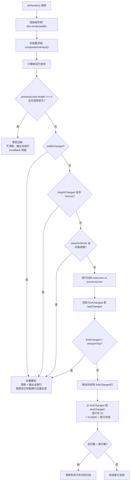
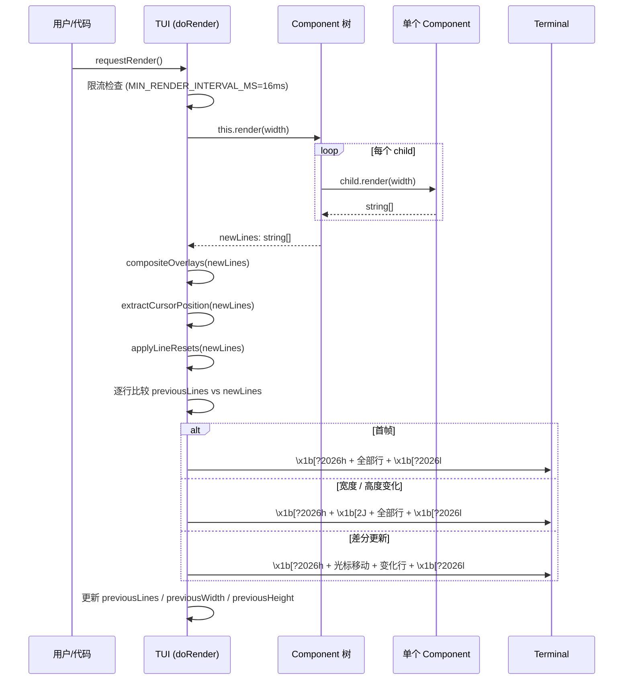

# 04 · TUI 框架（pi-tui）

pi-tui 是 Pi 项目自研的终端 UI 框架，npm 包名为 `@earendil-works/pi-tui`，定位为独立、最小化的组件式终端渲染库。它的核心卖点是**差分渲染（differential rendering）**与**同步输出（synchronized output）**，仅重绘变化的行，避免全屏重刷，从而在聊天式代理界面中获得无闪烁的流畅体验。

- **Source**: [pi/packages/tui/src/tui.ts](https://github.com/earendil-works/pi/blob/fc8a1559017f1e581cfa971aa3cef11a507a4975/packages/tui/src/tui.ts)
- **README**: [pi/packages/tui/README.md](https://github.com/earendil-works/pi/blob/fc8a1559017f1e581cfa971aa3cef11a507a4975/packages/tui/README.md)
- **pkg**: [pi/packages/tui/package.json](https://github.com/earendil-works/pi/blob/fc8a1559017f1e581cfa971aa3cef11a507a4975/packages/tui/package.json)

---

## 1. 设计哲学：行追加式 TUI vs 全屏式 TUI

传统 TUI 框架（如 FTXU、bubbletea）几乎都采用**全屏模式**：每次渲染前清屏（`\x1b[2J`），然后逐行重写全部内容。这对于"一次渲染一帧"的短会话场景是可接受的。

Pi 的使用场景不同：它是一个**长时间运行的聊天代理界面**，用户与 LLM 来回对话，历史消息不断堆积，只有最新的输入框或 spinner 在变化。如果每次重绘都清屏再全量写出，会有两个后果：

1. **滚动缓冲丢失**：清屏会清除终端滚动缓冲中的历史内容，用户无法回滚查看之前的对话。
2. **视觉闪烁**：即使帧率稳定，全屏重绘的区域变换也会产生可感知的闪烁。

pi-tui 选择了**行追加式 TUI** 策略：

- 第一次渲染时，直接输出所有行（不清屏），因此终端滚动缓冲中保留之前的 shell 输出。
- 后续渲染只移动光标到第一个变化的行，清除该行及其后面内容，仅重写变化部分。
- 只有当前终端宽度变化，或内容收缩需要回收空白行时，才触发全屏重绘（`fullRender(true)`）。

这种设计使 Pi 的 TUI 在聊天式交互中几乎不可见——用户看到的是"行被追加"，而非"屏幕在抖动"。

**证据**：[tui.ts L1022-L1051](https://github.com/earendil-works/pi/blob/fc8a1559017f1e581cfa971aa3cef11a507a4975/packages/tui/src/tui.ts#L1022-L1051) 展示三种渲染策略的分支：`previousLines.length === 0`（首帧不清屏），`widthChanged`（清屏全量），以及正常差分渲染。

---

## 2. 保留模式 UI：Component 树持久存在

pi-tui 采用**保留模式（retained mode）**而非即时模式。这意味着：

- Component 对象是持久的 JavaScript 实例，持有自己的内部状态（文本内容、选中索引、滚动位置等），不会每帧重新创建。
- `render(width)` 只是一个"投影"方法，将组件的当前状态映射为字符串行数组。
- TUI 框架在组件树之外维护上次渲染的快照（`previousLines`），用于与当前渲染结果逐行比较。

这种设计的性能优势体现在渲染缓存上。每个组件可以在内部缓存上一次渲染结果，当 `width` 未变且内部状态未变时直接返回缓存。README 中推荐的标准缓存模式：

```typescript
class CachedComponent implements Component {
  private cachedWidth?: number;
  private cachedLines?: string[];

  render(width: number): string[] {
    if (this.cachedLines && this.cachedWidth === width) {
      return this.cachedLines; // 缓存命中，零开销
    }
    // 实际渲染...
    this.cachedWidth = width;
    this.cachedLines = lines;
    return lines;
  }

  invalidate(): void {
    this.cachedWidth = undefined;  // 强制下次重新渲染
    this.cachedLines = undefined;
  }
}
```

TUI 框架本身也维护一组全局缓存状态：

| 字段 | 用途 |
|------|------|
| `previousLines` | 上次渲染的全部行，用于逐行 diff |
| `previousWidth` / `previousHeight` | 上次终端尺寸，用于检测宽度变化 |
| `previousKittyImageIds` | 上次渲染中的 Kitty 图形 ID，用于清理不再需要的图片 |
| `maxLinesRendered` | 历史最高行数，配合 `clearOnShrink` 决定是否回收空白行 |

**证据**：[tui.ts L240-L260](https://github.com/earendil-works/pi/blob/fc8a1559017f1e581cfa971aa3cef11a507a4975/packages/tui/src/tui.ts#L240-L260) 列出 TUI 类的所有差分渲染缓存字段。

---

## 3. 差分渲染算法

差分渲染是 pi-tui 最核心的能力。算法在 `doRender()` 方法中实现，决策流程图如下：



**线到线的比较逻辑**（[tui.ts L1053-L1078](https://github.com/earendil-works/pi/blob/fc8a1559017f1e581cfa971aa3cef11a507a4975/packages/tui/src/tui.ts#L1053-L1078)）：

```
for i in 0..max(oldLines, newLines):
  if oldLines[i] !== newLines[i]:
    firstChanged = min(firstChanged, i)
    lastChanged = max(lastChanged, i)
```

比较的是**整行字符串**（包含 ANSI 转义序列）。这意味着即使只改变了某行的一个字符颜色，该行也会被标记为"变化"并整体重写。这是有意为之：终端控制序列没有"局部修改一行"的能力，最可靠的做法是清除整行再重新输出。

**光标移动优化**：在差分渲染路径中，TUI 不会重新输出全部行，而是：

1. 计算当前硬件光标位置（`hardwareCursorRow`）到目标行（`firstChanged` 或 `firstChanged-1` 用于追加场景）的行差。
2. 发射 `\x1b[{n}B`（下移）或 `\x1b[{n}A`（上移）移动光标。
3. 从 `firstChanged` 行开始，每行先 `\x1b[2K`（清除整行），再 `\r\n`（换行），然后写入新内容。
4. 仅重写 `firstChanged` 到 `lastChanged` 之间的行，而非 `firstChanged` 到文件末尾。

**追加场景优化**：当 `newLines.length > previousLines.length` 且从 `previousLines.length` 行开始全部为新行时，光标移到 `previousLines.length - 1` 行处，然后 `\r\n` + 写入新行，避免擦除已有内容。

**回退场景处理**：当旧行数多于新行数时（内容收缩），算法移到新内容末尾，用 `\r\n\x1b[2K` 清除多余行，再将光标归位。

---

## 4. 同步输出：CSI ?2026h / CSI ?2026l

所有渲染输出（包括首帧、全量重绘、差分更新）都被包裹在同步输出转义序列中：

```
\x1b[?2026h    ← 开始同步更新（Begin Synchronized Update）
  ... 所有渲染操作 ...
\x1b[?2026l    ← 结束同步更新（End Synchronized Update）
```

这是 DEC STD 070 定义的 **Synchronized Output** 特性（也称"原子更新"）。启用后，终端模拟器会将中间的写入操作缓存在内存中，直到收到 `\x1b[?2026l` 再一次性刷新到屏幕。效果等价于双缓冲（double buffering）：

- **消除撕裂**：任何中间状态都不会被用户看到。
- **消除闪烁**：终端不刷新多次，只有最终帧可见。
- **改善性能**：减少了终端的实际重绘次数。

**证据**：[tui.ts L986](https://github.com/earendil-works/pi/blob/fc8a1559017f1e581cfa971aa3cef11a507a4975/packages/tui/src/tui.ts#L986) 和 [L994](https://github.com/earendil-works/pi/blob/fc8a1559017f1e581cfa971aa3cef11a507a4975/packages/tui/src/tui.ts#L994) 在 `fullRender` 中包裹输出，[L1145](https://github.com/earendil-works/pi/blob/fc8a1559017f1e581cfa971aa3cef11a507a4975/packages/tui/src/tui.ts#L1145) 和 [L1230](https://github.com/earendil-works/pi/blob/fc8a1559017f1e581cfa971aa3cef11a507a4975/packages/tui/src/tui.ts#L1230) 在差分渲染路径中同样包裹。

支持的终端模拟器：Kitty、WezTerm、Ghostty、Windows Terminal 1.22+、iTerm2 3.5+、Konsole 24.12+ 等。在不支持的终端上，这些序列是无操作的（被忽略），TUI 仍可正常工作，只是可能看到短暂闪烁。

---

## 5. 渲染管道

从组件渲染到终端写入的完整流程：



**行级复位**：渲染完成后，TUI 通过 `applyLineResets()` 在每行末尾追加 SGR 复位（`\x1b[0m`）和 OSC 8 复位（`\x1b]8;;\x07`）。这意味着样式不会跨行泄漏——每个组件在 `render()` 中不需要关心上一行的残留样式。

**宽度约束**：每个组件返回的每行字符串，其 `visibleWidth()` 必须 `<= width`。TUI 在差分渲染的输出步骤中执行硬校验（[tui.ts L1180-L1206](https://github.com/earendil-works/pi/blob/fc8a1559017f1e581cfa971aa3cef11a507a4975/packages/tui/src/tui.ts#L1180-L1206)），超宽会直接抛出异常并写入崩溃日志到 `~/.pi/agent/pi-crash.log`。

**限流机制**：`requestRender()` 实现在 `process.nextTick` 中调度，且两次渲染之间至少间隔 16ms（约 60fps），避免高频渲染（如 spinner 动画每 80ms 触发一次 `requestRender`）造成不必要的重绘。

---

## 6. Component / Container / TUI 类层次

pi-tui 的组件体系非常简单——只有一个接口和两个核心类：

```typescript
// src/tui.ts L39-L63
interface Component {
  render(width: number): string[];       // 必须实现
  handleInput?(data: string): void;      // 可选：接收键盘输入
  wantsKeyRelease?: boolean;             // 可选：是否接收按键松开事件
  invalidate(): void;                    // 必须实现：清除渲染缓存
}
```

- **`Component`** 是顶层接口。所有组件（Text、Editor、Markdown、Spacer 等）都实现它。
- **`Container`**（[tui.ts L200-L234](https://github.com/earendil-works/pi/blob/fc8a1559017f1e581cfa971aa3cef11a507a4975/packages/tui/src/tui.ts#L200-L234)）实现 `Component`，内部维护 `children: Component[]`。它的 `render()` 遍历 children，将每个 child 的渲染结果拼接为一个大数组。`invalidate()` 递归调用所有 children。
- **`TUI`**（[tui.ts L239](https://github.com/earendil-works/pi/blob/fc8a1559017f1e581cfa971aa3cef11a507a4975/packages/tui/src/tui.ts#L239)）继承 `Container`，追加差分渲染、终端控制、聚焦管理、悬浮层等功能。`TUI extends Container` 意味着 `addChild()` / `removeChild()` 对 TUI 同样适用——你可以直接往 TUI 根节点添加组件。

简化的类图：

```
Component (interface)
    ↑ implements
Container               ← children 管理
    ↑ extends
TUI                    ← 差分渲染 + 终端控制 + Overlay
```

**Focusable 接口**（[tui.ts L74-L77](https://github.com/earendil-works/pi/blob/fc8a1559017f1e581cfa971aa3cef11a507a4975/packages/tui/src/tui.ts#L74-L77)）是一个独立接口，用于需要硬件光标定位的组件（如 Editor、Input）支持 IME：

```typescript
interface Focusable {
  focused: boolean;  // TUI 在 setFocus 时设置
}
```

组件渲染时在光标位置嵌入 `CURSOR_MARKER`（零宽 APC escape：`\x1b_pi:c\x07`），TUI 的 `extractCursorPosition()` 扫描输出找到它，计算屏幕坐标，然后通过 `\x1b[{row}B` / `\x1b[{col}G` 移动硬件光标。这一步对于 CJK 输入法的候选窗口定位至关重要。

---

## 7. 关键约束：pi-tui 是零依赖独立包

pi-tui 的一个关键架构特性是**不依赖 pi-ai 或 pi-agent-core**。验证：

1. `package.json` 的 `dependencies` 仅列 `get-east-asian-width` 和 `marked` 两个纯通用库——没有任何 `@earendil-works/pi-*` 前缀的包。
2. 源码中的 import 仅包含 Node.js 内置模块、本地相对路径，以及两个外部依赖。

这意味着 pi-tui 可以在完全脱离 Pi agent 系统的场景中使用（例如独立的 CLI 工具）。它不知道什么是 LLM、什么是 tool call——它知道的只是组件树和终端控制序列。

从 `@earendil-works/pi-tui` 导出的公共 API（[src/index.ts](https://github.com/earendil-works/pi/blob/fc8a1559017f1e581cfa971aa3cef11a507a4975/packages/tui/src/index.ts)）包括：`TUI`、`Container`、`Component`、`Focusable`、`CURSOR_MARKER`、`Terminal` 接口、`ProcessTerminal`、`VirtualTerminal`、`matchesKey`、`Key`、`visibleWidth`、`truncateToWidth`、`wrapTextWithAnsi` 以及所有内置组件。

---

## 8. coding-agent 如何使用 pi-tui

在 Pi 的交互模式中，`coding-agent` 包（`@earendil-works/pi-coding-agent`）作为 pi-tui 的消费者，将 LLM 工具调用的渲染定义为返回 `Component` 对象的函数。

### 8.1 ToolDefinition 中的 renderCall / renderResult

每个工具定义（`ToolDefinition<TParams, TDetails, TState>`）包含两个可选的渲染函数：

```typescript
// coding-agent/src/core/extensions/types.ts L464-L472
renderCall?: (
  args: Static<TParams>,
  theme: Theme,
  context: ToolRenderContext<TState, Static<TParams>>
) => Component;

renderResult?: (
  result: AgentToolResult<TDetails>,
  options: ToolRenderResultOptions,
  theme: Theme,
  context: ToolRenderContext<TState, Static<TParams>>
) => Component;
```

- **`renderCall`**：渲染工具调用参数（例如显示"正在读取 `src/foo.ts`"）。
- **`renderResult`**：渲染工具执行结果（例如显示文件内容、diff、bash 输出等）。

**关键点**：这两个函数的返回值是 `Component`——即 pi-tui 的组件接口。工具渲染器不需要知道终端的细节，只需要返回一个 pi-tui 组件树，TUI 框架自动处理渲染、缓存和布局。

### 8.2 ToolExecutionComponent：渲染协调器

`ToolExecutionComponent`（[tool-execution.ts](https://github.com/earendil-works/pi/blob/fc8a1559017f1e581cfa971aa3cef11a507a4975/packages/coding-agent/src/modes/interactive/components/tool-execution.ts)）是实际调用 `renderCall` / `renderResult` 的协调组件。它继承 `Container`，管理一个工具调用的完整生命周期：

```
ToolExecutionComponent extends Container
  ├── contentBox: Box (或 selfRenderContainer: Container)
  │     ├── callRenderer 返回的 Component (如: "正在执行 bash...")
  │     └── resultRenderer 返回的 Component (如: 命令输出文本)
  └── imageComponents: Image[] (工具返回的图片)
```

渲染外壳有两种模式，由 `renderShell` 控制：

- **`"default"`（默认）**：组件放在 `Box` 内，Box 自动添加背景色和内边距。
- **`"self"`**：工具完全自定义渲染外观，放在 `selfRenderContainer` 中，不做额外包装。

### 8.3 数据流

```
LLM 流式返回 tool_use
  → Agent 创建 ToolExecutionComponent(toolName, args, toolDef, ...)
  → TUI.addChild(component)
  → TUI.requestRender()
  → TUI.doRender()
    → ToolExecutionComponent.render(width)
      → 调用 toolDef.renderCall(args, theme, ctx) → Component
      → child.render(width) → string[]
    → 差分渲染到终端

工具执行完成
  → ToolExecutionComponent.updateResult(result)
  → ToolExecutionComponent.updateDisplay()
    → 调用 toolDef.renderResult(result, opts, theme, ctx) → Component
  → TUI.requestRender() 触发重新 diff
```

**注意**：整个交互过程中，pi-tui 完全不知道 LLM 或 tool 的存在。它只是管理一个组件树并做差分渲染。coding-agent 负责将 LLM 语义映射为组件树结构。

---

## 9. 代码示例：自定义组件

一个完整的自定义交互式组件实现（参照 README 中的示例）：

```typescript
import { matchesKey, Key, truncateToWidth } from "@earendil-works/pi-tui";
import type { Component } from "@earendil-works/pi-tui";

class MyInteractiveComponent implements Component {
  private selectedIndex = 0;
  private items = ["Option 1", "Option 2", "Option 3"];
  private cachedWidth?: number;
  private cachedLines?: string[];

  public onSelect?: (index: number) => void;
  public onCancel?: () => void;

  handleInput(data: string): void {
    if (matchesKey(data, Key.up)) {
      this.selectedIndex = Math.max(0, this.selectedIndex - 1);
      this.invalidate();        // 清除缓存，触发重新渲染
    } else if (matchesKey(data, Key.down)) {
      this.selectedIndex = Math.min(this.items.length - 1, this.selectedIndex + 1);
      this.invalidate();
    } else if (matchesKey(data, Key.enter)) {
      this.onSelect?.(this.selectedIndex);
    } else if (matchesKey(data, Key.escape)) {
      this.onCancel?.();
    }
  }

  render(width: number): string[] {
    // 渲染缓存：width 未变时直接返回缓存结果
    if (this.cachedLines && this.cachedWidth === width) {
      return this.cachedLines;
    }
    const lines = this.items.map((item, i) => {
      const prefix = i === this.selectedIndex ? "> " : "  ";
      return truncateToWidth(prefix + item, width); // 确保不超过 width
    });
    this.cachedWidth = width;
    this.cachedLines = lines;
    return lines;
  }

  invalidate(): void {
    this.cachedWidth = undefined;
    this.cachedLines = undefined;
  }
}
```

该组件演示了 pi-tui 自定义组件的三个核心模式：
1. **渲染缓存**：仅在 `width` 变化或 `invalidate()` 被调用时重新渲染。
2. **宽度约束**：使用 `truncateToWidth()` 确保每行不超过 `width`。
3. **键盘处理**：通过 `matchesKey()` + `Key.*` 检测按键，支持 Kitty 键盘协议。

---

## 10. 补充细节

### 10.1 renderShell: "default" vs "self"

`renderShell` 控制工具渲染组件的外包装方式（源码：[types.ts L440](https://github.com/earendil-works/pi/blob/fc8a1559017f1e581cfa971aa3cef11a507a4975/packages/coding-agent/src/core/extensions/types.ts#L440)）：

- **`"default"`**：渲染结果放入 `Box` 组件（自动内边距+背景色）。适用于大多数工具。
- **`"self"`**：渲染结果放入 `Container`，不做任何外包装。工具完全控制外观，包括背景色、边框、内边距。适用于需要自定义布局的复杂工具。

`ToolExecutionComponent.getRenderShell()` 方法（[tool-execution.ts L105-L113](https://github.com/earendil-works/pi/blob/fc8a1559017f1e581cfa971aa3cef11a507a4975/packages/coding-agent/src/modes/interactive/components/tool-execution.ts#L105-L113)）的优先级：自定义 tool 的 `renderShell` > 内置 tool 的 `renderShell` > 默认 `"default"`。

### 10.2 悬浮层（Overlay）

pi-tui 支持在现有内容之上叠加渲染组件，用于对话框、菜单等模态 UI。关键机制：

- `showOverlay(component, options?)` 将组件推入 `overlayStack`。
- 渲染时，`compositeOverlays()` 将悬浮层内容按 `focusOrder` 排序后"合成"到基础行数组上——覆盖对应位置的行内容，不破坏基础行的结构。
- 悬浮层支持九种锚点、百分比/绝对定位、边距裁剪、响应式可见性回调。

### 10.3 调试日志

设置环境变量可获得内部状态输出：

- `PI_TUI_WRITE_LOG=/path/to/log`：捕获所有写入终端的原始 ANSI 字节流。
- `PI_DEBUG_REDRAW=1`：将每次全量重绘的原因写入 `~/.pi/agent/pi-debug.log`。
- `PI_TUI_DEBUG=1`：每次渲染时写一份详细日志到 `/tmp/tui/`，包含新旧行内容对比和完整的写入 buffer。

---

## 关键结论

1. **pi-tui 是独立包**：零依赖 pi-ai 或 pi-agent-core，仅按 `dependencies` 引入 `get-east-asian-width` 和 `marked`。可以在任何终端应用中使用。

2. **差分渲染由三种策略构成**：首帧不清屏保留滚动缓冲 → 宽度/高度变化时全量重绘 → 正常运行中逐行 diff 并仅重写变化区域。所有输出被 `CSI ?2026h/l` 包裹以消除闪烁。

3. **保留模式组件树**：Component 是持久对象，`render()` 是纯投射。组件内部的渲染缓存和 TUI 的 `previousLines` 缓存共同避免了不必要的计算和终端写入。

4. **coding-agent 通过 Component 接口桥接 LLM 与终端**：`ToolDefinition.renderCall` / `renderResult` 返回 `Component` 对象，`ToolExecutionComponent` 作为协调器组装渲染树。pi-tui 本身完全不知 LLM 的存在。

5. **渲染管道**：`Component.render()` → `Container.collect()` → `TUI.diff()`（含 overlay 合成、光标提取、行复位） → `terminal.write(buffer)`。

6. **宽度硬约束**：每行 `visibleWidth() <= width`，超宽 → 崩溃 + 日志写入。这是为了避免终端出现不可预测的换行行为。
