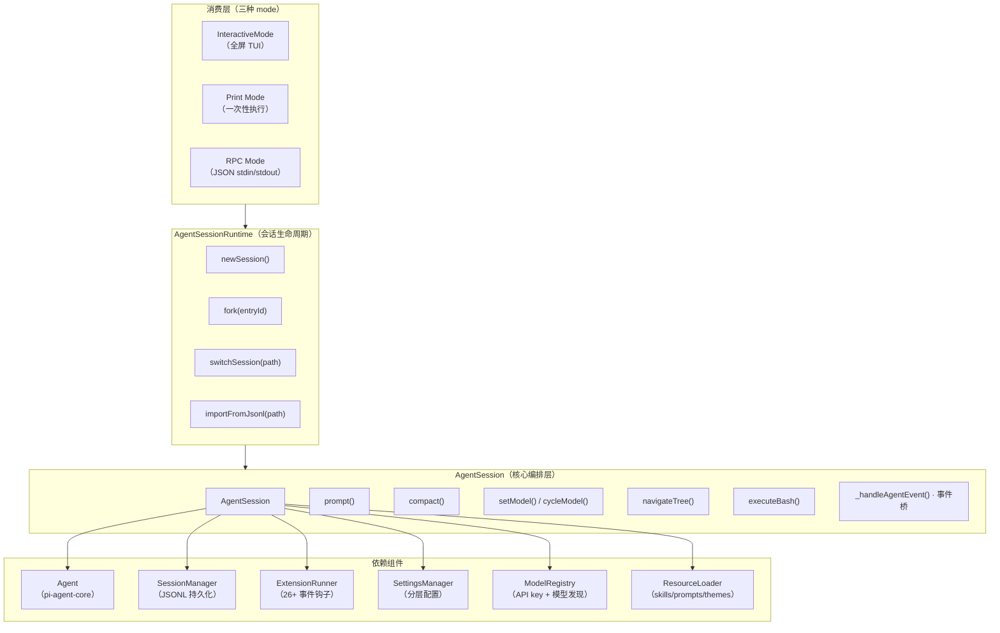
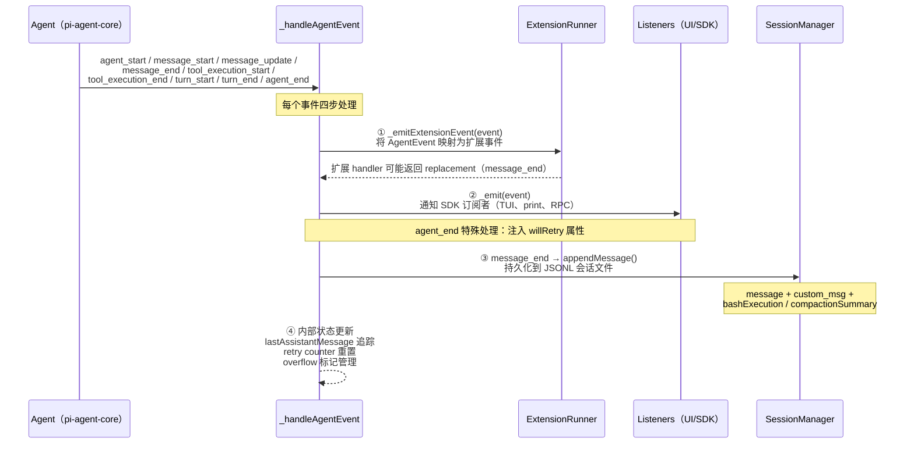
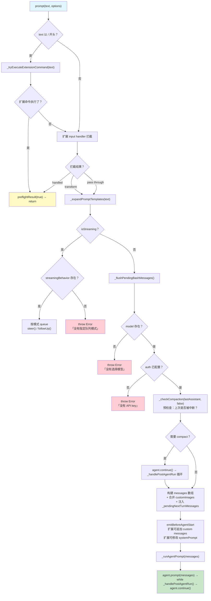
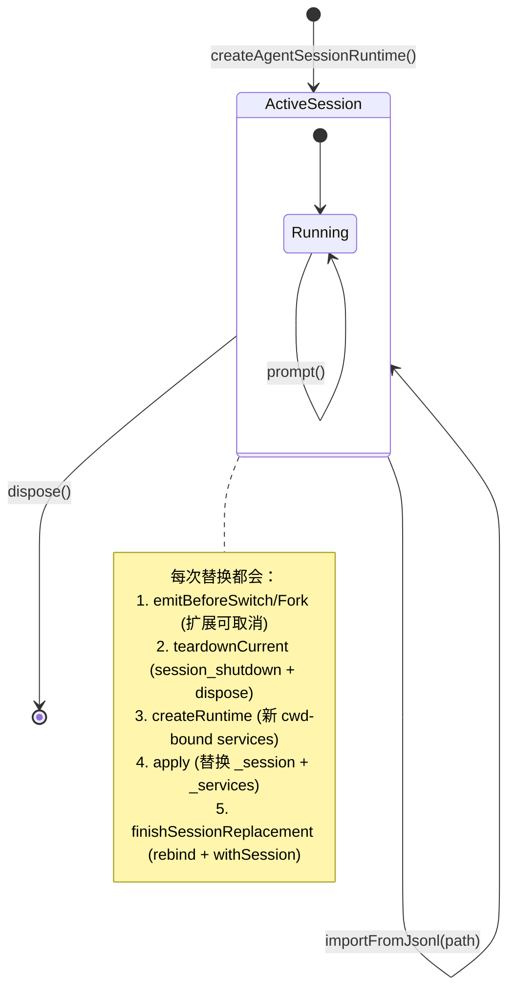

# 05 · AgentSession 运行时

**AgentSession 是 Pi 的「操作系统层」——它把裸的 agent 循环封装成可用的运行时，注入会话持久化、自动重试、上下文压缩、扩展系统桥接、模型热切换等真实世界必需的功能。**

如果将 [Agent 循环](./03-agent-loop.md) 比作 CPU，AgentSession 就是操作系统：它管理进程（prompt 调用）、内存管理（compaction）、中断处理（abort）、外设驱动（bash execution、event emission）和 I/O 抽象（三种 run mode）。

## 架构全景

AgentSession 在构造函数中完成组件织入，运行时通过事件驱动持续工作。



AgentSession 不需要任何集成层（AST-grep、Python runtime 等）。它只管流程编排和生命周期——agent 循环的细节由 [pi-agent-core](./03-agent-loop.md) 完成，扩展逻辑由 [ExtensionRunner](./06-extension-system.md) 完成，LLM 抽象由 [pi-ai](./02-llm-abstraction-layer.md) 完成。这是 Mario「渲染器抽象」思想的延续：每一层只做一件事。

---

## 1. AgentSession 构造：组件织入

构造函数接收 `AgentSessionConfig`，组装全部依赖（[源码 L319-L343](https://github.com/earendil-works/pi/blob/fc8a1559017f1e581cfa971aa3cef11a507a4975/packages/coding-agent/src/core/agent-session.ts#L319-L343)）：

```typescript
export interface AgentSessionConfig {
  agent: Agent;                          // 核心 agent 循环
  sessionManager: SessionManager;        // JSONL 会话持久化
  settingsManager: SettingsManager;      // 分层配置管理
  resourceLoader: ResourceLoader;        // skills/prompts/themes/context
  modelRegistry: ModelRegistry;          // API key + 模型发现
  cwd: string;                           // 工作目录

  scopedModels?: Array<...>;             // Ctrl+P 模型轮换范围
  customTools?: ToolDefinition[];         // SDK 自定义工具
  extensionRunnerRef?: { current?: ExtensionRunner };  // 可变的扩展引用
  sessionStartEvent?: SessionStartEvent; // 初始 session 事件
  // ...
}
```

构造函数执行的**关键初始化**（[源码 L334-L343](https://github.com/earendil-works/pi/blob/fc8a1559017f1e581cfa971aa3cef11a507a4975/packages/coding-agent/src/core/agent-session.ts#L334-L343)）：

1. **订阅 Agent 事件**：`this._unsubscribeAgent = this.agent.subscribe(this._handleAgentEvent)`——这是整个事件桥的起点
2. **安装工具钩子**：`this._installAgentToolHooks()`——在 Agent 的 `beforeToolCall`/`afterToolCall` 上装钩子，让扩展能拦截每个工具调用
3. **构建运行时**：`this._buildRuntime()`——初始化工具注册表、构建系统提示词

**组件职责边界：**

| 组件 | 谁创建 | AgentSession 怎么用 |
|------|--------|-------------------|
| `Agent` | SDK 层创建 | 只读访问 `agent.state` + 调用 `agent.prompt()` / `agent.continue()` |
| `SessionManager` | SDK 层创建 | 每次 `message_end` 调用 `appendMessage()`，compaction 时调用 `buildSessionContext()` |
| `ExtensionRunner` | SDK 层创建 | 事件桥发到所有 handler，绑定 UIContext / CommandContext / Core |
| `SettingsManager` | SDK 层创建 | 读取/写入 compaction 阈值、重试策略、thinking level 默认值 |
| `ModelRegistry` | SDK 层创建 | API key 查询、模型发现、OAuth 状态检查 |
| `ResourceLoader` | SDK 层创建 | 提供 skills、prompts、themes、context files、system prompt |

AgentSession **不创建**任何这些组件——它只接收它们。创建逻辑在 `sdk.ts` 的 `createAgentSession()` 函数中（[源码 L167-L200](https://github.com/earendil-works/pi/blob/fc8a1559017f1e581cfa971aa3cef11a507a4975/packages/coding-agent/src/core/sdk.ts#L167-L200)）。这种「注入一切」的设计使得 SDK 用户可以用 `SessionManager.inMemory()` 替代文件持久化，或用自定义 `ResourceLoader` 控制 skill/prompt 发现。

---

## 2. 事件桥（`_handleAgentEvent`）：Agent 事件到外部世界的桥梁

`_handleAgentEvent` 是 AgentSession 最关键的内部方法——它是所有 agent 内部事件的**唯一分发点**，每个事件触发 4 个动作（[源码 L469-L540](https://github.com/earendil-works/pi/blob/fc8a1559017f1e581cfa971aa3cef11a507a4975/packages/coding-agent/src/core/agent-session.ts#L469-L540)）：



### 事件映射表

`_emitExtensionEvent` 将核心 AgentEvent 映射为扩展系统能消费的 event（[源码 L595-L666](https://github.com/earendil-works/pi/blob/fc8a1559017f1e581cfa971aa3cef11a507a4975/packages/coding-agent/src/core/agent-session.ts#L595-L666)）：

| AgentEvent | 扩展事件 | 扩展能做什么 |
|-----------|---------|------------|
| `agent_start` | `agent_start` | 重置 turn 计数器 |
| `agent_end` | `agent_end` + messages | 检查结果、触发自动化 |
| `turn_start` | `turn_start` + turnIndex + timestamp | turn 级追踪 |
| `turn_end` | `turn_end` + message + toolResults | 检查每轮结果 |
| `message_start` | `message_start` + message | 消息开始通知 |
| `message_update` | `message_update` + assistantMessageEvent | 实时流式输出 |
| `message_end` | `message_end`（**可返回 replacement**） | **修改消息内容** |
| `tool_execution_start` | `tool_execution_start` | 工具执行开始通知 |
| `tool_execution_update` | `tool_execution_update` + partialResult | 流式工具输出 |
| `tool_execution_end` | `tool_execution_end` + result + isError | 工具执行结果通知 |

最重要的扩展事件是 `message_end`：扩展 handler 可以返回一个 replacement 消息，AgentSession 会用 `_replaceMessageInPlace()` 原地替换 agent 状态中的消息（[源码 L635-L638](https://github.com/earendil-works/pi/blob/fc8a1559017f1e581cfa971aa3cef11a507a4975/packages/coding-agent/src/core/agent-session.ts#L635-L638)）。

### 持久化策略

消息持久化在 `message_end` 时执行（[源码 L499-L538](https://github.com/earendil-works/pi/blob/fc8a1559017f1e581cfa971aa3cef11a507a4975/packages/coding-agent/src/core/agent-session.ts#L499-L538)）：

- **标准 LLM 消息**（`user` / `assistant` / `toolResult`）：`sessionManager.appendMessage()`
- **扩展自定义消息**（`role === "custom"`）：`sessionManager.appendCustomMessageEntry()`
- **其他消息**（`bashExecution` / `compactionSummary` / `branchSummary`）：由各自调用点单独持久化

`agent_end` 时有额外逻辑（[源码 L496](https://github.com/earendil-works/pi/blob/fc8a1559017f1e581cfa971aa3cef11a507a4975/packages/coding-agent/src/core/agent-session.ts#L496)）：将原生的 `AgentEvent` 包装为带 `willRetry` 属性的 `AgentSessionEvent`，让 UI 层知道即将触发自动重试。

---

## 3. prompt() 完整流程：从用户输入到 agent 执行

`prompt()` 是 AgentSession 最复杂的公共方法，处理从用户文本到 agent 执行的全链路（[源码 L962-L1112](https://github.com/earendil-works/pi/blob/fc8a1559017f1e581cfa971aa3cef11a507a4975/packages/coding-agent/src/core/agent-session.ts#L962-L1112)）。



### 七个预处理阶段

**阶段 1：扩展命令拦截（[源码 L968-L977](https://github.com/earendil-works/pi/blob/fc8a1559017f1e581cfa971aa3cef11a507a4975/packages/coding-agent/src/core/agent-session.ts#L968-L977)）**

以 `/` 开头的输入先交给 `_tryExecuteExtensionCommand()`。命令由 `ExtensionRunner.createCommandContext()` 提供完整上下文（可以调用 `pi.sendMessage()` 发起自己的 LLM 交互），执行完直接返回。

**阶段 2：扩展 input handler 拦截（[源码 L980-L996](https://github.com/earendil-works/pi/blob/fc8a1559017f1e581cfa971aa3cef11a507a4975/packages/coding-agent/src/core/agent-session.ts#L980-L996)）**

如果扩展注册了 `input` handler（扩展系统 26+ 事件之一），它有三个返回模式：
- `handled`：扩展自行处理输入，跳过后续流程
- `transform`：扩展返回修改后的 `text` 和 `images`，继续后续流程
- 不 return：透传原始输入

**阶段 3：Prompt 模板展开（[源码 L998-L1003](https://github.com/earendil-works/pi/blob/fc8a1559017f1e581cfa971aa3cef11a507a4975/packages/coding-agent/src/core/agent-session.ts#L998-L1003)）**

`_expandSkillCommand()` 将 `/skill:name args` 指令替换为 skill 的完整内容，`expandPromptTemplate()` 同理处理 `/template args`。

**阶段 4：流式中断检查（[源码 L1006-L1019](https://github.com/earendil-works/pi/blob/fc8a1559017f1e581cfa971aa3cef11a507a4975/packages/coding-agent/src/core/agent-session.ts#L1006-L1019)）**

当 agent 正在 streaming 时，`prompt()` 不允许直接发新消息。必须通过 `streamingBehavior` 指定 `"steer"`（中断当前执行）或 `"followUp"`（排队等当前完成后执行），否则抛错。

**阶段 5：模型与认证验证（[源码 L1024-L1039](https://github.com/earendil-works/pi/blob/fc8a1559017f1e581cfa971aa3cef11a507a4975/packages/coding-agent/src/core/agent-session.ts#L1024-L1039)）**

没有模型 → `formatNoModelSelectedMessage()` 友好的错误消息。
没有认证 → 区分 OAuth（提示 `/login`）和 API key（提示配置方式）。

**阶段 6：Compaction 预检查（[源码 L1041-L1052](https://github.com/earendil-works/pi/blob/fc8a1559017f1e581cfa971aa3cef11a507a4975/packages/coding-agent/src/core/agent-session.ts#L1041-L1052)）**

查找最后一条 assistant 消息，调用 `_checkCompaction(msg, false)`（注意参数 `skipAbortedCheck=false` 以包含被中断的消息）。如果需要 compact，则先 `agent.continue()` 触发自动压缩流程。

**阶段 7：消息构建与扩展增强（[源码 L1054-L1100](https://github.com/earendil-works/pi/blob/fc8a1559017f1e581cfa971aa3cef11a507a4975/packages/coding-agent/src/core/agent-session.ts#L1054-L1100)）**

构建包含 user 消息 + pending nextTurn messages + 扩展 before_agent_start 事件的最终 messages 数组。扩展可以追加 custom messages 和修改 system prompt。

---

## 4. 自动重试机制：`_isRetryableError` → `_prepareRetry`

当 agent 返回 `stopReason === "error"` 时，`_handlePostAgentRun()` 会触发重试检查（[源码 L929-L951](https://github.com/earendil-works/pi/blob/fc8a1559017f1e581cfa971aa3cef11a507a4975/packages/coding-agent/src/core/agent-session.ts#L929-L951)）。

### 可重试错误匹配

`_isRetryableError()` 用一个正则表达式匹配三类错误（[源码 L2429-L2441](https://github.com/earendil-works/pi/blob/fc8a1559017f1e581cfa971aa3cef11a507a4975/packages/coding-agent/src/core/agent-session.ts#L2429-L2441)）：

| 类别 | 匹配关键词 |
|------|-----------|
| Provider 过载 | `overloaded`, `provider returned error`, `500`, `502`, `503`, `504` |
| 限流 | `rate limit`, `too many requests`, `429`, `retry delay` |
| 网络/连接 | `network error`, `connection refused`, `connection lost`, `websocket closed`, `fetch failed`, `timeout`, `terminated` |

**上下文溢出（Context Overflow）不在重试范围**——它由 compaction 机制专门处理。

### 指数退避流程

`_prepareRetry()` 实现带中止功能的指数退避重试（[源码 L2447-L2497](https://github.com/earendil-works/pi/blob/fc8a1559017f1e581cfa971aa3cef11a507a4975/packages/coding-agent/src/core/agent-session.ts#L2447-L2497)）：

1. 检查 `retrySettings.enabled` 和当前 `_retryAttempt` 是否超过 `maxRetries`
2. 计算 `delayMs = baseDelayMs * 2^(attempt - 1)`（标准指数退避）
3. 发出 `auto_retry_start` 事件（UI 显示重试状态+倒计时）
4. 从 agent state 中移除错误消息（保留在 session 文件的历史中）
5. 用 `AbortController` 控制等待期（可被 `abortRetry()` 中途取消）
6. 返回 `true` 告知调用者应执行 `agent.continue()`

重试成功后（下一条 assistant 消息 `stopReason !== "error"`），`_handleAgentEvent` 自动重置 `_retryAttempt = 0` 并发送 `auto_retry_end(success: true)` 事件（[源码 L530-L537](https://github.com/earendil-works/pi/blob/fc8a1559017f1e581cfa971aa3cef11a507a4975/packages/coding-agent/src/core/agent-session.ts#L530-L537)）。

---

## 5. 压缩循环：溢出恢复与阈值提前

压缩（compaction）是 AgentSession 的「内存管理」。它分两种触发方式：

- **Auto-compaction**：`_checkCompaction()` 在每次 `agent_end` 后和每次 `prompt()` 前自动检查
- **Manual compaction**：用户通过 `compact()` 方法手动触发

### 自动压缩的两种场景

`_checkCompaction()` 区分两类场景（[源码 L1768-L1846](https://github.com/earendil-works/pi/blob/fc8a1559017f1e581cfa971aa3cef11a507a4975/packages/coding-agent/src/core/agent-session.ts#L1768-L1846)）：

| 场景 | 触发条件 | 行为 | `willRetry` |
|------|---------|------|------------|
| **溢出恢复** | `isContextOverflow(message, contextWindow)` | 紧凑 + 自动重试（移除了错误消息） | `true` |
| **阈值告警** | `shouldCompact(tokens, contextWindow, settings)` | 紧凑 + 不自动重试 | `false` |

溢出恢复有**防抖保护**：`_overflowRecoveryAttempted` 标志位确保每个 turn 只尝试一次 compact-and-retry，失败后发错误事件而不是无限循环（[源码 L1796-L1807](https://github.com/earendil-works/pi/blob/fc8a1559017f1e581cfa971aa3cef11a507a4975/packages/coding-agent/src/core/agent-session.ts#L1796-L1807)）。

### Compaction 时序

```
agent_end → _handlePostAgentRun()
              ├─ _isRetryableError? → _prepareRetry() → agent.continue()
              └─ _checkCompaction()
                   ├─ overflow → _runAutoCompaction("overflow", willRetry=true)
                   │              └─ compact() → agent.continue()（重试）
                   └─ threshold → _runAutoCompaction("threshold", willRetry=false)
                                    └─ compact() → 等待用户下一条 prompt
```

关键实现细节（[源码 L1851-L2027](https://github.com/earendil-works/pi/blob/fc8a1559017f1e581cfa971aa3cef11a507a4975/packages/coding-agent/src/core/agent-session.ts#L1851-L2027)）：

- 压缩前先通过扩展的 `session_before_compact` hook（扩展可以取消或提供自定义压缩内容）
- 压缩后 `sessionManager.buildSessionContext()` 重建 agent state 的 messages
- 即使 threshold 压缩完成，如果 agent 有排队的 messages（steer/followUp），仍需 `agent.continue()` 一次以投递它们

---

## 6. 模型管理：setModel / cycleModel / setThinkingLevel

AgentSession 提供三个模型管理方法：

### setModel（直接设置）

[源码 L1417-L1432](https://github.com/earendil-works/pi/blob/fc8a1559017f1e581cfa971aa3cef11a507a4975/packages/coding-agent/src/core/agent-session.ts#L1417-L1432)：

1. 验证认证可用 → 不通过抛错（不静默失败）
2. 更新 `agent.state.model`
3. 持久化到 session JSONL（`appendModelChange`）
4. 保存到项目 settings（`setDefaultModelAndProvider`）
5. 重新 clamp thinking level 到新模型的能力范围
6. 发送 `model_select` 扩展事件

### cycleModel（轮换切换）

通过 `Ctrl+P`（交互模式）触发（[源码 L1440-L1499](https://github.com/earendil-works/pi/blob/fc8a1559017f1e581cfa971aa3cef11a507a4975/packages/coding-agent/src/core/agent-session.ts#L1440-L1499)）：

- **Scoped 模式**：从 `--models` CLI 参数指定的候选列表中循环
- **Fallback 模式**：从 `ModelRegistry.getAvailable()` 获取所有已配置凭证的模型
- 支持 `forward` / `backward` 方向
- 每个 scoped model 可以绑定一个 `thinkingLevel`（不绑定的则继承当前 session 偏好）

### setThinkingLevel（思维等级设置）

[源码 L1510-L1532](https://github.com/earendil-works/pi/blob/fc8a1559017f1e581cfa971aa3cef11a507a4975/packages/coding-agent/src/core/agent-session.ts#L1510-L1532)：

- 自动 clamp 到模型支持的等级（通过 `getSupportedThinkingLevels()`）
- 仅当等级真正变化时才持久化 + 发事件
- 不支持 thinking 的模型也能设为 `"off"`（不保存到 settings）
- `cycleThinkingLevel()` 用 `Ctrl+T` 按标准等级列表 `['off', 'minimal', 'low', 'medium', 'high']` 轮换

---

## 7. 树形导航：navigateTree + 分支摘要

`navigateTree()` 支持在同一个 session 文件内从当前节点跳转到任意历史节点（[源码 L2657-L2841](https://github.com/earendil-works/pi/blob/fc8a1559017f1e581cfa971aa3cef11a507a4975/packages/coding-agent/src/core/agent-session.ts#L2657-L2841)）。

**与 fork 的区别：** `fork()` 创建新 session 文件；`navigateTree()` 在同一个文件内移动叶子指针。

### 核心流程

1. 收集从旧叶子到共同祖先之间的 entries（`collectEntriesForBranchSummary()`）
2. 发射 `session_before_tree` 扩展事件（扩展可取消或提供自定义摘要）
3. 如果用户选择 `summarize`，调用 LLM 生成分支摘要
4. 根据目标 entry 类型确定新叶子位置：
   - `user` 消息：新叶子 = 其 parent，文本回显到编辑器
   - 非 `user` 消息：新叶子 = 自身
5. 调用 `sessionManager.branchWithSummary()` 创建摘要 node 并剪枝
6. 重建 `agent.state.messages` 为新路径的上下文

**分支摘要的 LLM 调用**有独立的 `reserveTokens` 预算控制（[branchSummarySettings](https://github.com/earendil-works/pi/blob/fc8a1559017f1e581cfa971aa3cef11a507a4975/packages/coding-agent/src/core/agent-session.ts#L2743-L2752)），确保摘要生成本身不撑爆上下文。

---

## 8. AgentSessionRuntime：会话替换 API

AgentSession 只管理单个 session 的内部运行。跨 session 的创建、切换、fork 由 `AgentSessionRuntime` 管理（[源码文件](https://github.com/earendil-works/pi/blob/fc8a1559017f1e581cfa971aa3cef11a507a4975/packages/coding-agent/src/core/agent-session-runtime.ts)）。



### 四种替换操作

| 操作 | 触发方式 | Session 文件 | cwd | 典型用途 |
|------|---------|-------------|-----|---------|
| `newSession()` | `/new` 命令 | 新建 JSONL | 不变 | 开新对话 |
| `switchSession(path)` | `/resume <id>` 命令 | 加载已有 | 跟随 session | 继续历史对话 |
| `fork(entryId)` | `/fork` 命令 | 原文件上分叉 | 不变 | 从某个消息重新开始 |
| `importFromJsonl(path)` | `/import` 命令 | 复制到 session dir | 可 override | 导入外部会话 |

### 替换协议

每次替换遵循统一协议（以 `newSession` 为例，[源码 L212-L244](https://github.com/earendil-works/pi/blob/fc8a1559017f1e581cfa971aa3cef11a507a4975/packages/coding-agent/src/core/agent-session-runtime.ts#L212-L244)）：

1. **`emitBeforeSwitch("new")`**：给扩展拒绝的机会
2. **`teardownCurrent("new")`**：`session_shutdown` 事件 + `dispose()`
3. **新建 services + session**：通过 `createRuntime` 工厂重建 cwd-bound services
4. **`apply()`**：原子替换 `_session` / `_services` / `_diagnostics`
5. **`rebindSession(session)`**：让 host（TUI/RPC 等）重新绑定到新 session
6. **`withSession(ctx)`**：扩展的 post-replacement hook（自动失效旧的扩展 ctx）

**关键注意事项（[SDK 文档 L166-L182](https://github.com/earendil-works/pi/blob/fc8a1559017f1e581cfa971aa3cef11a507a4975/packages/coding-agent/docs/sdk.md#L166-L182)）：**
- `runtime.session` 对象在替换后改变——不能缓存旧的引用
- Event 订阅绑定到特定 `AgentSession`——替换后需重新订阅
- 扩展 binding 也需要重新设置

---

## 9. 三种 Run Mode：统一核心 + 差异化 I/O

所有三种模式共用同一个 `AgentSession` 实例，差异只体现在 I/O 层如何消费事件、如何提交 prompt：

| 特性 | Interactive (TUI) | Print | RPC |
|------|------------------|-------|-----|
| **怎么消费事件** | TUI 组件实时渲染 | `console.log` 流式输出 | JSON 序列化到 stdout |
| **怎么提交 prompt** | TUI 输入框 | CLI args + stdin | JSON-RPC stdin |
| **支持队列** | steer + followUp | 不支持（一次性） | 支持（通过 RPC 消息） |
| **扩展 UIContext** | 提供完整 TUI context | 无 | 无 |
| **代码位置** | `modes/interactive/interactive-mode.ts` | `modes/print-mode.ts` | `modes/rpc/rpc-mode.ts` |

模式分发在 `main.ts`（[源码 L678-L721](https://github.com/earendil-works/pi/blob/fc8a1559017f1e581cfa971aa3cef11a507a4975/packages/coding-agent/src/main.ts#L678-L721)）：

```typescript
if (appMode === "rpc") {
  await runRpcMode(runtime);
} else if (appMode === "interactive") {
  const interactiveMode = new InteractiveMode(runtime, options);
  await interactiveMode.run();
} else {
  const exitCode = await runPrintMode(runtime, printOptions);
}
```

**模式判断逻辑（[源码 L99-L111](https://github.com/earendil-works/pi/blob/fc8a1559017f1e581cfa971aa3cef11a507a4975/packages/coding-agent/src/main.ts#L99-L111)）：**

- `--rpc` → RPC 模式
- `--json` → Print 模式（JSON 输出）
- `--print` 或 stdin 不是 TTY → Print 模式（text 输出）
- 其他情况 → Interactive 模式

**SDK 用户不使用 main.ts**——他们直接调用 `createAgentSession()` 或 `createAgentSessionRuntime()`，然后通过 `session.subscribe()` 搭建自己的 I/O 层。

---

## 关键结论

1. **AgentSession 是「注入一切」的编排层**：不创建任何依赖组件（Agent / SessionManager / ExtensionRunner / SettingsManager / ModelRegistry），全部由外部注入，使得 SDK 用户可以自由替换每一层。

2. **`_handleAgentEvent` 是事件中枢**：每个 Agent 事件经过「扩展桥接 → Listener 广播 → 持久化 → 内部状态更新」四步流水线，是 AgentSession 所有外部可观测行为的单一出口。

3. **`prompt()` 的七个预处理阶段不是线性执行**：扩展命令和 input handler 可以提前 return，模板展开在队列检查之前，compaction 预检查在消息构建之前——这些分支路径是使用 SDK 时最容易被忽略的细节。

4. **自动重试和自动压缩是两种独立的恢复机制**，按优先级串行：先检查是否可重试（provider 错误 / 限流 / 网络）→ 不行再检查是否需要压缩（overflow / threshold）。两种机制都从 agent state 中移除错误消息后 `continue`，但保留在 session 历史中。

5. **Compaction 的 `willRetry` 标志是溢出恢复 vs 阈值压缩的唯一区别**：溢出恢复 → compact → 自动重试；阈值压缩 → compact → 等待用户输入。这个标志控制 agent 是否继续循环。

6. **`AgentSessionRuntime` 是跨 session 的生命周期管理器**：统一四种替换操作（new / resume / fork / import）的协议，确保每次替换都按「扩展前置 → 旧 session teardown → 新 services 重建 → apply → rebind」的步骤原子执行。

7. **三种 Run Mode 是对同一 AgentSession 的三种 I/O 封装**：核心和扩展系统完全共享，只有事件消费和 prompt 提交方式不同。这意味着写一个扩展，三种模式都自动支持。

8. **树形导航（`navigateTree`）和 fork 的区别在于作用域**：navigateTree 在同一 session 文件内跳转，fork 创建新文件。分支摘要的 reserveTokens 预算独立于 compaction 预算，防止摘要生成本身引发溢出。

9. **模型切换不只是改 state**：`setModel` 同时更新 session JSONL、项目 settings、re-clamp thinking level、发送 `model_select` 扩展事件。`cycleModel` 在此基础上支持 scoped 模型列表（`--models` flag）和 thinking level 绑定。

10. **AgentSession 的「不做什么」同样是设计选择**：不处理文件系统操作（由工具完成）、不管理 MCP 协议（Pi 不支持 MCP）、不实现 sub-agent（通过 bash 调用自己或装扩展）、不做权限弹窗——这些「不做」反映了 Pi 的哲学：**文件即状态、可见即真理**，所有复杂性交给可见的文件和扩展，核心层保持极简。
