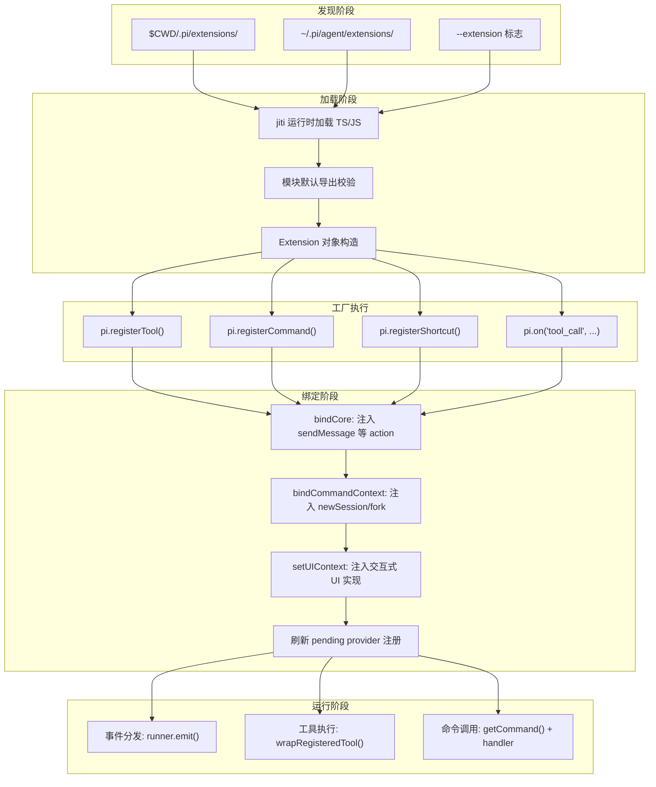
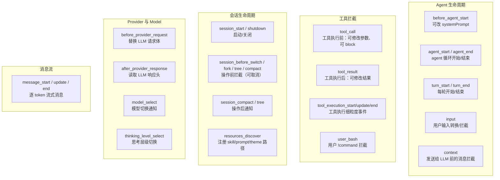
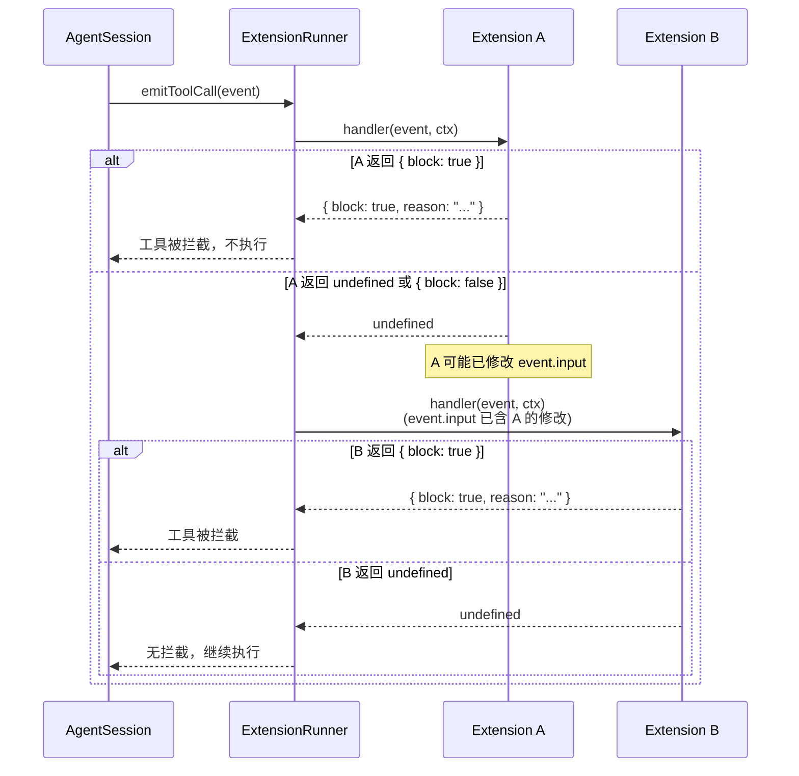

# 06 · 扩展系统

Pi 的扩展系统是整个框架最具特色的部分：**29 个生命周期钩子覆盖从工具拦截到会话管理的全部时刻**，任何 TypeScript 文件都可以成为扩展——无需编译、无需 npm publish。

> 源码：[earendil-works/pi](https://github.com/earendil-works/pi)
> 基线：`fc8a1559017f1e581cfa971aa3cef11a507a4975`

## 整体架构



核心流程分为五个阶段：

1. **发现**：从三个位置收集扩展路径
2. **加载**：通过 jiti 即时编译 TypeScript 文件
3. **工厂执行**：调用扩展的 `export default function(pi)`，收集注册信息
4. **绑定**：将运行时能力（发送消息、切换会话、UI 上下文）注入共享 runtime
5. **运行**：事件分发、工具调用、命令执行均通过 runner 转发

## 1. 扩展发现：三个位置

扩展可以从三个位置被发现，优先级从高到低：

| 位置 | 路径 | 用途 |
|------|------|------|
| 项目本地 | `$CWD/.pi/extensions/` | 项目特定的扩展，随仓库版本控制 |
| 全局用户 | `~/.pi/agent/extensions/` | 用户级扩展，跨项目可用 |
| 命令行标志 | `--extension <path>` | 临时加载，不持久化 |

> 源码：[loader.ts 的 `discoverAndLoadExtensions()`](https://github.com/earendil-works/pi/blob/fc8a1559017f1e581cfa971aa3cef11a507a4975/packages/coding-agent/src/core/extensions/loader.ts#L552-L599)

### 目录内发现规则

每个扩展目录中，loader 按以下规则递归一层：

1. **直接文件**：`*.ts` 或 `*.js` → 直接加载
2. **子目录 + index**：`foo/index.ts` 或 `foo/index.js` → 加载 index
3. **子目录 + package.json**：`package.json` 的 `pi.extensions` 字段声明入口点 → 加载声明路径

```typescript
// 源码: loader.ts#L515-L547
function discoverExtensionsInDir(dir: string): string[] {
  // 1. 直接文件: *.ts 或 *.js
  // 2 & 3. 子目录: 检查 index 文件或 package.json 的 pi 字段
}
```

这意味着一个包含多个文件的复杂扩展（如 subagent）可以放在子目录中，通过 `index.ts` 作为入口，loader 不会递归到子目录内部去查找额外的 `.ts` 文件。

## 2. 加载机制：jiti 即时编译

Pi 使用 [jiti](https://github.com/unjs/jiti) 作为扩展加载器，而非传统的 `tsc` 预编译或 `bun build`：

```typescript
// 源码: loader.ts#L331-L343
async function loadExtensionModule(extensionPath: string) {
  const jiti = createJiti(import.meta.url, {
    moduleCache: false,
    // Bun 二进制: 用 virtualModules 提供打包的依赖包
    // Node.js/开发: 用 alias 解析到 node_modules
    ...(isBunBinary
      ? { virtualModules: VIRTUAL_MODULES, tryNative: false }
      : { alias: getAliases() }
    ),
  });
  const module = await jiti.import(extensionPath, { default: true });
  const factory = module as ExtensionFactory;
  return typeof factory !== "function" ? undefined : factory;
}
```

关键设计决策：

- **`moduleCache: false`**：每次加载都是全新的模块实例，支持热重载
- **virtualModules（Bun 二进制模式）**：当 Pi 作为独立二进制发布时，扩展中 import 的 `typebox`、`@earendil-works/pi-coding-agent` 等包不需要文件系统解析，直接从二进制内存提供
- **alias（Node.js 开发模式）**：在 monorepo 内开发时，自动将包名映射到本地 `dist/` 或 `node_modules` 路径

> 源码：虚拟模块映射在 [loader.ts 的 `VIRTUAL_MODULES` 常量](https://github.com/earendil-works/pi/blob/fc8a1559017f1e581cfa971aa3cef11a507a4975/packages/coding-agent/src/core/extensions/loader.ts#L44-L61)，支持 `@earendil-works/` 和 `@mariozechner/` 两种 npm scope；别名映射在 [`getAliases()`](https://github.com/earendil-works/pi/blob/fc8a1559017f1e581cfa971aa3cef11a507a4975/packages/coding-agent/src/core/extensions/loader.ts#L71-L116)。

### 加载后的工厂校验

加载模块后，loader 检查默认导出是否为函数：

```typescript
// 源码: loader.ts#L368-L391
async function loadExtension(extensionPath, cwd, eventBus, runtime) {
  const factory = await loadExtensionModule(resolvedPath);
  if (!factory) {
    return { extension: null, error: "Extension does not export a valid factory function" };
  }
  const extension = createExtension(extensionPath, resolvedPath);
  const api = createExtensionAPI(extension, runtime, cwd, eventBus);
  await factory(api);  // 执行扩展工厂函数
  return { extension, error: null };
}
```

`ExtensionFactory` 的类型签名是 `(pi: ExtensionAPI) => void | Promise<void>`，支持同步和异步初始化。

## 3. 29 个事件钩子

Pi 的扩展系统共提供 29 个不同的事件类型，组织为四大类别。



### 完整事件表

<details>
<summary><b>点击展开全部 29 个事件</b></summary>

| 类别 | 事件名 | 触发时机 | 可修改？ | 可取消？ | 返回值类型 |
|------|--------|----------|----------|----------|------------|
| **资源发现** | `resources_discover` | session_start 之后 | 否，返回额外资源路径 | 否 | `{ skillPaths?, promptPaths?, themePaths? }` |
| **会话生命周期** | `session_start` | 会话启动/加载/重载 | 否 | 否 | `void` |
| | `session_before_switch` | 切换到其他会话前 | 否 | `cancel: true` | `{ cancel?: boolean }` |
| | `session_before_fork` | 分叉会话前 | 否 | `cancel: true` | `{ cancel?, skipConversationRestore? }` |
| | `session_before_compact` | 上下文压缩前 | 否 | `cancel: true` 或返回自定义压缩结果 | `{ cancel?, compaction? }` |
| | `session_compact` | 上下文压缩后 | 否 | 否 | `void` |
| | `session_shutdown` | 会话关闭/退出/重载 | 否 | 否 | `void` |
| | `session_before_tree` | 在会话树中导航前 | 否 | `cancel: true` | `{ cancel?, summary?, customInstructions?, label? }` |
| | `session_tree` | 在会话树中导航后 | 否 | 否 | `void` |
| **消息流** | `message_start` | 消息开始（user/assistant/toolResult） | 否 | 否 | `void` |
| | `message_update` | 助手消息流式更新（逐 token） | 否 | 否 | `void` |
| | `message_end` | 消息结束 | `message`（替换最终消息） | 否 | `{ message? }`（必须保持相同 role） |
| **工具执行** | `tool_execution_start` | 工具开始执行 | 否 | 否 | `void` |
| | `tool_execution_update` | 工具执行中（流式输出） | 否 | 否 | `void` |
| | `tool_execution_end` | 工具执行结束 | 否 | 否 | `void` |
| **工具拦截** | `tool_call` | 工具执行前 | `event.input` 就地修改 | `block: true` | `{ block?, reason? }` |
| | `tool_result` | 工具执行后 | `content`, `details`, `isError` | 否 | `{ content?, details?, isError? }` |
| | `user_bash` | 用户输入 `!command` 时 | `operations`（自定义执行器） | 否 | `{ operations?, result? }` |
| **Agent 生命周期** | `before_agent_start` | 用户提交后、agent 开始前 | `systemPrompt`（链式替换） | 否 | `{ message?, systemPrompt? }` |
| | `agent_start` | Agent 循环开始 | 否 | 否 | `void` |
| | `agent_end` | Agent 循环结束 | 否 | 否 | `void` |
| | `turn_start` | 每轮开始 | 否 | 否 | `void` |
| | `turn_end` | 每轮结束 | 否 | 否 | `void` |
| | `input` | 用户输入后（来自交互/RPC/扩展） | `text`/`images`（transform） | `handled`（吞掉） | `{ action: "continue" \| "transform" \| "handled" }` |
| **上下文拦截** | `context` | 消息发送给 LLM 前 | `messages`（替换整个消息数组） | 否 | `{ messages? }` |
| **Provider** | `before_provider_request` | LLM 请求发送前 | `payload`（替换整个请求体） | 否 | 新的 payload |
| | `after_provider_response` | LLM 响应接收后、流消费前 | 否 | 否 | `void` |
| **Model** | `model_select` | 模型切换后 | 否 | 否 | `void` |
| | `thinking_level_select` | 思考层级切换后 | 否 | 否 | `void` |

</details>

### 事件数量统计

| 类别 | 数量 |
|------|------|
| 会话生命周期 | 9 |
| Agent 生命周期 | 6 |
| 消息流 | 3 |
| 工具执行（细粒度） | 3 |
| 工具拦截 + user_bash | 3 |
| Provider + Model | 4 |
| 资源发现 | 1 |
| **合计** | **29** |

## 4. 事件分发机制：责任链模式

Pi 的事件分发采用**部分责任链（partial chain of responsibility）**模式：不同事件有不同的分发语义。



### 不同事件的分发语义

**短路类（short-circuit）——首个非空结果即返回：**

- `tool_call`：第一个返回 `{ block: true }` 的处理器即阻止工具执行，不再调用后续处理器。但 `event.input` 的修改会累积。
- `user_bash`：第一个返回结果的处理器直接替代执行。
- `input`：首个 `{ action: "handled" }` 吞掉输入。支持 `transform` 链。
- 所有 `session_before_*` 事件：首个 `{ cancel: true }` 取消操作。

**链式类（chain）——结果传递给下一个处理器：**

- `context`：每个处理器可替换 `messages`，下一个处理器收到已被修改的消息数组。源码使用 `structuredClone` 深拷贝后逐次替换。
- `before_provider_request`：每个处理器可替换 `payload`，下一个收到已修改的 payload。
- `message_end`：返回的 `message` 传递到下一处理器（必须保持相同 role）。
- `before_agent_start`：多个处理器可以各自添加 `message` 和链式修改 `systemPrompt`。

**广播类（broadcast）——无返回值的通知：**

- `agent_start`, `agent_end`, `turn_start`, `turn_end`：纯通知，不修改状态。
- `message_start`, `message_update`：纯通知。
- `tool_execution_start/update/end`：纯通知。
- `session_compact`, `session_tree`：事后通知。
- `model_select`, `thinking_level_select`：状态变化通知。

**聚合类（aggregation）——收集所有结果：**

- `resources_discover`：收集所有处理器返回的 `skillPaths`、`promptPaths`、`themePaths`，合并后统一处理。

> 源码：各事件的分发实现集中在 [runner.ts](https://github.com/earendil-works/pi/blob/fc8a1559017f1e581cfa971aa3cef11a507a4975/packages/coding-agent/src/core/extensions/runner.ts)。通用事件用 `emit()`（L680-L712），专用事件各有 `emitToolCall()`（L806-L827）、`emitToolResult()`（L756-L804）、`emitContext()`（L858-L888）、`emitBeforeAgentStart()`（L924-L988）、`emitInput()`（L1039-L1067）等。

## 5. 关键钩子深度解析

### 5.1 `input`：用户输入的转换/拦截

这是唯一在用户输入阶段同时支持**转换**和**拦截**的钩子。输入源可以是交互式、RPC 或扩展：

```typescript
// 源码: types.ts#L751-L766
export interface InputEvent {
  type: "input";
  text: string;
  images?: ImageContent[];
  source: InputSource;  // "interactive" | "rpc" | "extension"
}

export type InputEventResult =
  | { action: "continue" }                         // 放行
  | { action: "transform"; text: string; images?: ImageContent[] }  // 修改
  | { action: "handled" };                         // 吞掉（不再发给 agent）
```

分发逻辑（[runner.ts L1039-L1067](https://github.com/earendil-works/pi/blob/fc8a1559017f1e581cfa971aa3cef11a507a4975/packages/coding-agent/src/core/extensions/runner.ts#L1039-L1067)）：
- `handled` 立即短路，不再处理
- `transform` 改变当前 text/images，继续下一个处理器
- 所有处理器执行完后，若 text/images 被修改，最终返回 `{ action: "transform" }`

典型用法：`inline-bash.ts` 扩展监听 `input` 事件，将 `!{command}` 展开为命令输出。

### 5.2 `before_agent_start`：系统提示词链式替换

每个 agent 开始前触发，处理器可以：
- 注入自定义消息（`message` 字段）
- 替换系统提示词（`systemPrompt` 字段）——被替换后传递给下一个处理器

```typescript
// 源码: types.ts#L623-L633
export interface BeforeAgentStartEvent {
  prompt: string;                 // 用户原始输入（展开后）
  images?: ImageContent[];
  systemPrompt: string;           // 当前系统提示词
  systemPromptOptions: BuildSystemPromptOptions;  // 结构化选项
}

export interface BeforeAgentStartEventResult {
  message?: Pick<CustomMessage, "customType" | "content" | "display" | "details">;
  systemPrompt?: string;          // 替换后的系统提示词
}
```

runner 实现中（[L924-L988](https://github.com/earendil-works/pi/blob/fc8a1559017f1e581cfa971aa3cef11a507a4975/packages/coding-agent/src/core/extensions/runner.ts#L924-L988)），`systemPrompt` 是逐处理器链式传递的：处理器 A 修改后，处理器 B 收到的是 A 修改后的版本。

### 5.3 `tool_call`：工具执行拦截

在工具执行前触发。支持两个操作：

1. **修改参数**：直接 mutate `event.input`（无需返回值，就地修改），后续处理器看到修改后的值。注意无重新校验。
2. **阻止执行**：返回 `{ block: true, reason: "..." }`，工具不会被调用。

```typescript
// 示例: 阻止危险 bash 命令
pi.on("tool_call", async (event, ctx) => {
  if (isToolCallEventType("bash", event) && event.input.command?.includes("rm -rf")) {
    const ok = await ctx.ui.confirm("危险操作", "允许 rm -rf？");
    if (!ok) return { block: true, reason: "用户拒绝" };
  }
});
```

`ToolCallEvent` 是一个联合类型，对 7 种内置工具做了精确类型标注（`bash`/`read`/`edit`/`write`/`grep`/`find`/`ls`），自定义工具回退到 `CustomToolCallEvent`。`isToolCallEventType()` 类型守卫提供精确类型收窄。

### 5.4 `tool_result`：工具结果修改

工具执行后触发，可以修改 `content`（发送给 LLM 的文本）、`details`（会话存储的结构化数据）、`isError`。多个处理器链式修改：

```typescript
// runner.ts 的 emitToolResult() 中
// handler A 修改 content → handler B 看到 A 修改后的 event
// 最终返回累积修改
```

### 5.5 `session_before_compact`：上下文压缩拦截

在 Pi 自动压缩上下文之前触发。扩展可以阻止压缩、或提供自定义压缩结果。

```typescript
// 源码: types.ts#L536-L543
export interface SessionBeforeCompactEvent {
  preparation: CompactionPreparation;  // 当前会话状态
  branchEntries: SessionEntry[];       // 将被压缩的分支条目
  customInstructions?: string;
  signal: AbortSignal;
}

export interface SessionBeforeCompactResult {
  cancel?: boolean;                        // 取消压缩
  compaction?: CompactionResult;           // 自定义压缩结果
}
```

当 `compaction` 被提供时，Pi 跳过内置的压缩逻辑，使用扩展提供的摘要。

### 5.6 `context`：发送给 LLM 前的最后一关

在消息数组准备发送给 LLM 时触发。最强大的消息级拦截点——可以修改、添加、删除任意消息。

```typescript
// 源码: types.ts#L605-L609
export interface ContextEvent {
  type: "context";
  messages: AgentMessage[];
}

export interface ContextEventResult {
  messages?: AgentMessage[];  // 替换整个消息数组
}
```

注意：`runner.emitContext()` 内部使用 `structuredClone` 深拷贝消息数组，因此修改是隔离的；每个处理器的返回替换整个 `currentMessages` 引用传给下一个。

## 6. ExtensionAPI 完整表面

扩展工厂函数接收 `pi: ExtensionAPI` 参数，以下是其完整 API 表面：

### 6.1 事件订阅

```typescript
pi.on("resources_discover", handler);
pi.on("session_start", handler);
pi.on("session_before_switch", handler);
pi.on("session_before_fork", handler);
pi.on("session_before_compact", handler);
pi.on("session_compact", handler);
pi.on("session_shutdown", handler);
pi.on("session_before_tree", handler);
pi.on("session_tree", handler);
pi.on("context", handler);
pi.on("before_provider_request", handler);
pi.on("after_provider_response", handler);
pi.on("before_agent_start", handler);
pi.on("agent_start", handler);
pi.on("agent_end", handler);
pi.on("turn_start", handler);
pi.on("turn_end", handler);
pi.on("message_start", handler);
pi.on("message_update", handler);
pi.on("message_end", handler);
pi.on("tool_execution_start", handler);
pi.on("tool_execution_update", handler);
pi.on("tool_execution_end", handler);
pi.on("model_select", handler);
pi.on("thinking_level_select", handler);
pi.on("tool_call", handler);
pi.on("tool_result", handler);
pi.on("user_bash", handler);
pi.on("input", handler);
```

### 6.2 注册类方法

| 方法 | 作用 |
|------|------|
| `pi.registerTool(tool)` | 注册 LLM 可调用的工具 |
| `pi.registerCommand(name, options)` | 注册 `/` 命令 |
| `pi.registerShortcut(key, options)` | 注册键盘快捷键 |
| `pi.registerFlag(name, options)` | 注册 CLI 标志（`--my-flag`） |
| `pi.registerMessageRenderer(customType, renderer)` | 注册自定义消息渲染器 |
| `pi.registerProvider(name, config)` | 注册/覆盖 LLM provider |
| `pi.unregisterProvider(name)` | 取消注册 provider |

### 6.3 查询类方法

| 方法 | 作用 |
|------|------|
| `pi.getFlag(name)` | 获取 CLI 标志值 |
| `pi.getActiveTools()` | 获取当前活跃工具名列表 |
| `pi.getAllTools()` | 获取所有已配置工具（含参数 schema 和来源） |
| `pi.getCommands()` | 获取当前可用的 slash 命令列表 |
| `pi.getSessionName()` | 获取当前会话名称 |
| `pi.getThinkingLevel()` | 获取当前思考层级 |

### 6.4 控制类方法

| 方法 | 作用 |
|------|------|
| `pi.sendMessage(msg, opts)` | 发送自定义消息到会话（可选触发 turn） |
| `pi.sendUserMessage(content, opts)` | 作为用户发送消息（始终触发 turn） |
| `pi.appendEntry(customType, data)` | 追加自定义条目到会话（不发给 LLM） |
| `pi.setSessionName(name)` | 设置会话显示名称 |
| `pi.setLabel(entryId, label)` | 设置/清除条目标签 |
| `pi.setActiveTools(toolNames)` | 切换活跃工具集 |
| `pi.setModel(model)` | 切换模型 |
| `pi.setThinkingLevel(level)` | 设置思考层级 |
| `pi.exec(command, args, opts)` | 执行 shell 命令 |
| `pi.events` | 共享 EventBus（跨扩展通信） |

> 完整 API 定义在 [types.ts 的 `ExtensionAPI` 接口](https://github.com/earendil-works/pi/blob/fc8a1559017f1e581cfa971aa3cef11a507a4975/packages/coding-agent/src/core/extensions/types.ts#L1084-L1311)。

### 6.5 Provider 注册

`pi.registerProvider()` 是扩展系统中信息量最大的 API 之一，支持四种使用模式：

1. **注册新 provider + 模型**：提供 `baseUrl`、`apiKey`、`models` 完整定义
2. **覆盖已有 provider 的 baseUrl**：只提供 `baseUrl`
3. **注册 OAuth provider**：提供 `oauth` 配置（login/refreshToken/getApiKey）
4. **注册自定义流处理器**：提供 `streamSimple` 函数

Provider 注册在初始化阶段会被排队（`pendingProviderRegistrations`），在 `bindCore()` 时批量刷新；`bindCore()` 之后则立即可用，无需 `/reload`。

## 7. ToolDefinition 接口：自定义工具

扩展注册的工具与 Pi 内置的 read/write/edit/bash 使用**完全相同的工具框架**——它们共享同一个 `AgentTool` 执行管道。

### 完整接口

```typescript
// 源码: types.ts#L426-L473
export interface ToolDefinition<TParams extends TSchema, TDetails = unknown, TState = any> {
  name: string;                    // 工具名（LLM 使用）
  label: string;                   // UI 显示标签
  description: string;             // LLM 描述
  promptSnippet?: string;          // 在系统提示词的工具列表中显示的单行摘要
  promptGuidelines?: string[];     // 追加到系统提示词 Guidelines 的要点列表
  parameters: TParams;             // TypeBox 参数 schema
  renderShell?: "default" | "self"; // 工具框架渲染：默认 shell 样式 vs 自行渲染
  prepareArguments?: (args: unknown) => Static<TParams>; // schema 校验前的参数预处理
  executionMode?: ToolExecutionMode; // "sequential" | "parallel"

  execute(
    toolCallId: string,
    params: Static<TParams>,
    signal: AbortSignal | undefined,
    onUpdate: AgentToolUpdateCallback<TDetails> | undefined,
    ctx: ExtensionContext,
  ): Promise<AgentToolResult<TDetails>>;

  // TUI 集成
  renderCall?: (args, theme, context) => Component;      // 自定义工具调用行渲染
  renderResult?: (result, options, theme, context) => Component; // 自定义工具结果渲染
}
```

### TUI 集成：renderCall / renderResult

`renderCall` 和 `renderResult` 是 Pi 扩展系统与 TUI 框架的结合点。当工具执行时，TUI 组件 `ToolExecutionComponent` 调用这些渲染函数来显示调用的参数和结果。

如果不提供 `renderCall`/`renderResult`，Pi 使用默认的 shell 样式渲染（`renderShell: "default"`）。设置为 `"self"` 时，工具自行承担完整的边框和样式。

`renderCall` 和 `renderResult` 共享同一个 `ToolRenderContext`，其 `args`、`toolCallId`、`state`、`cwd` 在两次调用间保持一致。

### defineTool 辅助函数

为保持 TypeScript 参数类型推断，Pi 提供 `defineTool()` 包装器：

```typescript
// 源码: types.ts#L484-L488
export function defineTool<TParams, TDetails, TState>(
  tool: ToolDefinition<TParams, TDetails, TState>,
): ToolDefinition<TParams, TDetails, TState> & AnyToolDefinition {
  return tool as ToolDefinition<TParams, TDetails, TState> & AnyToolDefinition;
}
```

注意 `& AnyToolDefinition` 交叉类型——它将工具同时类型化为具体类型（保留泛型参数推断）和宽泛类型（可放入工具数组）。不使用时，TypeScript 可能将参数推断为 `unknown`。

## 8. 内置工具也是 ToolDefinition

Pi 的 7 个内置工具（read、write、edit、bash、grep、find、ls）本质上也是同一套 `AgentTool` 接口。它们的工具定义在 `packages/coding-agent/src/core/tools/` 下，结构如下：

```typescript
// 简化的内置工具结构示意
// 详见: packages/coding-agent/src/core/tools/{read,write,edit,bash,grep,find,ls}.ts
const readTool: AgentTool = {
  name: "read",
  label: "Read",
  description: "Reads a file from the local filesystem...",
  parameters: Type.Object({ file_path: Type.String(), offset: Type.Optional(...), limit: Type.Optional(...) }),
  execute: async (toolCallId, params, signal, onUpdate) => { /* ... */ },
};
```

连接点：`tool-definition-wrapper.ts` 提供两个方向的转换：

- **`wrapToolDefinition(ToolDefinition) → AgentTool`**：扩展注册的工具被包装为 AgentTool，注入 `ctxFactory` 使其在执行时获取 `ExtensionContext`
- **`createToolDefinitionFromAgentTool(AgentTool) → ToolDefinition`**：当 AgentSession 内部需要统一以 ToolDefinition 形式管理所有工具时使用

这意味着扩展可以用 `pi.on("tool_call")` 拦截**任何工具**（内置或自定义），并通过 `isToolCallEventType("read", event)` 获得精确类型。

## 9. ExtensionContext：处理器收到的上下文

所有事件处理器的第二个参数是 `ctx: ExtensionContext`：

```typescript
// 源码: types.ts#L298-L327
export interface ExtensionContext {
  ui: ExtensionUIContext;              // UI 交互方法
  hasUI: boolean;                      // 是否有 UI（print/RPC 模式为 false）
  cwd: string;                         // 当前工作目录
  sessionManager: ReadonlySessionManager; // 只读会话管理器
  modelRegistry: ModelRegistry;        // 模型注册表（API key 解析）
  model: Model<any> | undefined;       // 当前模型
  isIdle(): boolean;                   // Agent 是否空闲（未流式输出）
  signal: AbortSignal | undefined;     // 当前 AbortSignal（流式时有效）
  abort(): void;                       // 中止当前 agent 操作
  hasPendingMessages(): boolean;       // 是否有排队消息
  shutdown(): void;                    // 优雅关闭 pi 并退出
  getContextUsage(): ContextUsage | undefined;  // 当前上下文使用量
  compact(options?: CompactOptions): void;      // 触发上下文压缩
  getSystemPrompt(): string;           // 获取当前有效系统提示词
}
```

### ExtensionUIContext 详解

`ctx.ui` 提供完整的 TUI 交互能力（[types.ts L124-L275](https://github.com/earendil-works/pi/blob/fc8a1559017f1e581cfa971aa3cef11a507a4975/packages/coding-agent/src/core/extensions/types.ts#L124-L275)）：

| 方法 | 用途 |
|------|------|
| `ctx.ui.select(title, options)` | 弹出选择器 |
| `ctx.ui.confirm(title, msg)` | 确认对话框 |
| `ctx.ui.input(title, placeholder)` | 文本输入框 |
| `ctx.ui.notify(msg, type)` | 通知消息 |
| `ctx.ui.editor(title, prefill)` | 多行编辑器 |
| `ctx.ui.custom(factory, opts)` | 自定义组件（含 overlay） |
| `ctx.ui.setStatus(key, text)` | 设置状态栏文本 |
| `ctx.ui.setWidget(key, content, opts)` | 设置编辑器上方/下方的 widget |
| `ctx.ui.setFooter(factory)` | 自定义页脚组件 |
| `ctx.ui.setHeader(factory)` | 自定义页头组件 |
| `ctx.ui.setWorkingMessage(msg)` | 设置流式加载消息 |
| `ctx.ui.setWorkingIndicator(opts)` | 自定义流式加载动画 |
| `ctx.ui.setHiddenThinkingLabel(label)` | 自定义折叠思考标签 |
| `ctx.ui.setEditorText(text)` / `getEditorText()` | 读写编辑器文本 |
| `ctx.ui.pasteToEditor(text)` | 粘贴到编辑器 |
| `ctx.ui.setEditorComponent(factory)` | 替换输入编辑器（如 vim 模式） |
| `ctx.ui.addAutocompleteProvider(factory)` | 叠加自动补全 |
| `ctx.ui.setTitle(title)` | 设置终端标题 |
| `ctx.ui.setTheme(theme)` / `getTheme(name)` / `getAllThemes()` | 主题管理 |
| `ctx.ui.setToolsExpanded(bool)` / `getToolsExpanded()` | 工具输出折叠/展开 |
| `ctx.ui.onTerminalInput(handler)` | 监听原始终端输入 |

在 print 模式或 RPC 模式下，`ctx.ui` 被替换为 `noOpUIContext`（所有 UI 方法返回默认值），`hasUI` 为 `false`。

### ExtensionCommandContext：命令专属的额外能力

通过 `pi.registerCommand()` 注册的命令处理器收到 `ExtensionCommandContext`，它扩展了 `ExtensionContext`，增加了会话控制方法（[types.ts L333-L364](https://github.com/earendil-works/pi/blob/fc8a1559017f1e581cfa971aa3cef11a507a4975/packages/coding-agent/src/core/extensions/types.ts#L333-L364)）：

| 方法 | 用途 |
|------|------|
| `ctx.waitForIdle()` | 等待 agent 流式输出结束 |
| `ctx.newSession(opts)` | 创建新会话 |
| `ctx.fork(entryId, opts)` | 从指定条目分叉 |
| `ctx.navigateTree(targetId, opts)` | 在会话树中导航 |
| `ctx.switchSession(sessionPath, opts)` | 切换会话文件 |
| `ctx.reload()` | 重载扩展、skills、prompts、主题 |

`newSession()`、`fork()`、`switchSession()` 都接受可选的 `withSession` 回调，在新会话绑定完成后调用，此时旧的 `ctx` 已失效（stale），新 `ctx` 通过回调参数传入。

## 10. hello.ts：26 行最小示例

```typescript
/**
 * Hello Tool - Minimal custom tool example
 */

import { Type } from "@earendil-works/pi-ai";
import { defineTool, type ExtensionAPI } from "@earendil-works/pi-coding-agent";

const helloTool = defineTool({
  name: "hello",
  label: "Hello",
  description: "A simple greeting tool",
  parameters: Type.Object({
    name: Type.String({ description: "Name to greet" }),
  }),

  async execute(_toolCallId, params, _signal, _onUpdate, _ctx) {
    return {
      content: [{ type: "text", text: `Hello, ${params.name}!` }],
      details: { greeted: params.name },
    };
  },
});

export default function (pi: ExtensionAPI) {
  pi.registerTool(helloTool);
}
```

> 源码：[hello.ts](https://github.com/earendil-works/pi/blob/fc8a1559017f1e581cfa971aa3cef11a507a4975/packages/coding-agent/examples/extensions/hello.ts)

这个 26 行的示例展示了扩展的最小结构：

1. **导入**：从 `pi-ai` 导入 `Type`（TypeBox 的 Pi 再导出），从 `pi-coding-agent` 导入 `defineTool` 和类型
2. **工具定义**：用 `defineTool()` 包装完整定义（保留类型推断）
3. **execute 签名**：`(toolCallId, params, signal, onUpdate, ctx)` → 返回 `{ content, details }`
4. **默认导出**：`export default function(pi)` 接收 `ExtensionAPI`，调用 `pi.registerTool()`

## 11. subagent 扩展：复杂度示例

subagent 扩展展示了 Pi 扩展系统的全部能力：约 1000 行的 `index.ts` + `agents.ts` 辅助模块，通过 `spawn("pi", ...)` 启动子进程来实现隔离上下文的任务委派。

> 源码：[subagent/index.ts](https://github.com/earendil-works/pi/blob/fc8a1559017f1e581cfa971aa3cef11a507a4975/packages/coding-agent/examples/extensions/subagent/index.ts) | [subagent/agents.ts](https://github.com/earendil-works/pi/blob/fc8a1559017f1e581cfa971aa3cef11a507a4975/packages/coding-agent/examples/extensions/subagent/agents.ts)

### 核心设计

subagent 注册了一个名为 `subagent` 的工具，支持三种模式：

| 模式 | 参数 | 说明 |
|------|------|------|
| 单 agent | `{ agent, task }` | 一个 agent 执行一个任务 |
| 并行 | `{ tasks: [...] }` | 最多 8 个任务、4 个并发 |
| 链式 | `{ chain: [...] }` | 顺序执行，`{previous}` 占位符传递上下文 |

### 子进程执行

```typescript
// subagent/index.ts 中
const child = spawn("pi", [
  "-p", task,                          // print 模式
  "--model", model,
  "--system-prompt-file", tempPromptPath,
  "--allowedTools", allowedTools,
  "--session-file", tempSessionFile,
  // JSON 输出用于结构化捕获
]);
```

每个子 agent 在独立的 `pi` 进程中运行，使用 `-p`（print 模式），拥有独立的上下文窗口。

### Agent 发现

`agents.ts` 从两个位置发现 agent 定义（Markdown 文件 + YAML frontmatter）：

- `~/.pi/agent/agents/*.md`：用户级 agent（始终加载）
- `.pi/agents/*.md`：项目级 agent（需要 `agentScope: "project"` 或 `"both"`）

### TUI 定制

subagent 扩展大量使用自定义渲染：

- **`renderCall`**：显示 agent 选择、并行任务状态
- **`renderResult`**：折叠视图显示最后 10 个工具调用和用量统计；展开视图（Ctrl+O）渲染 Markdown 格式的最终输出
- **流式更新**：并行模式下实时显示每个任务的 ⏳/✓/✗ 状态

### 用量追踪

subagent 扩展展示了一个完整的用量追踪模式：

```typescript
function formatUsageStats(usage, model?): string {
  // 格式：3 turns ↑1.2k ↓3.4k R0.5k W0.1k $0.0123 ctx:45k claude-sonnet-4-20250514
}
```

## 12. 扩展系统核心设计原则

### 12.1 安全原则：stale 检测

Pi 的扩展运行时实现了完整的 stale 检测机制。当会话被替换（`newSession`/`fork`/`switchSession`）或重载（`reload`）后：

```typescript
// 旧 ctx 的所有方法调用都会抛出
ctx.ui.notify("...");  // → Error: "This extension ctx is stale..."
```

检测通过 `assertActive()` 实现，`ExtensionRuntimeState.invalidate()` 设置 stale 消息，`assertActive()` 在每次 API 调用时检查。这防止了扩展持有旧的上下文引用后产生非预期行为。

### 12.2 注册-绑定分离

扩展加载分为两个阶段：

- **注册阶段**（工厂函数执行时）：`pi.registerTool()`、`pi.on()` 等方法将配置写入 `Extension` 对象的 Map
- **绑定阶段**（`bindCore()`）：将真实的 action 实现注入共享的 `ExtensionRuntime`

这种分离意味着在注册阶段，action 方法（如 `pi.sendMessage()`）不可用（会抛出 "not initialized" 错误）。这确保了扩展在初始化时不能产生副作用。

### 12.3 先注册先服务

工具注册遵循"先注册优先"：当多个扩展注册同名工具时，第一个注册的生效。

```typescript
// runner.ts#L374-L384
getAllRegisteredTools(): RegisteredTool[] {
  const toolsByName = new Map();
  for (const ext of this.extensions) {
    for (const tool of ext.tools.values()) {
      if (!toolsByName.has(tool.definition.name)) {
        toolsByName.set(tool.definition.name, tool);  // 首次插入优先
      }
    }
  }
}
```

## 关键结论

1. **零编译扩展模型**：通过 jiti 实现 TypeScript 运行时加载，扩展无需任何预编译步骤。Bun 二进制模式下使用 virtualModules 提供依赖包，无需文件系统解析。

2. **29 个事件钩子覆盖全部生命周期**：从用户输入（`input`）到 LLM 请求发送前（`context`）、工具执行前后（`tool_call`/`tool_result`）、会话操作前后（`session_before_*`）、模型切换（`model_select`），事件数量在同类框架中显著偏多。Pi 没有内置 sub-agent、plan mode 和 MCP 支持——这些功能空缺由扩展系统填补，因此需要更细粒度的事件覆盖。

3. **责任链分发**：不同事件有不同分发语义——短路（`tool_call` 阻止）、链式传递（`context` 消息逐次替换）、广播（`agent_start` 纯通知）、聚合（`resources_discover` 收集路径）。扩展之间的修改在链上传递。

4. **统一工具框架**：内置工具（read/write/edit/bash/grep/find/ls）和扩展注册的工具共享同一个 `AgentTool` 管道。`tool_call`/`tool_result` 钩子可以拦截任何工具（内置或自定义），并通过 `isToolCallEventType()` 获得精确类型。

5. **UI 与逻辑分离**：`ExtensionContext.ui` 是可选接口——print/RPC 模式下为 `noOpUIContext`，所有 UI 调用静默失败。扩展不需要区分运行模式。

6. **Provider 即扩展**：`pi.registerProvider()` 允许扩展注册新的 LLM provider（含 OAuth）、覆盖已有 provider 的 URL、或自定义流处理器。注册在 bindCore 后立即可用。

7. **stale 安全检测**：会话替换或重载后，旧 `ctx` 的所有调用抛出异常，防止扩展使用失效引用产生非预期行为。

8. **扩展示例生态丰富**：官方提供 60+ 个示例扩展，覆盖权限控制、自定义工具、会话元数据、Provider 注册、游戏外挂（DOOM overlay）、vim 模式编辑器、subagent 等，构成了一个完整的"扩展即应用"生态。
