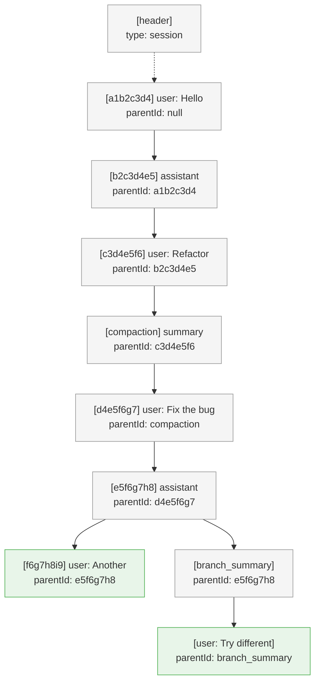
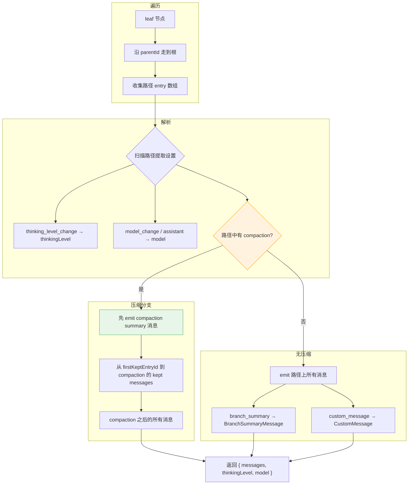
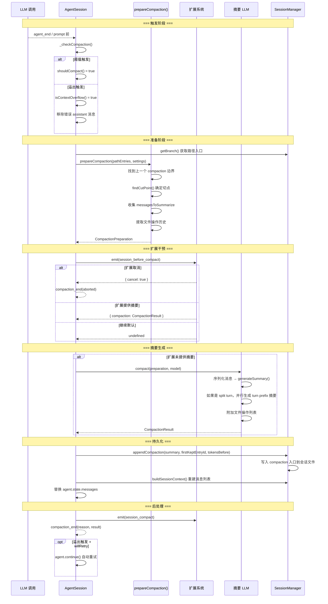

# 07 · 会话持久化与压缩

Pi 通过 append-only JSONL 文件持久化会话，用 `id`/`parentId` 树结构实现无拷贝分支，并配备自动上下文压缩机制解决长会话的 token 窗口压力。

## 1. JSONL Append-Only 存储格式

会话文件以 JSONL（每行一个 JSON 对象）格式存储在磁盘上，位于 `~/.pi/agent/sessions/--<cwd>--/<timestamp>_<uuid>.jsonl`。工作目录中的 `/` 替换为 `-` 编码为目录名。

每条记录是一个 JSON 行，带 `type` 字段标识类型。基准版本为 v3，v1/v2 格式在加载时自动迁移。

### 1.1 入口类型一览

```json
// 文件头（第一行，不是树节点，无 id/parentId）
{"type":"session","version":3,"id":"018f...","timestamp":"2024-12-03T14:00:00.000Z","cwd":"/path/to/project"}

// 消息入口（id 为 8 字符 hex，parentId 链向前驱）
{"type":"message","id":"a1b2c3d4","parentId":null,"timestamp":"...","message":{"role":"user","content":"Hello"}}
{"type":"message","id":"b2c3d4e5","parentId":"a1b2c3d4","timestamp":"...","message":{"role":"assistant","content":[{"type":"text","text":"Hi!"}],...}}

// 模型切换
{"type":"model_change","id":"d4e5f6g7","parentId":"c3d4e5f6","timestamp":"...","provider":"openai","modelId":"gpt-4o"}

// 思考级别变更
{"type":"thinking_level_change","id":"e5f6g7h8","parentId":"d4e5f6g7","timestamp":"...","thinkingLevel":"high"}

// 压缩入口（上下文压缩的产物）
{"type":"compaction","id":"f6g7h8i9","parentId":"e5f6g7h8","timestamp":"...","summary":"User discussed X, Y...","firstKeptEntryId":"c3d4e5f6","tokensBefore":50000}

// 分支摘要（树导航时对抛弃分支的摘要）
{"type":"branch_summary","id":"g7h8i9j0","parentId":"a1b2c3d4","timestamp":"...","fromId":"f6g7h8i9","summary":"Branch explored..."}

// 扩展自定义入口（不进入 LLM 上下文）
{"type":"custom","id":"h8i9j0k1","parentId":"...","timestamp":"...","customType":"my-ext","data":{...}}

// 扩展到上下文的自定义消息
{"type":"custom_message","id":"i9j0k1l2","parentId":"...","timestamp":"...","customType":"my-ext","content":"...","display":true}

// 标签（用户书签）
{"type":"label","id":"j0k1l2m3","parentId":"...","timestamp":"...","targetId":"a1b2c3d4","label":"checkpoint-1"}

// 会话元数据（如显示名）
{"type":"session_info","id":"k1l2m3n4","parentId":"...","timestamp":"...","name":"Refactor auth"}
```

所有非 header 入口都继承 `SessionEntryBase`（`id`、`parentId`、`timestamp`）。入口 ID 为 8 字符 hex，通过碰撞检测保证唯一（[`generateId()`](https://github.com/earendil-works/pi/blob/fc8a1559017f1e581cfa971aa3cef11a507a4975/packages/coding-agent/src/core/session-manager.ts#L206-L213)）。

### 1.2 版本迁移

| 版本 | 特性 | 迁移 |
|------|------|------|
| v1 | 线性序列（无 `id`/`parentId`） | `migrateV1ToV2()`: 添加 id/parentId，`firstKeptEntryIndex` → `firstKeptEntryId` |
| v2 | 树结构 | `migrateV2ToV3()`: `hookMessage` 重命名为 `custom` |
| v3 | 扩展消息统一化 | 当前版本 |

迁移在 `setSessionFile()` 中触发：加载后检测版本，一次性 `_rewriteFile()` 写回迁移后的文件（[来源](https://github.com/earendil-works/pi/blob/fc8a1559017f1e581cfa971aa3cef11a507a4975/packages/coding-agent/src/core/session-manager.ts#L759-L761)）。

## 2. 树结构与 Leaf 指针

### 2.1 核心设计



- **Leaf 指针**（`SessionManager.leafId`）：指向当前树位置。新入口始终作为当前 leaf 的子节点添加，然后 leaf 前移。
- **分支不拷贝数据**：`branch()` 只是移动 leaf 指针到某个历史入口。新的 `appendXXX()` 调用创建新子节点，形成分支。已有数据完全不变。
- **Header 不参与树**：第一行 `{"type":"session",...}` 是纯元数据，没有 `id`/`parentId`。

### 2.2 Leaf 机制

```typescript
// 添加到当前 leaf 的子节点，然后推进 leaf
private _appendEntry(entry: SessionEntry): void {
    this.fileEntries.push(entry);
    this.byId.set(entry.id, entry);
    this.leafId = entry.id; // 推进 leaf
    this._persist(entry);
}

// 分支：移动 leaf 到历史入口
branch(branchFromId: string): void {
    this.leafId = branchFromId;
}
```

`resetLeaf()` 将 leaf 设为 null，允许从根节点开始重新编辑第一条用户消息。

## 3. SessionManager API

`SessionManager` 封装了会话文件的全部读写与树操作。

### 3.1 静态工厂方法

| 方法 | 用途 | 持久化 |
|------|------|--------|
| `create(cwd, sessionDir?)` | 创建新会话 | 是 |
| `open(path, sessionDir?)` | 打开已有会话文件 | 是 |
| `continueRecent(cwd, sessionDir?)` | 打开最近会话，无则新建 | 是 |
| `inMemory(cwd?)` | 纯内存会话（无文件） | 否 |
| `forkFrom(sourcePath, targetCwd, sessionDir?)` | 从其他项目 fork | 是 |

### 3.2 数据写入方法（append-only）

所有返回入口 ID：

| 方法 | 入口类型 | 进入 LLM 上下文？ |
|------|----------|------------------|
| `appendMessage(message)` | `message` | 是 |
| `appendModelChange(provider, modelId)` | `model_change` | 否（只影响 setting） |
| `appendThinkingLevelChange(level)` | `thinking_level_change` | 否（只影响 setting） |
| `appendCompaction(summary, firstKeptEntryId, tokensBefore, details?, fromHook?)` | `compaction` | 是（摘要参与上下文） |
| `appendCustomEntry(customType, data?)` | `custom` | 否 |
| `appendCustomMessageEntry(customType, content, display, details?)` | `custom_message` | 是 |
| `appendSessionInfo(name)` | `session_info` | 否 |
| `appendLabelChange(targetId, label)` | `label` | 否 |

### 3.3 树导航方法

| 方法 | 功能 |
|------|------|
| `getLeafId()` | 当前 leaf 位置 |
| `getEntry(id)` | 按 ID 获取入口 |
| `getBranch(fromId?)` | 从指定入口（默认 leaf）走到根，返回路径数组 |
| `getTree()` | 完整树结构（`SessionTreeNode[]`，带 children 嵌套） |
| `getChildren(parentId)` | 获取直接子节点 |
| `branch(entryId)` | 移动 leaf 到历史位置（创建分支） |
| `resetLeaf()` | 重置 leaf 为 null |
| `branchWithSummary(entryId, summary)` | 分支并附加摘要 |
| `createBranchedSession(leafId)` | 提取单条路径到新会话文件 |

## 4. `buildSessionContext()`：LLM 上下文的构建

这是核心函数：将树结构转换为发送给 LLM 的消息列表。入口在 `SessionManager.buildSessionContext()` 中调用独立函数 `buildSessionContext(entries, leafId, byId)`。



关键逻辑（[`buildSessionContext()`](https://github.com/earendil-works/pi/blob/fc8a1559017f1e581cfa971aa3cef11a507a4975/packages/coding-agent/src/core/session-manager.ts#L315-L422)）：

1. **leaf→root 遍历**：从 leaf 沿 `parentId` 走到根（`parentId === null`），形成 `path[]`。
2. **提取设置**：扫描 path 上的 `thinking_level_change`（最后一条生效）、`model_change` 或最近 assistant 消息的 model。
3. **压缩处理**：如果路径上有 `compaction` 入口：
   - 首先生成 `CompactionSummaryMessage`（摘要）
   - 然后从 `firstKeptEntryId` 到 compaction 入口之间的 "保留消息"
   - 最后 compaction 之后的所有新消息
4. **消息转换**：
   - `message` → 直接取 `entry.message`
   - `custom_message` → `createCustomMessage()`
   - `branch_summary` → `createBranchSummaryMessage()`
   - `compaction`（当有摘要时）→ `createCompactionSummaryMessage()`

**边界条件**：`leafId === null` 返回空上下文（`{ messages: [], thinkingLevel: "off", model: null }`），用于导航到第一条消息之前的情况。

## 5. 压缩触发机制

Pi 具备两套压缩触发路径：**阈值检测**（主动预防）和 **溢出恢复**（被动触发）。

### 5.1 触发条件

```typescript
// 阈值检测：当前 token > contextWindow - reserveTokens
function shouldCompact(contextTokens: number, contextWindow: number, settings: CompactionSettings): boolean {
    if (!settings.enabled) return false;
    return contextTokens > contextWindow - settings.reserveTokens;
}

// 默认配置
const DEFAULT_COMPACTION_SETTINGS: CompactionSettings = {
    enabled: true,
    reserveTokens: 16384,   // 保留空间（用于 prompt + response）
    keepRecentTokens: 20000, // 保留最近这些 token 不压缩
};
```

（[来源](https://github.com/earendil-works/pi/blob/fc8a1559017f1e581cfa971aa3cef11a507a4975/packages/coding-agent/src/core/compaction/compaction.ts#L115-L125)）

### 5.2 两条触发路径

`_checkCompaction()` 在 `agent_end` 事件后和每次 prompt 提交前被调用（[来源](https://github.com/earendil-works/pi/blob/fc8a1559017f1e581cfa971aa3cef11a507a4975/packages/coding-agent/src/core/agent-session.ts#L1768-L1846)）：

| 触发类型 | 条件 | 行为 | 自动重试 |
|----------|------|------|----------|
| **阈值** | `contextTokens > contextWindow - reserveTokens` | 压缩 + 不重试，用户手动继续 | 否 |
| **溢出** | LLM 返回 context overflow 错误（`isContextOverflow()`） | 移除错误消息 → 压缩 → 自动重试 | 是 |

**溢出恢复**：只尝试一次（`_overflowRecoveryAttempted` 标志防护），失败后提示用户减上下文或换大窗口模型。

```typescript
// 防重复触发的保护机制：
// 1. 跳过 aborted 消息（用户取消的）
// 2. 跳过不同模型的消息（模型切换后不做跨模型溢出检测）
// 3. 跳过压缩时间戳之前的消息（压缩后立即又触发的问题）
const assistantIsFromBeforeCompaction =
    compactionEntry !== null && 
    assistantMessage.timestamp <= new Date(compactionEntry.timestamp).getTime();
```

### 5.3 Token 估算

压缩使用两种 token 估算策略：

1. **精确计算**：从最后一个非 aborted/non-error assistant 的 `usage.totalTokens` 获取（[`calculateContextTokens()`](https://github.com/earendil-works/pi/blob/fc8a1559017f1e581cfa971aa3cef11a507a4975/packages/coding-agent/src/core/compaction/compaction.ts#L135-L137)）
2. **估算回退**：当无有效 usage 数据时（如 API 错误后），用 `chars/4` 启发式逐个消息估算（[`estimateTokens()`](https://github.com/earendil-works/pi/blob/fc8a1559017f1e581cfa971aa3cef11a507a4975/packages/coding-agent/src/core/compaction/compaction.ts#L232-L290)）

## 6. 压缩流程



### 6.1 切点选择

`findCutPoint()` 的核心算法（[来源](https://github.com/earendil-works/pi/blob/fc8a1559017f1e581cfa971aa3cef11a507a4975/packages/coding-agent/src/core/compaction/compaction.ts#L386-L448)）：

1. 从最新消息反向累积 token 估算值
2. 当累积量 >= `keepRecentTokens` 时，在最近的合法切点处切割
3. **合法切点**：user、assistant、custom、branchSummary、custom_message 消息（绝对不能切割 toolResult！切割 assistant 时其后续 toolResult 自然跟随）
4. **回合穿越（split turn）**：如果切点不是 user 消息（即切在回合中间），回溯到当前回合的第一条 user 消息，对前半部分单独生成 prefix 摘要

### 6.2 摘要格式

LLM 生成结构化摘要，格式固定：

```
## Goal
[用户目标]

## Constraints & Preferences
- [约束条件]

## Progress
### Done
- [x] [已完成]

### In Progress
- [ ] [进行中]

### Blocked
- [阻塞项]

## Key Decisions
- **[决策]**: [理由]

## Next Steps
1. [后续步骤]

## Critical Context
- [关键上下文]
```

（[来源](https://github.com/earendil-works/pi/blob/fc8a1559017f1e581cfa971aa3cef11a507a4975/packages/coding-agent/src/core/compaction/compaction.ts#L454-L485)）

**增量更新**：如果已有上一次压缩的 `previousSummary`，使用 `UPDATE_SUMMARIZATION_PROMPT` 进行合并更新，而不是从头生成。这将新内容融入已有摘要，保留之前的所有信息。

**文件追踪**：摘要末尾附加 `<read-files>` 和 `<modified-files>` XML 标签，从工具调用中提取文件操作历史。

### 6.3 回合前缀摘要

当 `findCutPoint()` 发现切割发生在回合中间时（`isSplitTurn = true`），`compact()` 并行生成两份摘要：

- **历史摘要**（`messagesToSummarize`）：正常流程，`reserveTokens` 80% 预算
- **Turn prefix 摘要**（`turnPrefixMessages`）：回合前半部分的专门摘要，`reserveTokens` 50% 预算（[来源](https://github.com/earendil-works/pi/blob/fc8a1559017f1e581cfa971aa3cef11a507a4975/packages/coding-agent/src/core/compaction/compaction.ts#L769-L814)）

两个摘要合并为一个 summary："历史摘要 + `---` + Turn Context"。

## 7. 扩展钩子：`session_before_compact`

扩展系统通过 `session_before_compact` 事件暴露完整的压缩干预能力。

### 7.1 事件定义

```typescript
// 事件
interface SessionBeforeCompactEvent {
    type: "session_before_compact";
    preparation: CompactionPreparation;    // 完整的压缩准备数据
    branchEntries: SessionEntry[];         // 当前分支的全部入口
    customInstructions?: string;           // 用户提供的自定义指令
    signal: AbortSignal;                   // 可被取消
}

// 返回结果
interface SessionBeforeCompactResult {
    cancel?: boolean;                      // 取消压缩
    compaction?: CompactionResult;         // 扩展提供自己的压缩结果
}
```

### 7.2 扩展可利用的能力

| 操作 | 方式 |
|------|------|
| **取消压缩** | 返回 `{ cancel: true }` |
| **提供自定义压缩** | 返回 `{ compaction: { summary, firstKeptEntryId, tokensBefore, details? } }`，跳过 LLM 摘要 |
| **注入自定义指令** | 修改 `customInstructions`（该字段通过函数参数传入，不是通过 hook 返回值） |

`CompactionPreparation` 包含：
- `firstKeptEntryId`：第一个保留入口的 ID
- `messagesToSummarize`：将被摘要并丢弃的消息
- `turnPrefixMessages`：回合前缀消息（split turn 时）
- `isSplitTurn`：是否切在回合中间
- `tokensBefore`：压缩前的 token 数
- `previousSummary`：上一次压缩的摘要（用于增量更新）
- `fileOps`：已提取的文件操作（read/written/edited 的 Set）
- `settings`：压缩配置

当扩展提供 `compaction` 时，`CompactionEntry.fromHook` 被设为 `true`，其他字段与 pi 生成的压缩入口完全相同（[来源](https://github.com/earendil-works/pi/blob/fc8a1559017f1e581cfa971aa3cef11a507a4975/packages/coding-agent/src/core/session-manager.ts#L916-L936)）。

## 8. Branch vs Fork

| 操作 | SessionManager API | 文件操作 | 数据影响 |
|------|-------------------|----------|----------|
| **Branch** | `branch(entryId)` | 不回写文件 | 只移动 leaf 指针，已有数据完全不变 |
| **Branch with summary** | `branchWithSummary(entryId, summary)` | 追加 `branch_summary` 入口 | leaf 指针 + 摘要入口 |
| **Create branched session** | `createBranchedSession(leafId)` | 创建新 `.jsonl` 文件 | 提取单条路径，分配新 session ID |
| **Fork** | `SessionManager.forkFrom(sourcePath, targetCwd)` | 创建新 `.jsonl` 文件 | 完整复制源 session 的非 header 入口，`parentSession` 指向源文件 |

**Branch** 在同一个会话文件内进行，通过树结构实现。**Fork** 创建全新的会话文件，跨越项目目录。

树导航（`navigateTree()`）的完整流程：
1. 收集旧 leaf 到公共祖先之间的待摘要入口
2. 发射 `session_before_tree` 扩展事件（允许扩展取消或提供自定义摘要）
3. 调用 `generateBranchSummary()` 生成分支摘要
4. `branchWithSummary()` 移动 leaf + 写入 `branch_summary` 入口
5. 更新 agent state 的消息列表

## 9. 文件 I/O 策略：惰性写入

Pi 的会话文件 I/O 采用了独特的"推迟到第一条 assistant 消息"策略。

```typescript
_persist(entry: SessionEntry): void {
    if (!this.persist || !this.sessionFile) return;

    const hasAssistant = this.fileEntries.some(
        (e) => e.type === "message" && e.message.role === "assistant"
    );
    if (!hasAssistant) {
        // 还没有 assistant → 标记为未刷新
        this.flushed = false;
        return;
    }

    if (!this.flushed) {
        // 第一次刷新 → 写入所有累积的入口（include header）
        for (const e of this.fileEntries) {
            appendFileSync(this.sessionFile, `${JSON.stringify(e)}\n`);
        }
        this.flushed = true;
    } else {
        // 后续 → 只追加最新入口
        appendFileSync(this.sessionFile, `${JSON.stringify(entry)}\n`);
    }
}
```

（[来源](https://github.com/earendil-works/pi/blob/fc8a1559017f1e581cfa971aa3cef11a507a4975/packages/coding-agent/src/core/session-manager.ts#L843-L861)）

**设计意图**：
- 会话文件只在第一条 assistant 消息后才实际创建/写入
- 用户如果只输入消息但未收到回复（如退出程序），不会产生空的会话文件
- `flushed` 标志区分"首次全量写入"与"后续增量追加"
- `createBranchedSession()` 同样遵守此规则：检查是否有 assistant 消息决定是立即 `_rewriteFile()` 还是延迟到 `_persist()`（[来源](https://github.com/earendil-works/pi/blob/fc8a1559017f1e581cfa971aa3cef11a507a4975/packages/coding-agent/src/core/session-manager.ts#L1274-L1280)）

## 10. 源码索引

| 模块 | 文件 | 说明 |
|------|------|------|
| SessionManager | `packages/coding-agent/src/core/session-manager.ts` | 树结构管理、JSONL I/O、上下文构建 |
| Compaction core | `packages/coding-agent/src/core/compaction/compaction.ts` | 压缩算法：token 估算、切点检测、摘要生成 |
| Compaction utils | `packages/coding-agent/src/core/compaction/utils.ts` | 文件操作追踪、消息序列化、system prompt |
| Branch summarization | `packages/coding-agent/src/core/compaction/branch-summarization.ts` | 树导航时的分支摘要生成 |
| AgentSession | `packages/coding-agent/src/core/agent-session.ts` | 压缩触发、手动/自动压缩编排 |
| Extension types | `packages/coding-agent/src/core/extensions/types.ts` | `session_before_compact` 事件类型定义 |
| Extension runner | `packages/coding-agent/src/core/extensions/runner.ts` | 扩展事件分发 |
| Session format doc | `packages/coding-agent/docs/session-format.md` | JSONL 格式的完整文档 |

基准 commit: `fc8a1559017f1e581cfa971aa3cef11a507a4975`

## 关键结论

1. **Append-Only 树结构**：Pi 的会话持久化用 JSONL + `id`/`parentId` 树结构替代传统线性日志，分支只需移动 leaf 指针而不复制数据，这是状态最小化的分支实现。

2. **压缩入口作为结构哨兵**：`CompactionEntry` 不是简单的文本摘要，而是 `buildSessionContext()` 中的控制结构——它定义了"哪些消息被保留、哪些被折叠为摘要"的边界。摘要消息排在 kept messages 前面，让 LLM 先看到压缩后的上下文。

3. **双触发路径形成安全网**：阈值检测（主动预防）和溢出恢复（被动兜底）的组合覆盖了精确 token 估算失败的情况（如 API 错误后无 usage 数据）。

4. **回合感知的切点算法**：`findCutPoint()` 绝不能切割 toolResult（会破坏 tool_call/tool_result 配对），split turn 会自动生成专门的回合前缀摘要，保持上下文连贯性。

5. **扩展钩子提供完全控制权**：`session_before_compact` 允许扩展取消压缩、提供自定义压缩结果（跳过 LLM 摘要）或注入自定义指令，这比简单的 `onCompaction` 回调更有深度。

6. **惰性写入避免垃圾文件**：会话文件推迟到第一条 assistant 消息才创建，避免了"用户只输入就退出"产生的无效文件。
