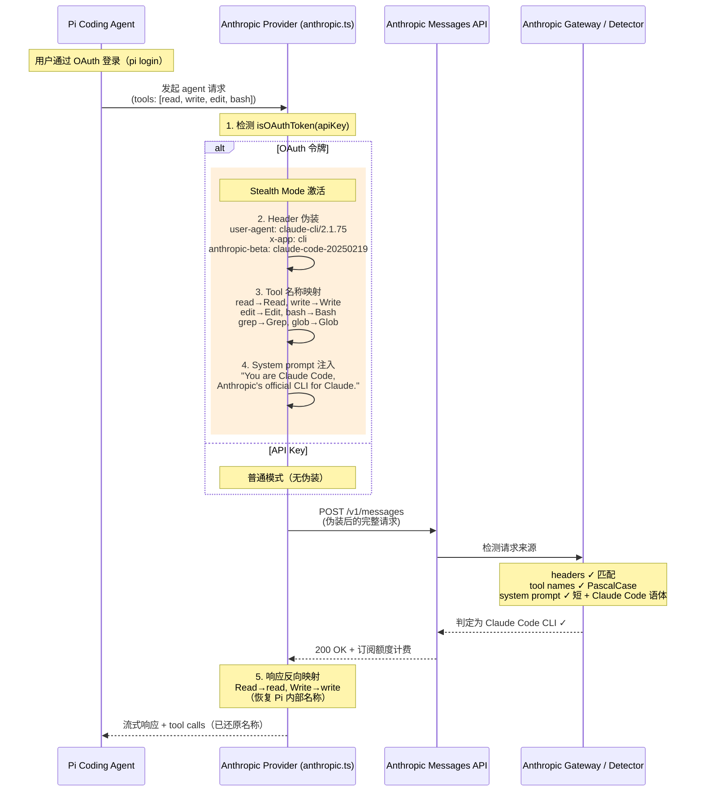

# 08 · Stealth Mode —— 伪装 Claude Code

Pi 通过 Anthropic OAuth 令牌（`sk-ant-oat...`）使用 Claude Pro/Max 订阅额度时，会启用一套名为 "Stealth Mode" 的机制：将自身的 HTTP 头、system 提示词和 tool 名称**完全伪装成 Claude Code 客户端的形态**，以此绕过 Anthropic 服务端的"第三方客户端检测"，直接享受订阅计划内的平价额度。

这不是一个偶然的兼容层——它是一套刻意设计的**身份伪装系统**，其存在本身就是 Anthropic 正在将 ACI（Agent-Computer Interface）工具命名变成竞争护城河的明证。

---

## 1. 问题背景：Anthropic 的第三方客户端检测

2025 年底到 2026 年初，Anthropic 在其 Messages API 上部署了多层检测机制，识别请求是否来自官方 Claude Code CLI。检测逻辑至少包含三层（参见 [Byoky 的 bisecting 实验](https://byoky.com/blog/anthropic-claude-code-fingerprint)）：

| 检测层 | 信号 | 拒绝行为 |
|--------|------|----------|
| **HTTP 头** | `user-agent: claude-cli/2.1.xx`、`x-app: cli`、`anthropic-beta: claude-code-20250219` | 缺少即拒绝（400） |
| **Tool 名称** | PascalCase 命名（`Read`/`Write`/`Bash`），而非 lowercase/snake_case | 不匹配即路由到"额外用量"计费池 |
| **System 内容** | 短 prompt + 特定语体，非长 agent-framework prompt | 内容分类器判定为第三方 |

检测不是简单的字符串匹配。Byoky 在 system prompt 中把所有 "openclaw" 替换为 "claude"，请求仍然被拒绝——说明 Anthropic 部署了内容分类器（很可能是 ML 模型），而非正则表达式。

**结果**：第三方 harness（OpenClaw、Pi 等）使用 OAuth 令牌时，被路由到独立的"extra usage"信用池，需按用量付费，不能再享受 Pro/Max 订阅的固定价格。

---

## 2. Pi 的应对：Stealth Mode 全链路伪装

Pi 在 OAuth 令牌路径上做了三层伪装，使每个 API 请求在 Anthropic 服务端看来**与 Claude Code 发出的请求无法区分**。

### 2.1 整体流程（Mermaid 序列图）



### 2.2 源码核心实现

所有关键代码集中在 `packages/ai/src/providers/anthropic.ts`。以下是各层的实现方式。

#### Layer 1：版本号伪装 + Tool 名称映射表（第 69–106 行）

```typescript
// Stealth mode: Mimic Claude Code's tool naming exactly
const claudeCodeVersion = "2.1.75";

const claudeCodeTools = [
  "Read", "Write", "Edit", "Bash",
  "Grep", "Glob", "AskUserQuestion",
  "EnterPlanMode", "ExitPlanMode", "KillShell",
  "NotebookEdit", "Skill", "Task",
  "TaskOutput", "TodoWrite", "WebFetch", "WebSearch",
];

const ccToolLookup = new Map(claudeCodeTools.map((t) => [t.toLowerCase(), t]));

// 发送方向：Pi 内部名 → Claude Code 标准名
const toClaudeCodeName = (name: string) =>
  ccToolLookup.get(name.toLowerCase()) ?? name;

// 接收方向：Claude Code 标准名 → Pi 内部名
const fromClaudeCodeName = (name: string, tools?: Tool[]) => {
  if (tools && tools.length > 0) {
    const lowerName = name.toLowerCase();
    const matchedTool = tools.find((tool) => tool.name.toLowerCase() === lowerName);
    if (matchedTool) return matchedTool.name;
  }
  return name;
};
```

**证据**：[`anthropic.ts` L69–L106](https://github.com/earendil-works/pi/blob/fc8a1559017f1e581cfa971aa3cef11a507a4975/packages/ai/src/providers/anthropic.ts#L69-L106)

`claudeCodeVersion` 的值是硬编码的，代表 Claude Code CLI 的特定发布版本。当 Anthropic 更新 Claude Code 版本号时，这个值也需要同步更新。Pi 选择 `2.1.75` 是基于当时稳定版本的选择。

`claudeCodeTools` 列表来自 Mario Zechner 自己的项目 [cchistory](https://cchistory.mariozechner.at)（见第 4 节）。

`ccToolLookup` 是一个 `Map<string, string>`，key 是 lowercase 的工具名（如 `"read"`），value 是 Claude Code 规范大小写（如 `"Read"`）。这使得 `toClaudeCodeName("read")` → `"Read"`。

#### Layer 2：HTTP Header 伪装（第 843–863 行）

```typescript
// OAuth: Bearer auth, Claude Code identity headers
if (isOAuthToken(apiKey)) {
  const client = new Anthropic({
    apiKey: null,
    authToken: apiKey,
    baseURL: model.baseUrl,
    dangerouslyAllowBrowser: true,
    defaultHeaders: mergeHeaders(
      {
        accept: "application/json",
        "anthropic-dangerous-direct-browser-access": "true",
        "anthropic-beta": ["claude-code-20250219", "oauth-2025-04-20", ...betaFeatures].join(","),
        "user-agent": `claude-cli/${claudeCodeVersion}`,
        "x-app": "cli",
      },
      model.headers,
      optionsHeaders,
    ),
  });

  return { client, isOAuthToken: true };
}
```

**证据**：[`anthropic.ts` L843–L863](https://github.com/earendil-works/pi/blob/fc8a1559017f1e581cfa971aa3cef11a507a4975/packages/ai/src/providers/anthropic.ts#L843-L863)

关键头部：
- `anthropic-beta: claude-code-20250219` —— Claude Code 专属 beta flag，是进入检测第一关的"入场券"
- `user-agent: claude-cli/2.1.75` —— 声明自己是 Claude Code CLI 2.1.75
- `x-app: cli` —— 声明为 CLI 应用

这些头部在 Anthropic API Key 路径（第 866–886 行）和 GitHub Copilot 路径（第 822–840 行）中**不会**设置——只有在检测到 OAuth 令牌时才激活。

#### Layer 3：System Prompt 注入（第 904–918 行）

```typescript
// For OAuth tokens, we MUST include Claude Code identity
if (isOAuthToken) {
  params.system = [
    {
      type: "text",
      text: "You are Claude Code, Anthropic's official CLI for Claude.",
      ...(cacheControl ? { cache_control: cacheControl } : {}),
    },
  ];
  if (context.systemPrompt) {
    params.system.push({
      type: "text",
      text: sanitizeSurrogates(context.systemPrompt),
      ...(cacheControl ? { cache_control: cacheControl } : {}),
    });
  }
}
```

**证据**：[`anthropic.ts` L904–L918](https://github.com/earendil-works/pi/blob/fc8a1559017f1e581cfa971aa3cef11a507a4975/packages/ai/src/providers/anthropic.ts#L904-L918)

OAuth 路径下，system prompt 的第一个 block 固定为 `"You are Claude Code, Anthropic's official CLI for Claude."`。Pi 自己的 system prompt（约 150 词）作为第二个 block 追加在后面。

这不是为了影响模型行为——它主要是为了**通过 Anthropic 的 system 内容分类器**。一个短小的、以 "Claude Code" 开头的 system prompt 读起来更像官方 CLI 的产品，而不是 OpenClaw 那样的 44KB agent-framework prompt。

#### Layer 4：Tool 名称转换（请求/响应双向）

**发送方向（Pi → Anthropic）**：

在 `convertTools()` 中（第 1179 行）：
```typescript
name: isOAuthToken ? toClaudeCodeName(tool.name) : tool.name,
```

在 `convertMessages()` 中处理 tool_use block（第 1090 行）：
```typescript
name: isOAuthToken ? toClaudeCodeName(block.name) : block.name,
```

**证据**：[`anthropic.ts` L1179](https://github.com/earendil-works/pi/blob/fc8a1559017f1e581cfa971aa3cef11a507a4975/packages/ai/src/providers/anthropic.ts#L1179) · [L1090](https://github.com/earendil-works/pi/blob/fc8a1559017f1e581cfa971aa3cef11a507a4975/packages/ai/src/providers/anthropic.ts#L1090)

**接收方向（Anthropic → Pi）**：

在 content_block_start 处理 tool_use 时（第 569–571 行）：
```typescript
name: isOAuthToken
  ? fromClaudeCodeName(event.content_block.name, context.tools)
  : event.content_block.name,
```

**证据**：[`anthropic.ts` L569–L571](https://github.com/earendil-works/pi/blob/fc8a1559017f1e581cfa971aa3cef11a507a4975/packages/ai/src/providers/anthropic.ts#L569-L571)

这个双向转换至关重要：**Pi 内部始终使用小写名称**（`"read"`、`"bash"`），**仅在网络边界做转换**。Agent 循环、会话日志、扩展系统都不会看到 PascalCase 的工具名。

---

## 3. 实际效果：四个信号全对齐

将四层伪装组合在一起，Pi 的 OAuth 路径请求在 Anthropic 网关看来：

| 信号 | Claude Code 真实值 | Pi Stealth Mode 发出的值 | 是否一致 |
|------|-------------------|------------------------|---------|
| `user-agent` | `claude-cli/2.1.xx` | `claude-cli/2.1.75` | 是 |
| `x-app` | `cli` | `cli` | 是 |
| `anthropic-beta` | `claude-code-20250219,...` | `claude-code-20250219,...` | 是 |
| tool 名称 | `Read`, `Write`, `Bash`, ... | `Read`, `Write`, `Bash`, ... | 是 |
| system prompt 首 block | 短 + Claude Code 相关 | `"You are Claude Code, ..."` | 是 |
| API 端点 | `POST /v1/messages` | `POST /v1/messages` | 是 |

这就是为什么 Pi 用户可以通过 `pi login` 使用 Anthropic 订阅，而不会触发第三方计费提示。

---

## 4. cchistory：Stealth Mode 的数据源

Pi 的 `claudeCodeTools` 列表来自 Mario Zechner 自己的另一个项目：[cchistory —— Claude Code Version History](https://cchistory.mariozechner.at)。

### 4.1 项目原理

cchistory 是一个 CLI 工具（npm: `@mariozechner/cchistory`），通过以下步骤提取 Claude Code 各版本的 system prompt 和 tool 定义：

1. 从 npm 下载指定版本的 `@anthropic-ai/claude-code`
2. 打补丁移除版本自检逻辑（以便旧版本能继续运行）
3. 通过 `claude-trace` 拦截 Claude Code 发出的 API 请求
4. 发送一条测试消息（`-p "hello"`）触发生成完整请求
5. 提取请求中的 system prompt、tool 定义和用户消息格式
6. 保存为 `prompts-{version}.md`

[详细原理](https://mariozechner.at/posts/2025-08-03-cchistory/)见 Zechner 的博客。

### 4.2 在 Pi 中的应用

Pi 源码中的注释（第 73–74 行）明确标注了数据源：

```typescript
// Claude Code 2.x tool names (canonical casing)
// Source: https://cchistory.mariozechner.at/data/prompts-2.1.11.md
// To update: https://github.com/badlogic/cchistory
```

这意味着 Pi 的 stealth mode 是一个**持续维护的映射表**：当 Anthropic 在 Claude Code 新版本中增删或重命名工具时，cchistory 会捕获变化，Pi 需要相应更新 `claudeCodeTools` 数组。

### 4.3 cchistory 的社区影响

cchistory 发布后迅速成为社区分析 Claude Code 演化的标准工具。已有多个衍生项目：

- [marckrenn/claude-code-changelog](https://github.com/marckrenn/claude-code-changelog) —— 社区维护的 Claude Code prompt 与 feature flag 演化追踪
- [Piebald-AI/claude-code-system-prompts](https://github.com/Piebald-AI/claude-code-system-prompts) —— 完整的 prompt 历史存档
- [claude-wiki.com](https://claude-wiki.com/cchistory.html) —— 社区维基中引用 cchistory 分析 prompt 变化趋势

cchistory 也揭示了一些有趣的 prompt 演变：例如"避免创建新文件"的规则从强制要求弱化为偏好；Malware/exploit 禁令在 Glasswing 和 Mythos 事件后被显著加强。

---

## 5. Tool 名称冲突：Stealth Mode 的副作用

Stealth Mode 的 tool 名称映射会引入一个实际问题：**多个 Pi 内部工具可能映射到同一个 Claude Code 工具名**。

在 [GitHub Issue #664](https://github.com/earendil-works/pi/issues/664) 中，用户报告 `find` 和 `ls` 工具在 OAuth 路径下都被重命名为 `Glob`，导致 Anthropic API 拒绝请求：

```
400 {"type":"error","error":{"type":"invalid_request_error",
"message":"tools: Tool names must be unique."}}
```

**原因**：Claude Code 的工具设计粒度与 Pi 不同。Claude Code 用 `Glob` 处理所有文件系统搜索（模式匹配 + 列出目录），而 Pi 将其拆分为 `find`（模式搜索）和 `ls`（目录列表）两个工具。当两者同时激活时，stealth mode 映射产生重名冲突。

**解决方案**：在使用 OAuth 订阅时避免同时启用 `find` 和 `ls`，用 `bash ls` 替代 `ls` 工具。

这个 issue 侧面反映了 stealth mode 的脆弱性：映射表假设 Pi 工具名与 Claude Code 工具名之间存在一对一的对应关系，但实际语义粒度并不总是一致的。

---

## 6. 哲学讨论：兼容 vs 伪装

Stealth Mode 引发了关于 agent 框架生态的深层问题。

### 6.1 "兼容"与"伪装"的边界

Pi 的做法是**格式兼容**（header + tool name + system prompt），而非**身份诚实**。它在 HTTP 层声明 `user-agent: claude-cli/2.1.75`，但实际运行的二进制是 `@mariozechner/pi-coding-agent`。

技术上有几个档次：

| 层级 | 做法 | 例子 |
|------|------|------|
| **API 兼容** | 使用标准 API Key + 按 token 付费 | Pi 的 API Key 路径 |
| **格式兼容** | 使用 OAuth 令牌 + 保留自身 tool 命名 | 可能被检测为第三方 |
| **格式伪装** | 使用 OAuth 令牌 + **完全复制 Claude Code 的 headers + tool names + system prompt** | Pi 的 Stealth Mode |
| **二进制伪装** | 修改 user-agent 等更多元数据 | 更激进的伪装 |
| **协议劫持** | 替换 Claude Code 安装目录中的二进制 | 违反 ToS，不讨论 |

Pi 的 Stealth Mode 处在"格式伪装"层。它**不是** API 的非法使用——Anthropic 的 OAuth 令牌本身就是一个标准的 OAuth 2.0 令牌，Pi 只是利用了 Anthropic 客户端检测逻辑的弱点。

### 6.2 Anthropic 的立场

Anthropic 收紧第三方客户端限制并非技术故障——是**商业策略**：

- Claude Code（官方 CLI）享受 Pro/Max 订阅的固定费率
- 第三方 harness（Pi、OpenClaw 等）需要额外购买 "extra usage" 或使用标准 API Key

这种做法在云计算历史上已有成熟先例：AWS 对自家服务（如 DynamoDB）提供比第三方（如 MongoDB Atlas on AWS）更优惠的网络出口费用；Apple 对自家 App Store 应用不抽成但对第三方收 30%。

Anthropic 的不同之处在于：它不是通过合同条款或计费代码来区分第一方和第三方，而是通过**API 请求的形态特征**来判定。这使得 ACI（Agent-Computer Interface）——具体到 tool 命名约定——变成了一个**竞争护城河**。

### 6.3 ACI 作为护城河

ACI 的设计选择（PascalCase `Read` vs lowercase `read`）看似只是风格差异，但在 Anthropic 的网关检测逻辑下，它变成了**区分"官方客户端"与"第三方 harness"的指纹**。

这意味着：

- **工具命名不再是单纯的开发者体验决策** ——它影响计费和访问权限
- **锁定效应加剧** ——第三方 harness 为了通过检测，必须复制 Claude Code 的 ACI 命名（这正是 Pi 在做的事情）
- **生态碎片化风险** ——如果每个 AI 厂商都建立自己的 ACI 作为网关指纹，跨厂商兼容层将变得异常脆弱

---

## 7. 前向兼容性风险

Stealth Mode 依赖对 Anthropic 检测逻辑的逆向工程，存在多种失效风险：

| 风险 | 触发条件 | 影响 |
|------|----------|------|
| **版本号过期** | Anthropic 服务端要求更高版本的 `user-agent` | Stealth Mode 失效，需更新 `claudeCodeVersion` |
| **Tool 列表变化** | Claude Code 新增/删除/重命名 tool | 映射表需更新（通过 cchistory 追踪） |
| **新检测维度** | Anthropic 增加第 4 层检测（如 body 大小模式、请求频率模式） | 需要新一轮逆向工程 |
| **System prompt 分类器升级** | Anthropic 的 ML 分类器更精细，能检测出"伪 Claude Code prompt" | 更难以绕过 |
| **OAuth 令牌吊销** | Anthropic 判定违规使用，吊销令牌 | 用户无法使用订阅额度 |

其中最大的风险不是技术层面的——是 Anthropic 随时可以改变检测逻辑，且**不受 API 版本契约约束**（因为第三方 harness 本就不在该令牌的设计用途之内）。

---

## 8. 关键结论

1. **Stealth Mode 是三合一伪装**：Pi 在 OAuth 令牌路径上将 HTTP 头、system prompt 和 tool 名称全部复制为 Claude Code 的格式，以通过 Anthropic 的第三方客户端检测。

2. **检测是多层的**：Byoky 的逆向实验证明 Anthropic 至少部署了三层独立的检测信号（headers、tool names、system content），任意一层不匹配即触发第三方计费。

3. **cchistory 是 Stealth Mode 的数据基础设施**：Mario Zechner 自己的 cchistory 项目自动提取 Claude Code 各版本的 tool 定义，使 Pi 能持续维护 `claudeCodeTools` 映射表。

4. **ACI 正在成为竞争护城河**：工具命名（PascalCase vs lowercase）不再是纯粹的 DX（Developer Experience）问题——它在 Anthropic 的网关中决定了计费路径。这是 AI agent 时代独有的锁定方式。

5. **Stealth Mode 是脆弱的**：它依赖逆向工程，不享受 API 契约保护。Anthropic 升级检测逻辑时，Stealth Mode 可能无预警失效。对于生产环境，标准 API Key 路径是更稳定但更贵的选择。

6. **兼容与伪装的边界模糊**：Pi 的 Stealth Mode 技术上是格式兼容（发送合法的 OAuth 令牌到正确端点），但行为上是伪装（声明自己是另一个客户端）。这反映了平台 API 经济中一个核心张力：**拥有令牌和拥有使用令牌的"权利"是两回事**。
