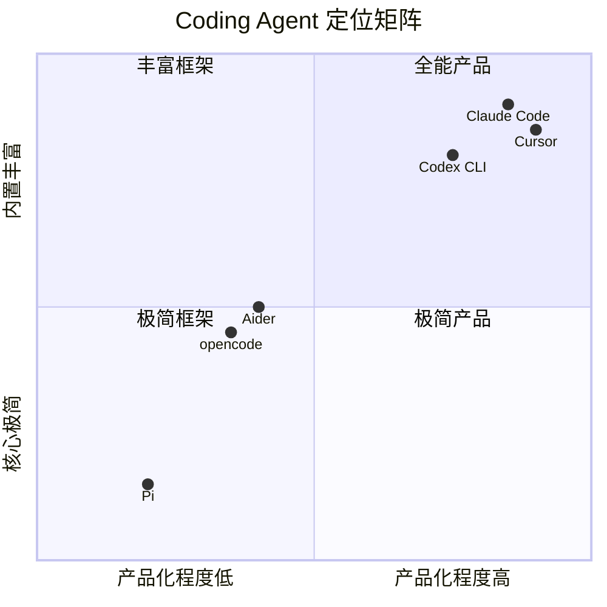

# 09 · 生态与对比分析

Pi 的扩展生态是理解其「核心极简、扩展激进」设计哲学的关键维度。相比 Claude Code 将所有能力内建于产品，或将 sub-agent/MCP 写进核心，Pi 选择让社区通过 TypeScript 扩展、npm 包和 Git 安装来覆盖这些需求。截至 2026 年 5 月，Pi 的 npm 包目录已有超过 2,000 个第三方扩展（[implicator.ai 报道](https://www.implicator.ai/pi-is-not-a-claude-code-rival-it-is-a-harness-rebellion/)），涵盖多 agent 编排、代码库分析、流程自动化等方向。

---

## 1. Pi 扩展生态系统一览

### 1.1 多 Agent 编排

多 agent 协作是 Pi 生态中最活跃的扩展方向。由于 Pi 核心刻意不做 sub-agent（[README 明确列出](https://github.com/earendil-works/pi/blob/fc8a1559017f1e581cfa971aa3cef11a507a4975/packages/coding-agent/README.md)），社区实现了多种编排方案：

#### pi-team-agents（Jabbslad/pi-team-agents）

最成熟的多 agent 扩展之一，支持两种工作流：

- **`team_dispatch`（并行批处理）**：同时派发 N 个 agent，等待所有完成，一次性收集结果。适合代码库多区域并行探索。
- **`team_create + team_spawn`（顺序流水线）**：完整控制 agent 生命周期，构建 researcher → planner → implementer → reviewer 多阶段流水线。

内置 6 种 agent 角色（explore、planner、coder、reviewer、general-purpose、verifier），每种角色有不同的工具权限。架构分三层：Extension（SDK 接线）、Core（纯逻辑+文件系统 IO+mailbox+task）和 Tests。

- 参考：[Jabbslad/pi-team-agents README](https://github.com/Jabbslad/pi-team-agents)

#### multipi（Ch3w3y/multipi）

专门为**开源/本地 LLM**（Ollama 等）设计的多 agent 编排框架，核心创新点：

- **能力路由**：将 reasoning → architecture → coding → review 路由到不同本地模型，利用各自的强项
- **状态机流水线**：S0（需求）→ S1（架构）→ S2（规划）→ S3（实现）→ S4（自审）→ S5（对抗性审查）→ S6（部署）
- **SearXNG 集成**：本地部署的 web 搜索，让开源模型也能获得实时信息
- **完整上下文隔离**：每个 agent 独立的 tmux 窗口/进程，避免 token 膨胀（引用 Anthropic 研究：「多个 agent + 隔离上下文胜过单 agent」）

定位对比：multipi 用户选择「硬件成本」而非「API 成本」，完全去云化。

- 参考：[Ch3w3y/multipi README](https://github.com/Ch3w3y/multipi)

#### pi-agent-flow（tuanhung303/pi-agent-flow）

流式状态委托扩展，用「flow state」代替传统的 sub-agent 模式，核心设计：

- **6 种内置流**：`scout`（代码探索）、`debug`（问题定位）、`build`（实现修复）、`craft`（架构设计）、`audit`（安全审查）、`ideas`（创意发散）
- **上下文隔离**：每个流作为独立 `pi` 子进程运行，接收经过净化的会话快照。净化包括删除 steering hints、推理/思考产物、不可继承内容，将之前的 flow 结果压缩为紧凑摘要
- **结构化报告**：每个流返回 `[Summary]` / `[Done]` / `[Not Done]` / `[Next Steps]`
- **深度守卫 + 循环防护**：最大委托深度默认 3；阻止重新进入祖先栈中已存在的流
- **自动转换矩阵**：流完成后自动建议下一步（如 `scout` → `build` → `audit`）
- **并行执行**：可批量派发独立流，设置并发上限

核心收益：避免重复工具调用、防止上下文膨胀、主 agent 只看到结构化结果、每个流保持专注。

- 参考：[pi.dev/packages/pi-agent-flow](https://pi.dev/packages/pi-agent-flow)

#### 其他多 agent 扩展速览

| 扩展 | 仓库 | 特点 |
|------|------|------|
| pi-teams | [vadimcomanescu/pi-teams](https://github.com/vadimcomanescu/pi-teams) | fork 自 pi-subagents，团队优先工作流，共享任务看板，`/team` 统一检查界面 |
| Pi Agents Team | [KristjanPikhof/pi-agents-team](https://github.com/KristjanPikhof/pi-agents-team) | 后台 RPC worker，orchestrator 不读取 worker 全文 transcript，只看 compact summary |
| pi-agent-teams | [codexstar69/pi-agent-teams](https://github.com/codexstar69/pi-agent-teams) | Claude Code agent teams 风格移植，git worktree 隔离，session 分支，自动领取任务 |
| pi-multiagent | [Tiziano-AI/pi-multiagent](https://github.com/Tiziano-AI/pi-multiagent) | 单一工具 `agent_team`，支持依赖图运行、catalog 可复用 agent、模型原生委托 |
| pi-agentteam | [LinYS77/PI-agentteam](https://github.com/LinYS77/PI-agentteam) | tmux 原生多 pane 协作，事件驱动唤醒，零轮询，角色化工具守卫 |
| agent-pi | [ruizrica/agent-pi](https://github.com/ruizrica/agent-pi) | 43 扩展 + 11 主题 + 20+ skills，6 种操作模式（NORMAL/PLAN/SPEC/PIPELINE/TEAM/CHAIN） |

**观察结论**：Pi 的多 agent 生态呈现出「百花齐放」态势，每种方案反映不同的编排哲学——内存调度 vs 进程隔离、push（主动派发）vs pull（自动领取）、结构化报告 vs 全文透传。这种多样性是「无内置方案」的副产品——社区不必迁就官方实现，可以用最适合自己场景的方式来做。

### 1.2 代码库逆向工程

#### CodeCartographer（HuginnIndustries/CodeCartographer）

结构化逆向工程工具包，帮助 LLM 系统性地分析和记录陌生代码库。核心理念：将模糊的「解释这段代码」prompt 转化为严格的、多阶段分析管线，每个阶段产出经过验证的结果。

**分析管线**：
1. 架构映射（分层、依赖方向）
2. 缺陷扫描
3. 行为契约（事件流、状态机）
4. 协议文档
5. 移植包
6. 语言无关的重实现 spec

**三种使用界面**：
- Pi 扩展：推荐交互式使用，带 slash commands + live widget + dashboard
- MCP 服务器：支持 Claude Code、Codex、opencode、Cursor 等任何 MCP agent
- 独立模板：纯 `.codecarto/` markdown + YAML，可独立使用

**关键创新**：不允许跨越 FAIL 输出推进到下一阶段，强制产出质量。每个发现带有证据标签。

- 参考：[HuginnIndustries/CodeCartographer](https://github.com/HuginnIndustries/CodeCartographer)

### 1.3 Rust 重写生态

Pi 的设计足够优秀，催生了至少 4 个独立的 Rust 重写：

| 项目 | 仓库 | 特点 |
|------|------|------|
| **pie** | [c4pt0r/pie](https://github.com/c4pt0r/pie)（69 stars） | 直接 Rust port，7 工具，持久化 memory，sub-task 委托 |
| **pi_agent_rust** | [Dicklesworthstone/pi_agent_rust](https://github.com/Dicklesworthstone/pi_agent_rust)（~1K stars） | 单二进制、<100ms 启动、<50MB 空闲内存、8 工具、零 unsafe、asupersync runtime |
| **rsBot/rust-pi** | [arthrod/rsBot](https://github.com/arthrod/rsBot) | 完整 skill 系统（markdown→工具注册）、JSONL 会话、provider auth 矩阵 |
| **pi-mono Rust rewrite** | [juancruzmunozalbelo/pi-mono PR#1](https://github.com/juancruzmunozalbelo/pi-mono/pull/1) | 5 crate，7 工具，90 测试，4 平台 CI，完整 OpenSpec 文档 |

**为什么这么多次重写？** Pi 的核心抽象（4 工具 + agent loop + provider 接口）足够薄，一个开发者可以在一个周末完成 Rust 重写。TypeScript 版本的 npm/Node.js 依赖在某些场景（CI、嵌入式设备、边缘部署）有天然劣势，Rust 提供单二进制分发、更低资源占用。但 Pi 的扩展生态（npm 包、TypeScript 钩子）目前仍是 Rust 版本的短板——Rust 侧的扩展机制尚未统一。

---

## 2. Pi 作为 SDK

Pi 不仅是 CLI 工具，更是可嵌入的 agent 运行时。其 SDK 设计使其成为构建 agent 系统的「乐高积木」。

### 2.1 `createAgentSession()` 核心 API

```typescript
import { createAgentSession } from "@mariozechner/pi-coding-agent";

const { session } = await createAgentSession({
  cwd: process.cwd(),
  model: getModel("anthropic", "claude-opus-4-5"),
  thinkingLevel: "high",
  tools: ["read", "bash", "edit", "write"],
  customTools: [{ name: "deploy", /* ... */ }],
  sessionManager: SessionManager.inMemory(),
  authStorage,
  modelRegistry,
});

await session.prompt("Refactor this function...");
```

参考：[pi-mono SDK 文档](https://github.com/earendil-works/pi/blob/main/packages/coding-agent/docs/sdk.md)

### 2.2 OpenClaw 集成

OpenClaw 是 Pi SDK 最重要的生产级集成案例。它是一个自托管的 messaging gateway，连接 Discord/Telegram/Slack/WhatsApp 等 10+ 通道到 Pi agent。

**集成架构**（参考：[OpenClaw Pi 集成文档](https://docs.openclaw.ai/pi)）：

- OpenClaw 不通过子进程或 RPC 模式调用 Pi，而是**直接 `import` 并实例化 `AgentSession`**
- `runEmbeddedPiAgent()` 调用 `createAgentSession()`，注入 OpenClaw 的自定义工具（messaging、browser、canvas、sessions 等）
- OpenClaw 替换默认 bash 工具为 `exec`/`process` 版本，并定制 read/edit/write 工具用于沙箱
- 工具策略按 profile/provider/agent/group/sandbox 多层过滤

**对比 Pi CLI vs OpenClaw 嵌入**：

| 维度 | Pi CLI | OpenClaw 嵌入 |
|------|--------|---------------|
| 调用方式 | `pi` 命令 / RPC | SDK `createAgentSession()` |
| 工具集 | 默认 4 工具 | 自定义 OpenClaw 工具套件 |
| 系统提示词 | AGENTS.md + prompts | 动态按通道/上下文构建 |
| 会话存储 | `~/.pi/agent/sessions/` | `~/.openclaw/agents/<id>/sessions/` |
| 认证 | 单一凭证 | 多 profile 轮换 |
| 扩展加载 | 从磁盘发现 | 程序化 + 磁盘路径 |

### 2.3 GitHub Agentic Workflows

GitHub 于 2026 年初推出 Agentic Workflows（技术预览），允许用 Markdown 文件定义仓库自动化目标，由 coding agent 在 GitHub Actions 中执行（参考：[InfoQ 报道](https://www.infoq.com/news/2026/02/github-agentic-workflows/)）。Pi 作为开源 coding agent 可嵌入此类流程——社区已有实践（如 [l3wi/agents-workflow](https://github.com/l3wi/agents-workflow) 用 Pi 实现多 agent 并行 feature 开发流水线）。

### 2.4 pi-web-ui：独立 WebComponents

`@mariozechner/pi-web-ui` 是 pi-mono 中最容易被忽视的包。它提供：

- **ChatPanel**：完整聊天界面，消息历史、流式输出、工具执行可视化
- **Artifacts**：沙箱化的 HTML/SVG/Markdown 交互执行
- **存储层**：IndexedDB 支持的 sessions、API keys、settings
- **自定义 Provider**：Ollama、LM Studio、vLLM、OpenAI 兼容 API
- **文档处理**：PDF、DOCX、XLSX、PPTX 预览和文本提取

使用 mini-lit WebComponents + Tailwind CSS v4 构建。这意味着任何 Web 应用可以直接 `npm install` 获得完整 AI agent 聊天界面，不依赖任何框架（React/Vue 等）。

参考：[pi-mono packages/web-ui](https://github.com/earendil-works/pi/blob/main/packages/web-ui/README.md)

---

## 3. 竞品横向对比

### 3.1 四象限定位图



### 3.2 多维对比表

| 维度 | Pi | Claude Code | opencode | Codex CLI |
|------|-----|-------------|----------|-----------|
| **系统提示词大小** | ~150 词，<1K token | ~900 行，~5K token | 模块化 YAML，中等 | ~内置，模型特化，中等 |
| **内置工具数** | 4（read/write/edit/bash） | 30+ | ~8-10（read/write/bash/grep/glob 等） | ~8（shell/apply_patch/read_file/search_files 等） |
| **扩展机制** | TypeScript 扩展（26+ 钩子）+ npm 包 + skills | Hooks（17 事件）+ MCP + skills | 插件系统 + MCP + skills | Hooks（6 事件）+ MCP + plugins + skills |
| **多 Provider 支持** | 15+（Anthropic/OpenAI/Google/Bedrock 等） | Anthropic 独占（API） | 75+（Vercel AI SDK） | OpenAI 独占 |
| **Sub-agent** | 无意内置（社区扩展实现） | Agent Teams（内置） | 通过插件实现 | Agent Teams + cloud sandbox |
| **MCP 支持** | 无意内置（哲学抵触） | 成熟（5,618+ servers） | 支持 | 支持 + 并行工具调用 |
| **会话格式** | JSONL 树形（id/parentId），分支 | 专有格式 | JSONL（推测） | 专有/会话文件 |
| **自托管 LLM** | 原生支持（Ollama/vLLM/LM Studio） | 不支持 | 原生支持（Ollama） | 不支持（仅 OpenAI API） |
| **开源协议** | MIT | 闭源 | MIT（Apache 2.0？） | Apache 2.0（CLI 部分） |
| **分发方式** | npm 包 + 多 Rust 二进制 | 闭源 CLI | npm + Tauri 桌面应用 | npm wrapper + Rust 二进制 |
| **运行模式** | 交互/print/JSON/RPC/SDK | 交互/print/JSON | 交互/HTTP API | 交互/exec/cloud/IDE 扩展 |
| **代码规模** | ~147K LOC（TS） | 闭源 | 较大（全栈 monorepo） | Rust 重写，规模不详 |
| **GitHub Stars** | ~45K | N/A（产品级） | ~100K+ | ~75K |

### 3.3 Pi 的独特定位

Pi 在所有主流 coding agent 中具备一个独一无二的特性组合：

**唯一同时拥有以下三者的项目：**

1. **独立的 LLM API 库（`pi-ai`）**：可作为独立 npm 包使用，不依赖 agent 逻辑。提供 4 种协议层（OpenAI Chat Completions、Anthropic Messages、Google Gemini、通用 REST）统一 15+ provider。

2. **GPU Pod 管理 CLI（`pi-pods`）**：管理 vLLM 部署的 GPU pod 生命周期。其他 coding agent 要么完全不涉及推理基础设施，要么依赖第三方 API。

3. **原生 WebComponents（`pi-web-ui`）**：框架无关的 AI 聊天界面组件库。ChatPanel、Artifacts、IndexedDB 存储——任何 Web 应用可直接使用。Claude Code 无等效功能，Codex CLI 侧重终端而非 Web 嵌入，opencode 有 Tauri 桌面应用但无独立 WebComponents。

**这决定了 Pi 的双重身份**：
- 作为 coding agent CLI：与其他三者竞争
- 作为 AI agent 工具包：与 LangChain、Vercel AI SDK 竞争——但 Pi 更轻、更聚焦于 agent 运行时而非通用 LLM 编排

---

## 4. 何时选择 Pi vs Claude Code vs opencode

### 4.1 决策指南

| 场景 | 推荐工具 | 理由 |
|------|----------|------|
| **构建 agent 系统（Pi 作为组件）** | Pi | `createAgentSession()` 可嵌入任何 Node.js 应用；OpenClaw 是最好的参考实现 |
| **需要完整的 MCP 生态** | Claude Code | 5,618+ MCP servers，最成熟的 tool 集成生态 |
| **需要 provider 自由 + 自托管 LLM** | Pi 或 opencode | 两者都支持 10+ provider 和 Ollama；Pi 更轻量 |
| **日常交互式编码** | Claude Code 或 Codex CLI | 产品化程度高，默认体验好，但锁定单一 provider |
| **需要 IDE 内集成** | Cursor 或 Codex IDE 扩展 | Pi 和 opencode 是终端优先工具 |
| **需要沙箱安全执行** | Codex CLI | 唯一的 OS 内核级沙箱（Apple Seatbelt/Linux Landlock） |
| **想要控制 agent 的每一个细节** | Pi | 系统提示词 ~150 词，你可以完全替换；不会和你「打架」 |
| **需要云任务委派** | Codex CLI（cloud agent） | GitHub Actions 风格的任务委派到 OpenAI 云沙箱 |
| **最小开销 + 最快启动** | Pi（Rust 重写版） | <100ms 启动，<50MB 内存，单二进制 |

### 4.2 Pi 不适合的场景

- **需要开箱即用的 sub-agent**：Pi 不内置 sub-agent，需要装扩展或自行编排
- **依赖 MCP 工具链**：Pi 哲学不支持 MCP（18K token 的上下文开销被认为不值得）
- **想要一个「只管用就行」的产品**：Pi 是框架，不是产品。需要你自己写系统提示词、管理上下文、处理安全

### 4.3 社区共识

来自社区的多篇深度对比文章（[Claude Code vs Pi Behavioral Analysis](https://gist.github.com/thelbane/ddf99e29660d70abfc3633705528da4b)、[From Claude Code to Pi](https://www.reinforcementcoding.com/blog/from-claude-code-to-pi-building-ai-agent-harness)、[Pi Coding Agent Turns Minimalism Into Harness Rebellion](https://www.implicator.ai/pi-is-not-a-claude-code-rival-it-is-a-harness-rebellion/)）形成共识：

- **Claude Code 是产品，Pi 是框架**。两者的竞争不是feature 对 feature，而是设计哲学的冲突。
- **Pi 适合「构建系统」的人**：如果你把 coding agent 视为更大自动化系统中的一个组件，Pi 的 RPC 模式 + SDK 是正确的架构选择。
- **Claude Code 适合「使用工具」的人**：如果你要的是开箱即用的 coding 体验，Claude Code 的 MCP 生态和产品化程度无可匹敌。
- **模型不是瓶颈，harness 才是**：多篇基准测试研究证实，同一模型在不同 harness 中的表现差距可达 5-40 个百分点。系统提示词、工具描述、上下文管理比模型选择对实际效果影响更大。
- **Pi 的生态在 2026 年爆炸式增长**：从 0 到 2,000+ 包只用了几个月，但这既是活力信号，也是质量风险的信号——任何可安装的包都可能执行任意代码。

---

## 关键结论

1. **Pi 的扩展生态不是「功能不足的补充」，而是「刻意的架构选择」**。Pi 不做 sub-agent/MCP/Plan Mode，不是因为做不到，而是认为不同场景需要不同方案。社区用 2,000+ 包证明了这一判断。

2. **Pi 的 SDK 能力是其最被低估的价值**。OpenClaw 证明 Pi 可以嵌入生产级 messaging gateway；`createAgentSession()` 的三行代码即可启动完整 agent 循环。

3. **Pi 是唯一同时提供 LLM API 抽象层 + GPU Pod 管理 + 独立 WebComponents 的 coding agent 项目**。这使得 Pi 不只是一个 CLI 工具，而是构建 AI agent 系统的完整工具包。

4. **多 agent 编排是 Pi 生态中最活跃的扩展方向**，但没有任何一种方案成为公认标准。这反映了社区对「什么是最佳编排模型」缺乏共识——也可能是 Pi 的「无官方方案」策略在起效。

5. **Rust 重写潮说明 Pi 的核心设计足够薄、足够好**，值得多人独立地用不同语言重新实现。但 TypeScript 侧的扩展生态是 Rust 版本的短板。

6. **选择 Pi vs 竞品的核心问题是：你想构建一个系统，还是使用一个工具？** 前者选 Pi，后者选 Claude Code 或 Codex CLI。

7. **Harness 质量比模型质量更重要**。基准测试反复证明，同样的模型在不同 harness 中表现差异巨大。Pi 的极简系统提示词 + 4 工具 + 可见上下文，本身就是一种 harness 优势——你知道模型看到了什么，不会和隐藏的产品逻辑「打架」。
